# Toward a 10 ms decision model: every idea we tried, what we measured, and what's next

October 2026.

**The question.** How fast can a decision model be made per request? What would it take to reach about 10 ms for a 1,000-token input on an RTX 3090-class GPU, without losing the accuracy of Strands Decider 2B (hobson-v19)?

**The model:**
- **What it does:** a decision model answers typed yes/no, multiple-choice and ordinal-score questions about an agent's state, and returns calibrated probabilities. It generates no text.
- **What it is:** hobson-v19 is a Qwen3.5-2B model with a pointer head.
  - 24 layers, d = 2048, MLP width 6144.
  - 18 layers are Gated DeltaNet (GDN, a linear-attention recurrence); 6 are full attention, at layers 3, 7, 11, 15, 19 and 23.

Every idea here keeps the model at hobson's size. Smaller models are faster simply because they compute less, so they appear only as a reference point ([R10](#r10)).

This document merges the earlier `FAST_DECISION_MODEL.md` (rounds D–H) and `IDEAS_EXPLORED.md` (rounds J, Q, M and N). It covers every idea tested by several dozen research agents across those rounds. Each agent's notes, code and draft report are in `~/decider2/<agent>/`.

## Summary

1. **Engineering alone made hobson 2.8x faster with identical decisions** (S1). A lean fused runtime took it from 148.7 to 52.7 ms at 1,000 tokens on an A10G GPU, and from about 520 to 200 ms at 4,000.
   - Most of the stock engine's time was launch overhead: 3,054 kernel launches per request, 74% of them from an unmerged LoRA adapter.
   - This also explains most of the speed gap other decision models appeared to have.
2. **The time that remains is matrix-multiply arithmetic** (see the section [The floor on wall time](#the-floor-on-wall-time)):
   - at 1,000 tokens, 87% of the 52.7 ms is matrix multiplies running near the GPU's tensor-core rate;
   - attention is 1.7%, and all token mixing together is about 10%.

   So faster attention kernels or new sequence mixers can save at most a few percent. Latency can fall substantially only through fewer rows (tokens), fewer layers per row, or cheaper arithmetic per row.
3. **Two measured speedups keep hobson's decisions exactly as reliable as its own runtime:**
   - **8-bit arithmetic** with rotated weights and activations (P1): 1.57x at 1,000 tokens;
   - **an exit at layer 16** (R1): 0 of 6,216 real decisions changed, and 0.688x of the 8-bit latency on 120 real requests.
4. **The best fidelity-preserving configuration is C1** (P11 + R1):
   - **how it works:** the 32 least sensitive of hobson's 96 matrix multiplies run in 4-bit on the state's tokens, the rest stay in 8-bit, and the model exits at layer 16 when it is confident;
   - **speed:** 0.635x of the 8-bit latency on 120 real requests (50.6 against 79.7 ms mean);
   - **accuracy:** 0.65% of real decisions differ from hobson's, within the 0.7% bar;
   - **projected at 1,000 tokens:** 13.1 ms on an RTX 3090, 7.8 ms on a 4090 and 5.3 ms on a 5090.
5. **Accurate 4-bit arithmetic everywhere is blocked by one thing:** rounding the state tokens' activations in layers 0–11 (P10, B1–B6). That error is spread over about 1,000 of 2,048 directions, is independent across tokens, and resisted every format and training method we tried.
   - It is concentrated in a few *tokens*: the 5% most sensitive state tokens carry 63% of it.
   - The open lead is precision chosen per token by the question (B1; see the section [Recommended next steps](#recommended-next-steps)).
6. **Choosing what to drop by the decision's own sensitivity works in the late layers** (B11–B13). Decision-aware 2:4 sparsity and per-deployment neuron removal:
   - have 2–40x lower decision error than the standard per-layer criteria;
   - keep decisions within the fidelity bar in layers 12–23;
   - cut matrix-multiply time to 0.82–0.92x of the 8-bit runtime's.

   Two exact eliminations (B13) give a further 4%.
7. **Removing rows gives the largest multipliers, but mostly at an accuracy cost:**
   - precompiling the deployment's fixed documents (A6) and questions (A3, A4), and a domain vocabulary (A7), give 2–5x speedups;
   - each, after retraining at our budgets, fell short of the accuracy bar, mostly on two long 23-way procedure questions.
8. **A decision-native layout met an accuracy bar for the first time** (M2). State tokens attend only within their own segment (message, tool output, document) through 12 layers, while the question's tokens read every segment through all 24.
   - It is 1.7–1.8x faster than hobson on real requests in bf16.
   - It makes constant documents exactly precomputable: 228 of 228 decisions were unchanged.
9. **hobson itself reads details poorly, and training data fixes it** (E1). It gets both halves of a counterfactual pair right on 27% of pairs. Adding counterfactual examples to training, with no architecture change, raises the synthetic-probe pair accuracy from .328 to .95–.99.
10. **Hardware:**
    - Inferentia2 runs hobson at 132 ms (1,000 tokens, one core) for 0.83x the A10G's cost per decision (HW3). That is only about 28% of the chip's peak, because of how we ported it; a corrected port should reach about 0.3–0.4x the A10G's cost (arithmetic);
    - CPUs cost 12–16x more per decision, and an Apple M4 Pro can't approach 10 ms (HW1, HW2).
11. **Where 10 ms at 1,000 tokens stands:**
    - **4090:** C1 projects to 7.8 ms, and plain 8-bit to 11.6 ms.
    - **3090:** no measured configuration gets there; C1 projects to 13.1 ms. Getting below 10 ms needs C1 combined with fewer rows (M2 or A6 compiled documents, A7 vocabulary), or exact 4-GPU context parallelism (S5, about 8–10 ms predicted). Both are untested.

## How to read this report

**Scope:**
- Requests are cold and independent: no caching across requests, and no use of the agent loop.
- Within one request, the 1–15 questions over the same state may share work.
- Per-deployment constants (the fixed question specs and documents) may be precomputed.

**Hardware:**
- Every GPU number comes from NVIDIA A10G boxes (AWS g5.2xlarge, 24 GB). The A10G is the RTX 3090's chip family (GA102), with the same bf16 tensor rate per SM per clock, so arithmetic-bound times transfer roughly 1:1. The 3090 has 1.56x the memory bandwidth.
- GeForce cards run fp16 with fp16 accumulation at twice the bf16 rate. Their int8 rate is 2x, and their int4 rate 4x, the fp16-accumulation rate.
- RTX 3090, 4090 and 5090 numbers are projections from A10G measurements (see the subsection [Projections to other GPUs](#projections-to-other-gpus)).

**What the labels mean:**
- **Measured:**
  - wall-clock time, end to end, for one request;
  - batch 1, CUDA graph, exclusive use of the GPU;
  - fresh inputs on each call, median of at least 12 warm repetitions.
- **Arithmetic:** a model built from measured parts.
- **Projected:** an arithmetic carry-over to hardware we didn't measure.
- **Speculation:** marked as such.

**Lengths:**
- Lengths are exact, with no bucket padding.
- "At 1,000 tokens" means a state of exactly 1,000 tokens plus one real question of 85–125 tokens.
- "Real requests" are recorded gate requests from the tau3 agent runs.

**IDs.** Each idea has a category letter and a number; figure points use the same labels.

| letter | category | what it changes |
|---|---|---|
| S | systems | run the same model faster |
| P | numeric precision | cheaper arithmetic per row |
| R | reducing work per token | fewer rows or fewer layers per row |
| B | decision-specific numerics and structure | precision and pruning aimed by the decision's own sensitivity |
| A | architecture changes | what the model computes: layout, inputs, modules |
| M | mixers and decision-native layout | how rows exchange information |
| C | combinations | stacks of individually measured pieces |
| HW | hardware | other chips |
| E | data and evaluation | training data, and how we measure |

Variants plotted separately get a letter suffix (R2a, R2b). Agent names in parentheses (J15, Q2, …) are folders in `~/decider2/`.

## The decision model in one picture

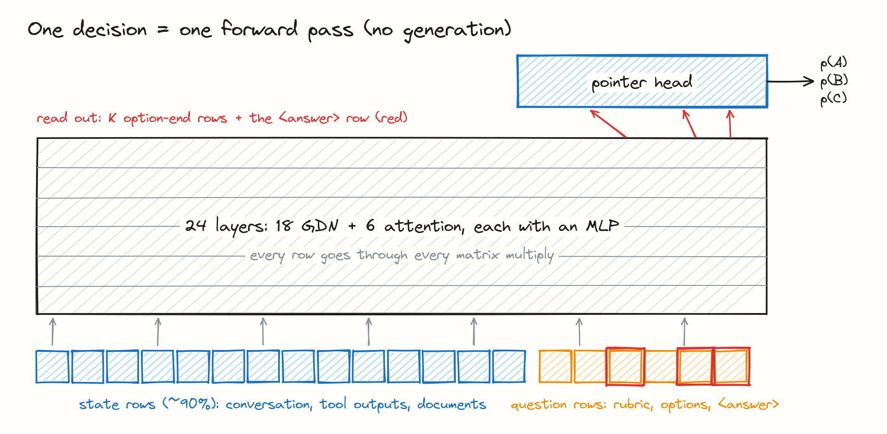

**How hobson answers a question:**
- **A request is tokenized into N rows,** one vector per token. Every weight matrix in every layer is applied to every row, at about 2.75 GFLOP per row for hobson.
- **The state comes first:** the conversation, tool outputs and documents. Its tokens are the **state rows**.
- **The questions come after it.** Each question's text, options and `<answer>` marker are its **question rows**.
- **The mask is causal,** so state rows never see the question. Every question over the same state can share one pass over it (S6).
- **A pointer head reads the readout rows** (K + 1 per question: each option's last token and `<answer>`) and returns K probabilities.

Three features of this setup recur throughout the report, because LLMs lack them:
1. **One forward pass with no generation.** There is no decoding loop to amortize work over.
2. **A few output probabilities, not a 250,000-way distribution.** Errors matter only insofar as they change which option wins.
3. **A fixed, narrow workload per deployment.** The questions are fixed, many documents are constant, and the text is repetitive.

## Index of ideas

Speeds are relative to hobson in bf16 unless the entry says W8A8. The fidelity and accuracy bars are defined in the section [How we measure accuracy](#how-we-measure-accuracy). Each ID links to its subsection.

| ID | idea | result |
|---|---|---|
| **S** | **Systems: run the same model faster** | |
| [S1](#s1) | lean fused runtime | 148.7 → 52.7 ms at 1,000 tokens, same decisions; the largest single gain |
| [S2](#s2) | faster or replaced attention | attention is 1.7% of the time at 1,000 tokens, so at most 1.02x |
| [S3](#s3) | megakernel | at most 0.7% faster at 1,000 tokens |
| [S4](#s4) | layer streaming, co-scheduling | at most 7% faster; co-scheduling two models was slower |
| [S5](#s5) | exact context parallelism on 4 GPUs | predicted 8–10 ms on 4x 3090; never measured (no capacity) |
| [S6](#s6) | one packed pass for several questions | 3 extra questions add 14 ms (stock engine: 64 ms); same decisions |
| [S7](#s7) | fp16 accumulation (GeForce) | 2x the bf16 rate, 0 of 680 decisions changed |
| [S8](#s8) | Rust tokenizer | 0.82 ms per 1,000 tokens, identical token ids |
| [S9](#s9) | activation sparsity, library 2:4 | at most 11% faster; library 2:4 slower than dense at our sizes |
| [S10](#s10) | Strassen–Winograd | never faster than dense; its 7-bit inputs miss the fidelity bar |
| [S11](#s11) | decisions computed as the conversation happens | proposed; today's request format allows only 18% exact reuse |
| **P** | **Numeric precision** | |
| [P1](#p1) | W8A8 with rotation and GPTQ | 1.57x, decisions at the runtime's noise floor |
| [P2](#p2) | W4A4 | 2.4x, but 2–13% of decisions change |
| [P3](#p3) | 4-bit weights only | no faster; 2–3% of decisions change |
| [P4](#p4) | NVFP4 block scales (emulated) | halves int4's error; 4–5% of decisions still change |
| [P5](#p5) | learned rotations | no better than a fixed Hadamard rotation |
| [P6](#p6) | LoRA quantization-aware training | no gain on any metric |
| [P7](#p7) | hyperspherical layers | its premise doesn't hold for hobson |
| [P8](#p8) | speculative precision | 1.27x *slower* than W8A8 |
| [P9](#p9) | native ternary 2B (BitNet) | slower than hobson in W8A8, and less accurate |
| [P10](#p10) | row-role precision | 0.724x of W8A8's latency; 3.7–3.9% of decisions change |
| [P11](#p11) | k64rr mixed 8/4-bit | meets the fidelity bar at 0.877x of W8A8 |
| **R** | **Reducing work per token** | |
| [R1](#r1) | exit at layer 16 | 0 of 6,216 decisions changed; 0.688x of W8A8 on real requests |
| [R2](#r2) | depth split | 1.7–2.4x, meets the accuracy bar, weaker on multi-step deduction |
| [R3](#r3) | token selection | 2.4x, but loses exact values (agreement .76, bar .95) |
| [R4](#r4) | learned pooling | about 3x, but loses exact values (agreement .71–.78) |
| [R5](#r5) | small reader feeding the 2B | 2x, but loses exact values (agreement .66) |
| [R6](#r6) | token-adaptive width | no setting met the bar, even with an oracle |
| [R7](#r7) | MLP pruning, mixture-of-experts | only late-layer cuts keep accuracy; MoE untested at scale |
| [R8](#r8) | structured matrices | 3.5x faster kernels, but JB-all .654 against .706 for a dense control |
| [R9](#r9) | looped layers | saves parameters, not time |
| [R10](#r10) | smaller models (controls) | what equal latency buys: agreement .82–.88 |
| **B** | **Decision-specific numerics and structure** | |
| [B1](#b1) | precision where the decision looks | not low-rank on state rows; concentrated in a few rows |
| [B2](#b2) | dithered rounding | premise false: errors already independent |
| [B3](#b3) | prototype subtraction | more accurate, but the search costs more than it saves |
| [B4](#b4) | decision-level rounding and QAT | W4A4 flips 9.2% → 6.1%; not enough |
| [B5](#b5) | decision-weighted transform coding | best 4-bit format (1.29% flips), too costly to run as built |
| [B6](#b6) | self-certifying decisions | the visible error doesn't predict the flip |
| [B7](#b7) | per-deployment calibration | a mismatch hurts; matching helps neuron removal |
| [B8](#b8) | more bits for value tokens | premise false: structural tokens matter more |
| [B9](#b9) | sampled matrix multiplies | far too noisy (81 of 300 decisions changed) |
| [B10](#b10) | option-difference precision | true, but saves nothing |
| [B11](#b11) | decision-aware 2:4 sparsity | meets the fidelity bar in layers 12–23; GEMM time 0.83–0.92x of W8A8's |
| [B12](#b12) | per-deployment neuron removal | meets the fidelity bar at 60% of layers 12–23; GEMM time 0.82x |
| [B13](#b13) | exact eliminations | 0.958x of W8A8's latency, bit-exact |
| [B14](#b14) | persistent short-request kernel | 12–15% slower than a CUDA graph |
| **A** | **Architecture changes** | |
| [A1](#a1) | 2B bidirectional encoder | slower (85.8 against 56.7 ms) and less accurate |
| [A2](#a2) | bidirectional GDN | 13–19% slower; no accuracy gain over a matched control |
| [A3](#a3) | question-first compiled schema | 15 questions 4x faster; agreement only .685 |
| [A4](#a4) | questions compiled into weights | 2–5x for deployed questions; agreement .86 |
| [A5](#a5) | compiled question rows | fails: the question's own rows do the reading |
| [A6](#a6) | precompiled documents | 1.9x on banking; slightly below the accuracy bar |
| [A7](#a7) | domain vocabulary | 2.0x on real traffic (modeled); below the accuracy bar |
| [A8](#a8) | value-identity features | the model never used them |
| [A9](#a9) | exact comparator module | unnecessary: training data does the job |
| [A10](#a10) | decision pretraining | helps only with very little labelled data |
| [A11](#a11) | from-scratch slot model | decoder accuracy at 0.3x the FLOPs, at small scale only |
| [A12](#a12) | dual encoders | too inaccurate |
| [A13](#a13) | pointer programs, JSON reader | no benefit |
| **M** | **Mixers and decision-native layout** | |
| [M1](#m1) | all-attention hobson | same latency as hobson on GPU; training in progress |
| [M2](#m2) | segment-isolated state | meets an accuracy bar; 1.7–1.8x; exact document precompilation |
| [M3](#m3) | shallow state, deep reading | 12 state layers work; 8 lose JevBench |
| [M4](#m4) | global summary slots | not built |
| [M5](#m5) | top-k retrieval for question rows | agreement .991 untrained at k = 256; not timed |
| [M6](#m6) | linear attention without erase | not planned |
| [M7](#m7) | local attention as the only mixer | loses long-range reads |
| **C** | **Combinations** | |
| [C1](#c1) | k64rr + layer-16 exit | meets the fidelity bar at 0.635x of W8A8 on real requests |
| **HW** | **Hardware** | |
| [HW1](#hw1) | Inferentia2, AMX CPU | inf2 matches the A10G's cost; CPU 12–16x the cost |
| [HW2](#hw2) | Apple M4 Pro | 469 ms; can't approach 10 ms |
| [HW3](#hw3) | pipelined NKI GDN kernel | 132 ms on inf2, 0.83x the A10G's cost per decision |
| **E** | **Data and evaluation** | |
| [E1](#e1) | counterfactual training data | fixes detail reading without new architecture |
| [E2](#e2) | this-that-model | complementary errors to hobson's |
| [E3](#e3) | evaluation noise floors | bars set against the runtime's own noise |

## How we measure accuracy

Every idea in this report is judged by one of two questions:
- **Speedups meant to keep hobson's function:** does the faster version still make hobson's decisions?
- **Changes to the model itself:** is the new model still as good as hobson?

JevBench, the public decision benchmark, cannot answer either question well, so most of the evaluation runs on a kit built from real agent traffic (`~/decider2/evalkit`). This section describes the kit, the metrics, the baselines every number should be read against, and the two pass/fail bars. E3 describes what building it taught us about evaluating decision models.

### JevBench hides where the accuracy is

JevBench has 231 public tasks in 18 families. They split into two very different groups:

| family group | tasks | hobson-v19 correct | chance |
|---|---|---|---|
| seven surface-classification families (extraction, fact, intent, ordinal, routing, routing_hard, tool_selection) | 101 | 99 | – |
| eleven reading and policy families (JB-hard) | 130 | 68 (.523) | about 48 |

**What the split means:**
- **Classification is nearly saturated.** A model that solves the classification families and guesses on the rest scores about .64 on JB-all, and 400M-parameter models sit near that floor. hobson's lead over them is about 20 tasks, all in JB-hard.
- **JB-hard has little resolution.** One task is 0.8 points and the binomial standard error is about 4.4 points, so differences under about 4 points are noise.
- **hobson is weak on several JB-hard families itself:** temporal_numeric 3 of 15, probability 3 of 10, multi_hop 8 of 18, long_policy 8 of 19. A cheaper design that loses depth or long-range reading can't lose much there, because hobson has little to lose.

**JevBench is also shorter than real traffic.**
- Its median request is 143 rows.
- In the tau3 runs, the median gate state is 964 tokens and the 90th percentile is 4,774.
- Banking hook requests carry 1, 4, 8 or 15 questions, and question tokens are 10–40% of all tokens.

### The evaluation kit

**Source data:**
- 31,013 gate records from the tau3 agent runs became 18,153 unique requests, each a state plus a question set.
- Requests are split by tau task id: in each domain, 3 of every 10 tasks are held out for evaluation.
- Every training run in the program used only the other 12,747 train-split requests (the "train pool").
- hobson's reference outputs were recomputed for every suite with the deployed engine. Against the answers stored in the gate logs, they differ by at most 0.016 in probability, and 5 of 1,535 decisions flip, all within 0.005 of the boundary.

**The suites,** 3,227 questions in all:

| suite | size | what it is | what it catches |
|---|---|---|---|
| REAL-agree | 561 requests, 1,083 questions | held-out real gate requests (361 banking, 200 retail), states under 4,000 tokens | agreement with hobson on real traffic |
| LONG | 187 requests, 471 questions | held-out banking requests with 4,000–8,000-token states | long-context reading |
| CF | 406 pairs | real states plus one edit that flips the right answer: a request for a human, a changed digit in a stated identity, a stated amount, the customer's procedure intent, or a closing message | lost details, identities, counts and intents |
| CF-probe | 320 pairs | real states with one synthetic tool call and JSON result inserted in the first 60% of the conversation; the question compares a field with a limit, a date, a status or an id. Half also carry a distractor record for another id with the opposite answer. | exact values read from deep in the context, and binding a field to the right record |
| SHUF | 387 pairs | CF items whose state is swapped for another task's state with the opposite answer | models that ignore the state |
| REAL-label | 400 questions | REAL-agree questions labelled by Claude Opus, balanced toward each question's minority answer | accuracy on real traffic, not anchored to hobson |
| JB-all, JB-hard | 231, 130 tasks | JevBench public | the public benchmark |

**Label quality:**
- **CF and CF-probe:** 48 random pairs were checked by hand and 280 items independently by Opus. Opus's 4 disagreements exposed a bug in the procedure pairs, which was fixed. After the fix there are 0 known errors in 326 checked items (95% upper bound about 1%).
- **REAL-label:** Sonnet agrees with Opus on 368 of 400 labels (92%).

### Metrics

hobson-v19's own score is in brackets.

| metric | meaning |
|---|---|
| JB-all | accuracy on JevBench's 231 public tasks [.723] |
| JB-hard | accuracy on the 130 reading and policy tasks [.523] |
| REAL-label | accuracy on the 400 labelled real questions [.785] |
| flips | the share of real decisions (REAL-agree and LONG) whose answer differs from hobson's |
| agreement | the share of questions with the same answer as hobson |
| state-dependent agreement | agreement restricted to questions where hobson's answer changes when the state is removed. Plain agreement is inflated by questions answerable without reading: an empty state already agrees with hobson on .681 of REAL-agree questions. |
| CF pair accuracy | the share of CF pairs where both items are answered right, so the model tracks the edit [.268] |
| CF-probe pair accuracy | the same for CF-probe [.328] |
| CF retention | of the CF pairs hobson gets right, the share the new model also gets right. Same for CF-probe. |
| Brier score | the squared error between the predicted probabilities and the true answer, averaged over questions; lower is better [REAL-label .347] |
| McNemar test | a paired test that compares two models using only the questions where exactly one of them is right; every "p" against hobson in this report is one |

**hobson's own counterfactual scores** show what it can and can't read:
- **CF:** it moves its probability the right way on 95% of pairs, but often not across 0.5, so it tracks only .268 of them.
- **CF by edit kind:**

  | kind | hobson tracks |
  |---|---|
  | closing message replaced | .92 |
  | request for a human inserted | .35 |
  | amount inserted | .10 |
  | identity digit changed | 0 |
  | procedure intent changed | 0 |

- **CF-probe by kind:**

  | kind | hobson tracks |
  |---|---|
  | status equal | .89 |
  | status equal, with a distractor | .25 |
  | id match | .54 |
  | id match, with a distractor | .38 |
  | amount against a limit | .24–.33 |
  | date order | .03–.06 |

  hobson can't compare dates, and it can't bind a field to its record when a distractor record is present.
- **On states of 4,000 tokens or more** it tracks 1 of 76 CF pairs.

### Baselines that read less of the state

The kit includes runs of hobson that deliberately read less: an empty state, all state rows dropped after layer k, a random X% of state rows kept after layer k, and the X% chosen by hobson's own question-to-state attention at layer k. A design is interesting only where it clearly beats these. The two that matter most:

| | state-dependent agreement | CF retention |
|---|---|---|
| noise floor: the same function in another runtime | .997 | 1.00 |
| random 50% of state rows kept after layer 7 | .870 | .72 |
| the 10% of state rows hobson's question attends to most, after layer 7 | .853 | .88 |

So a state-dependent agreement of .87 sounds high, but it is what you get by throwing away half the state halfway through the model.

### The pass bars

The bars were set before the experiments.

**The fidelity bar,** for speedups that are meant to keep hobson's function (precision, exits, kernels, eliminations). All of these must hold:
- at most 0.7% of REAL decisions differ from hobson's, and a McNemar test against the bf16 runtime's own decisions gives p > .05. The bf16 runtime itself differs from hobson's reference on 0.37–0.46% of decisions, which is the noise floor;
- CF retention at least .99 and CF-probe retention at least .95;
- JB-hard not significantly lower than hobson's, and REAL-label at least .78.

**The accuracy bar,** for changes to the model (new layouts, mixers, training). It has two versions:
- **strict:** no significant drop on JB-all or JB-hard (McNemar against hobson); REAL-label at least .78; CF and CF-probe pair accuracy at least hobson's (.268 and .328);
- **relaxed,** for an outsized speedup, where the engineer accepts a marginal loss: JB-all at least .693 (7 tasks below hobson); REAL-label at least .765; REAL state-dependent agreement at least .85; CF and CF-probe pair accuracy at least hobson's.

The strict bar tests significance and the relaxed bar uses fixed thresholds, so a model can pass one and miss the other. M2's N layout is an example: its JB-all of .6926 (160 of 231) is not significantly below hobson's .723 (p .35), but it is one task short of the relaxed threshold.

**The speed bar,** for the 4-bit program (B section, P10, P11, C1): end to end at most 0.75x of W8A8's latency at a 1,000-token state with one question, i.e. at most about 27 ms on the A10G.

**Two lessons shaped these bars** (E3 has the evidence):
- **Agreement on easy or forgiving inputs overstates fidelity.** Removing the whole state after layer 7 still agrees with hobson on .79 of real questions. So the bars lean on state-dependent agreement and counterfactual retention.
- **Flip-rate bars must be set against the runtime's own noise.** Re-running one matrix multiply in fp32 instead of bf16 moves decisions as much as quantizing it to 8 bits. Raw flip counts of 4–8 out of 1,083 can't tell configurations apart; paired tests can.

## The floor on wall time

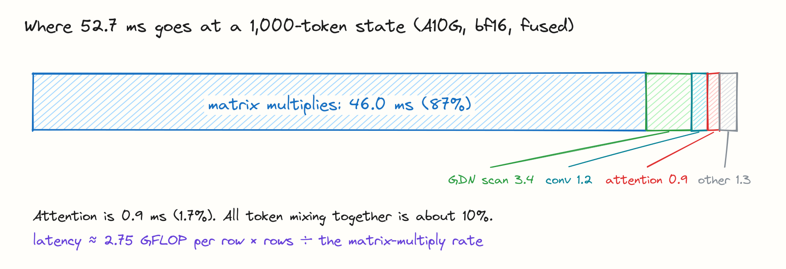

This section derives the lowest possible latency for a decision from the model's size and depth, the numeric precision, and the GPU's arithmetic rate and memory bandwidth. It then explains which ideas could matter and which could not.

### Notation

A decision request is one forward pass with no token generation; the answer is read at a few rows. The request has $N$ rows: the state's tokens plus every question's tokens.

| symbol | meaning | hobson-v19 |
|---|---|---|
| $N$ | rows in the request | e.g. 1,100 for a 1,000-token state and one question |
| $L$ | layers | 24 |
| $L_A$ | full-attention layers | 6 (the other 18 are GDN) |
| $d$ | width | 2048 |
| $d_A$ | attention query width (heads × head size) | 8 × 256 = 2048 |
| $P$ | weights used by matrix multiplies | about 1.37B. The 0.5B embedding table is excluded: a lookup involves no multiply, and there is no output layer. |
| $b_p$ | bytes per weight at precision $p$ | 2 (bf16), 1 (int8), 0.5 (int4) |
| $R_p$ | peak dense tensor-core rate | 3090: 71 (bf16, fp32 accumulation), 142 (fp16 accumulation), 284 (int8), 568 (int4) TFLOPS |
| $\eta$ | achieved fraction of $R_p$ | about 0.85 (0.81–0.91 measured) |
| $B$ | memory bandwidth | 3090: 936 GB/s; 4090: 1,008 GB/s; A10G: 600 GB/s |

### Where the arithmetic goes

**Projections and MLPs.** Each row passes through every layer's projections and MLP, one multiply-add per weight: $2P$ FLOPs per row, or 2.745 GFLOP for hobson. About two thirds of that is the MLPs ($3 \times 2048 \times 6144$ weights per layer); the rest is the attention and GDN projections.

**The token-mixing parts:**
- **Full attention:** about $2N^2 d_A$ FLOPs per layer for a causal model, the only term that grows with the square of length.
- **GDN:** linear in $N$, roughly 1–2% of the projection FLOPs at hobson's head sizes.
- **Norms and activations:** negligible arithmetic, but they move memory.

$$
F(N) \;\approx\; \underbrace{2PN}_{\text{projections and MLPs}} \;+\; \underbrace{2L_A d_A N^2}_{\text{attention}} \;+\; \underbrace{c_{\text{GDN}} N}_{\text{GDN scan}},
\qquad
\frac{2L_A d_A N^2}{2PN} \;=\; \frac{L_A d_A}{P}\,N .
$$

**How small attention is:**
- **For hobson** the attention share is about $9 \times 10^{-6}\,N$: 0.9% at 1,000 rows, 3.6% at 4,000. Attention would equal the rest of the model only at about 110,000 rows.
- **For a conventional all-attention transformer** ($P \approx 12Ld^2$) the share is $N/12d$, so parity comes at about 25,000 tokens for $d = 2048$.
- **Decision requests are much shorter than that.** The median gate state is 964 tokens, and JevBench's median request is 143 rows.

**Measured at 1,000 tokens** on the A10G, bf16, fused runtime, out of 52.8 ms in total:

| component | time | share |
|---|---|---|
| matrix multiplies | 46.0 ms | 87% |
| GDN scan | 3.4 ms | 6.5% |
| GDN convolution | 1.2 ms | 2.3% |
| attention | 0.9 ms | 1.7% |
| norms, activations, copies | 1.3 ms | 2.5% |

The GDN scan takes more than its FLOP share because its small per-head operations run far below the tensor-core peak.

### The two limits: loading weights, or doing arithmetic

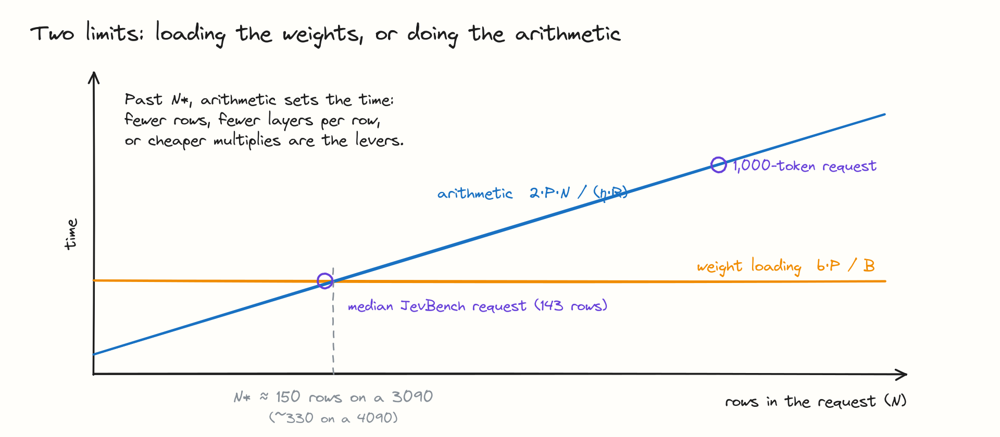

At batch 1 the GPU must do the arithmetic and also load every weight at least once:

$$
t(N) \;\ge\; t_{\text{host}} \;+\; \max\!\left(\frac{b_p P}{B},\; \frac{F(N)}{\eta R_p}\right) \;+\; t_{\text{other}}(N),
\qquad
N^{*} \;=\; \frac{b_p R_p}{2B}.
$$

- **The other terms:** $t_{\text{host}}$ (tokenizing, copies) is about 1 ms at 1,000 tokens. $t_{\text{other}}$, the memory-bound elementwise work, moves about 30 KB per row per layer after fusion.
- **The crossover $N^{*}$ is a property of the GPU.** Halving the bytes per weight usually doubles the tensor rate, so it barely changes with precision:

  | GPU | $N^{*}$ |
  |---|---|
  | A10G | about 95 rows |
  | RTX 3090 | about 150 rows |
  | RTX 4090 and Blackwell | about 330 rows |

  Weight-only 4-bit is the exception: on a 3090 it lowers $N^{*}$ to about 38 rows.
- **On Ampere, nearly every request is limited by arithmetic.** Every question adds about 100 rows. That is why smaller weights (P3, P9) and megakernels (S3) saved almost nothing on the A10G.
- **On a 4090, short requests are limited by weight loading.** For JevBench's median request, the W8A8 floor there is about 1.65 ms (J5).

**The floor in numbers,** for full 24-layer hobson. The arithmetic columns are at 100% of peak; the last column projects from the A10G's measured efficiency and non-matrix time:

| GPU, precision | weight loading | arithmetic, N = 143 | arithmetic, N = 1,000 | projected at 1,000 tokens |
|---|---|---|---|---|
| 3090, bf16 (fp32 accumulation) | 2.9 ms | 5.5 ms | 38.7 ms | about 51 ms |
| 3090, fp16 accumulation | 2.9 ms | 2.8 ms | 19.3 ms | 27.4 ms |
| 3090, int8 (W8A8) | 1.5 ms | 1.4 ms | 9.7 ms | 18.3 ms |
| 3090, int4 (W4A4) | 0.7 ms | 0.7 ms | 4.8 ms | 12.5 ms |
| 4090, fp16 accumulation | 2.7 ms | 1.2 ms | 8.3 ms | 13.7 ms |
| 4090, int8 (W8A8) | 1.4 ms | 0.6 ms | 4.2 ms | 10.7 ms |

### What each idea can change

Past $N^{*}$:

$$
t_{\text{GEMM}} \;=\; \frac{2\,(P/L)\,\sum_{i=1}^{N} \ell_i}{\eta\,R_p}, \qquad \ell_i = \text{layers row } i \text{ goes through}.
$$

| factor | ideas that change it | measured effect |
|---|---|---|
| rows $N$ | A6 compiled documents, A7 vocabulary, A3/A4/A5 compiled questions, R3 selection, M2 isolated documents | A6 0.53x rows on banking; A7 0.4–0.6x; R3 failed on accuracy |
| layers per row $\ell_i$ | R1 exit, R2/M3 depth split, R6 thin late layers | R1: 16 of 24 for 94% of decisions; R2: 8 of 24 for state rows |
| rate $R_p$ | P1 W8A8 (2x), P2 W4A4 (4x), S7 fp16 accumulation (2x), B11 2:4 sparsity (2x math) | P1 1.57x end to end; P2 fails accuracy |
| efficiency $\eta$ | S1 fused runtime, S3/B14 persistent kernels | S1 reached 0.86–0.91; S3 adds ≤ 0.7% |
| weights per layer $P/L$ | R10 smaller models, R8 low rank, R7 MoE, B12 neuron removal | narrowing ruled out (R6, R8); B12 meets the bar in layers 12–23 |
| attention | S2 kernels and mixers | 1.7% of time at 1,000 tokens |
| weight loading | P3, P9 | matters only below $N^{*}$ |

**The most each component could save** at 1,000 tokens, from Amdahl's law: if a fraction $f$ of the time becomes $s$ times faster, the speedup is at most $1/(1-f)$.

| component | f | best speedup |
|---|---|---|
| attention, made free | 0.017 | 1.017x |
| all token mixing, made free | 0.104 | 1.12x |
| int8 matrix multiplies (2x) | 0.87 | 1.77x (measured 1.57x) |
| every row through 16 of 24 layers | ~1 | 1.5x |
| half the rows | ~1 | ~2x |

**Throughput has the same limits.** Past $N^{*}$, batching cannot raise throughput beyond $\eta R_p / 2PN$, about 88 decisions per second for a 3090 in int8 at 1,000 rows.

**What 10 ms at 1,000 tokens requires** on a 3090 in int8, after about 5.5 ms of non-matrix time:

$$
\sum_i \ell_i \;\le\; \frac{4.5\text{ ms} \times 0.85 \times 284\text{ TFLOPS}}{2 \times 57\text{M}} \;\approx\; 9{,}500 \text{ row-layers}.
$$

That is about 400 rows going through all 24 layers. A 1,000-token request is about 1,100 rows × 24 layers, so the row-layer count must fall about 2.8x. The non-matrix time also scales with row-layers, so it shrinks along with them.

No single measured idea reaches that on a 3090; combinations do (arithmetic, untested together):
- compiled documents (A6/M2, 0.53x rows) with the layer-16 exit (R1, 0.67x layers): 0.36x;
- the domain vocabulary (A7, about 0.5x rows) with the exit: 0.33x;
- the depth split (R2) alone: 0.35x of the state's row-layers.

Making attention faster doesn't change $\sum_i \ell_i$ at all.

### Projections to other GPUs

**Method (arithmetic):**
- matrix-multiply time scales with each card's dense tensor peak at its precision;
- memory-bound kernels scale with its DRAM bandwidth;
- efficiency equals the A10G's measured efficiency;
- host time (about 1.2 ms) is excluded.

Nothing was measured on a 3090, 4090 or 5090.

| full 24-layer hobson, 1,000 tokens, ms | A10G (measured) | RTX 3090 | RTX 4090 | RTX 5090 |
|---|---|---|---|---|
| bf16 (fp16 accumulation on GeForce, S7) | 52.7–57.0 | 27.4 | 13.7 | 10.0 |
| W8A8 (P1), hobson's layout | 36.3 | 19.9 | 11.6 | 7.9 |
| W8A8, compiled question schema (A3; needs a retrained model) | 33.5 | 18.3 | 10.7 | 7.3 |
| W4A4, compiled schema (P2; fails accuracy) | 21.7 | 12.5 | 8.1 | 5.3 (NVFP4) |
| W4A4, 15 questions, compiled schema | 25.6 | 16.3 | 9.8 | 6.6 |
| **C1: k64rr + layer-16 exit, hobson's layout (meets the fidelity bar)** | 23.8 (arithmetic from measured segments) | **13.1** | **7.8** | **5.3** |
| exact context parallelism, 4 GPUs, bf16/fp16 accumulation (S5, predicted) | 15–17 | 8–10 | 5–6 | – |

- **At 4,000 tokens,** W4A4 with a compiled schema projects to 49.6, 31.1 and 20.4 ms on the 3090, 4090 and 5090.
- **The non-matrix floor.** At 4 bits, memory-bound work is 52–69% of the time on Ada and Blackwell. Shrinking it is the next systems step after accurate 4-bit arithmetic.

## Result figures

These figures put every scored idea on common axes.
- **Labels and the baseline:** points and lines carry the IDs used in this report. hobson-v19 is the black star in the scatter plots, the black line in the latency curves and the first box in the box plots.
- **Encoding:** colour (Okabe–Ito, readable with colour-vision deficiencies) and marker shape both follow the category:

  | marker | category |
  |---|---|
  | ■ | P |
  | ⬟ | B |
  | ▲ | R |
  | ▼ | A |
  | ⬢ | M |
  | ✚ | C |
  | ◆ | HW |
  | ● | E |

  Hollow markers are smaller models (controls), and the figures stay readable in greyscale.
- **Estimates:** a latency marked "(est.)" is arithmetic from measured matrix-multiply times, not an end-to-end measurement.
- **Data and regeneration:** the plotted numbers are in `figures/data/*.csv`. To regenerate everything, run `bash ~/decider2/analysis/run_all.sh` (about 35 s).

**Figure 1: accuracy against calibration.**
- **Axes:** accuracy against Brier score (lower is better calibrated), on JevBench and on REAL-label, with a zoom on the cluster around hobson.

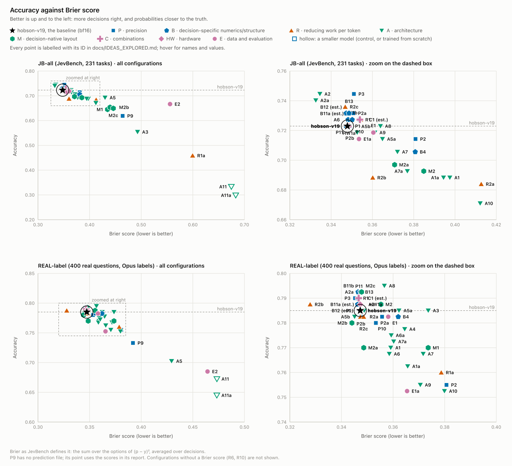

**Figure 2: accuracy against speed.**
- **Axes:** accuracy against speedup over hobson at a 1,000-token state.
- **The frontier:** the step line marks configurations that no other configuration beats on both axes.

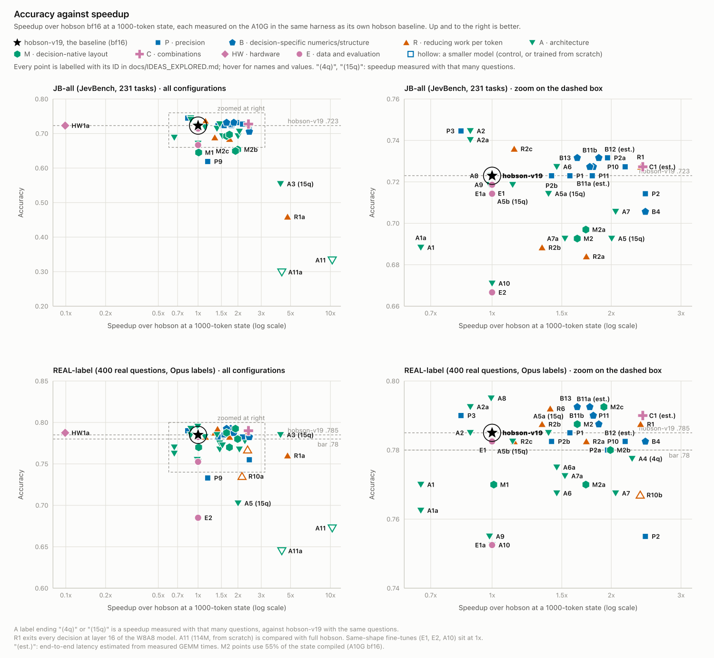

**Figure 3: latency against state length.**
- **The curves:** measured latency against state length (log-log), in six panels by theme, with hobson's curve in each.
- **Where they separate:** the curves converge at short lengths, where fixed costs dominate, and spread apart at long ones.

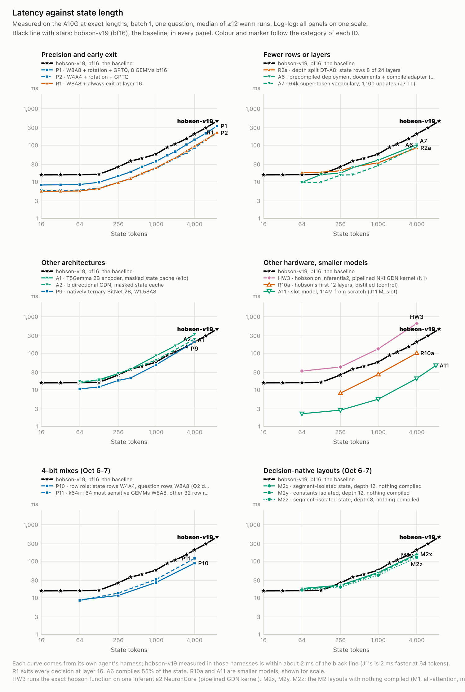

**Figure 4: modeled latency per request.**
- **The boxes:** per-request latency on JevBench and on real traffic.
- **How it's computed:** each request's latency is read off the measured curves at its own token count.

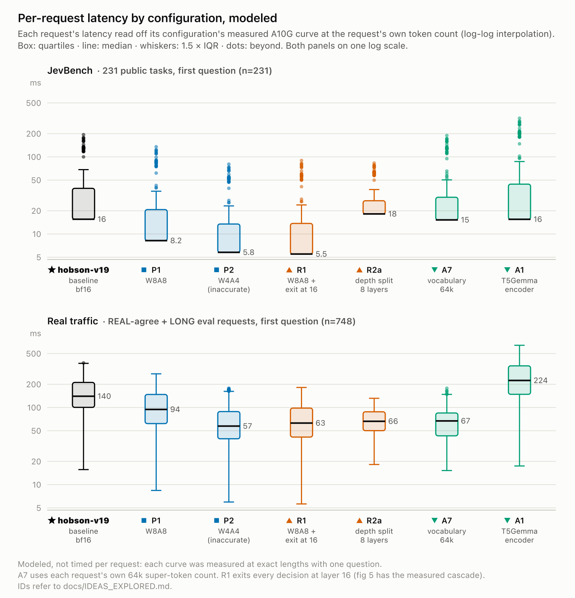

**Figure 5: timed latency per request.**
- **The requests:** per-request latency timed end to end on J15's 120 real requests, J9's 84 banking requests, and the same 120 requests on the C1 box.

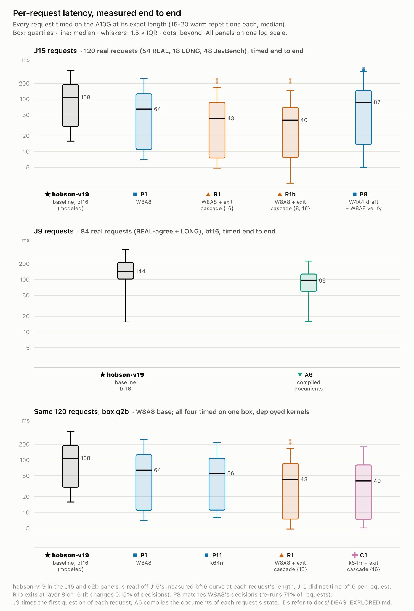

**Figure 6: timed latency against length.**
- **The data:** the same timed requests as figure 5, plotted against state length.

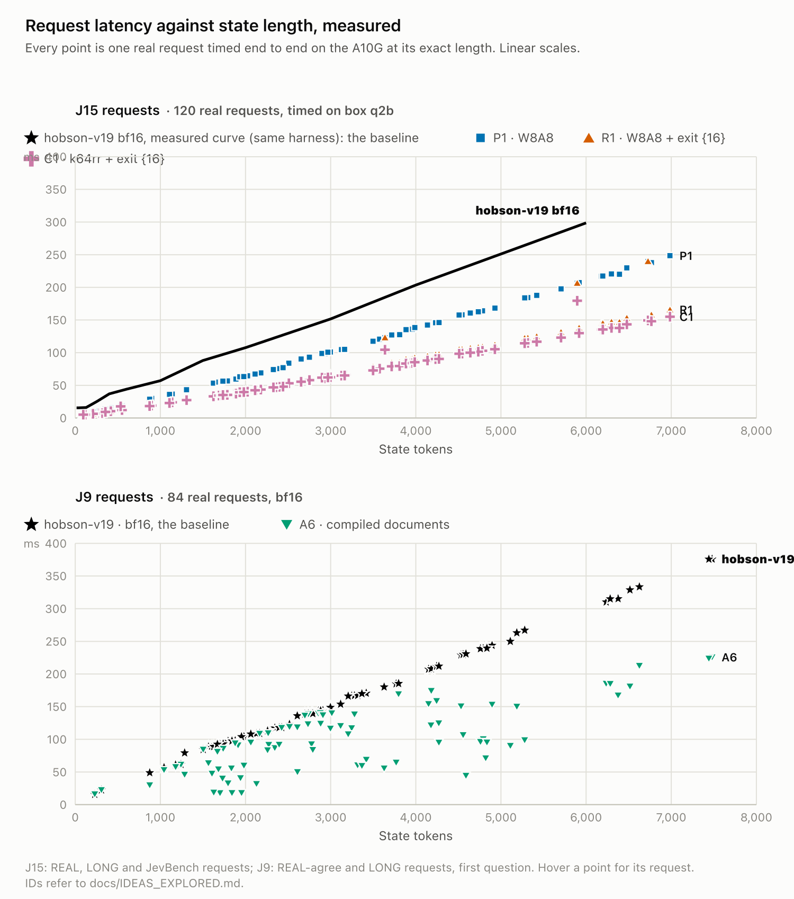

**Figure 7: accuracy and calibration against latency.**
- **Axes:** JevBench accuracy and Brier score against latency at a 1,000-token state, with one question, on the A10G.
- **The frontier:** the Pareto frontier marks configurations that no other is both faster and better than.

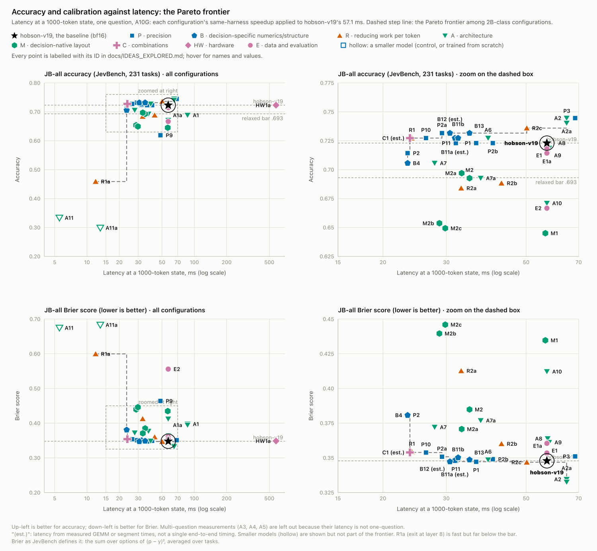

## S · Systems: run the same model faster

These ideas leave hobson's weights and function unchanged and change only how the forward pass runs on the hardware. In the wall-time floor they act on:
- the efficiency η, meaning how close the matrix multiplies run to the tensor-core peak;
- the host time t_host and the memory-bound time t_other;
- in two cases, on the rate R_p (fp16 accumulation, S7) or on how many rows each GPU has to process (S5).

Because the function is meant to stay the same, the fidelity bar applies: decisions must stay at the bf16 runtime's own noise floor.

Almost all of the gain came from one step. Removing the stock engine's overhead (S1) cut latency at 1,000 tokens by 2.8x, the largest single gain in the program. After it, the GPU spends 87% of its time in matrix multiplies that run at 86–91% of their standalone speed. That leaves little for any other single-GPU systems idea: megakernels, layer streaming, attention kernels and Strassen are each worth a few percent at most, or nothing.

Three cheap measures are in use:
- one packed pass for several questions (S6);
- fp16 accumulation on GeForce cards (S7);
- the Rust tokenizer (S8).

The one systems idea that could reach about 10 ms at 1,000 tokens with no change to the function, splitting a request across four GPUs (S5), was never measured, because no 4-GPU machine was available.

### S1 · A lean fused runtime: the same model, 2.8x faster at 1,000 tokens

- **Background:**
  - The stock strands-decider engine runs hobson through Hugging Face PyTorch in eager mode: each operation is dispatched from Python, and the LoRA adapter is applied as a separate, unmerged module on every projection.
  - A 64-token request launched 3,054 GPU kernels and 11,700 framework operations. Only 24 ms of its 67.5 ms was GPU kernel time, and the unmerged LoRA alone added 74% of the kernels.
- **Motivation / intuition:**
  - A decision is one forward pass whose shapes are fully known before it starts, and nothing is generated afterwards. So nothing needs per-operation dispatch.
  - The whole pass can be recorded once per exact length as a CUDA graph: a captured sequence of kernels replayed with a single launch.
  - The memory-bound steps between matrix multiplies (norms, activations, residual adds) can be fused into neighbouring kernels.
  - The arithmetic itself is about 2.75 GFLOP per row, or about 39 ms for 1,000 rows at a 3090's 71 TFLOPS bf16 peak. So the 60–65 ms Brooker measured for hobson-v19 on a 3090 pointed to overhead, not arithmetic.
- **What we did** (D round, agent d1; `~/decider2/d1/lean2.py`):
  1. merged the LoRA into the weights;
  2. rewrote the forward as a lean runtime on fla's GDN kernels and PyTorch's fused attention (SDPA);
  3. captured a CUDA graph per exact length;
  4. climbed a fusion ladder, timing each step:
     - fused residual add + RMSNorm (1 kernel instead of 10);
     - a fused gated RMSNorm on the GDN output;
     - a fused SiLU·mul;
     - fused attention preparation, covering q/k norms, rotary position embedding and the sigmoid gate (1 kernel instead of 36);
     - a convolution + SiLU + l2-norm kernel that also removes fla's input copies;
     - SwiGLU computed in the epilogue of the gate/up matrix multiply;
     - finally, every RMSNorm folded into the next matrix multiply. The norm weight is multiplied into W, the per-row scale is applied in the epilogue, and the previous GEMM's epilogue accumulates the residual add and each row's sum of squares.

  Lengths are exact rather than padded to buckets. The stock runner's buckets put a 1,000-token state plus its question at 1,280 rows, 20% wasted work.
- **Results** (A10G, median ms, exact lengths, one question):

  | step | 64 | 256 | 512 | 1,000 | 2,000 | 4,000 tokens |
  |---|---|---|---|---|---|---|
  | stock engine (LoRA unmerged, eager) | 67.5 | ~70 | 86.3 | 148.7 | 278.3 | 519.8 |
  | lean runtime + CUDA graph | 11.1 | 19.3 | 36.4 | 74.1 | 149.4 | 296.2 |
  | + all fusions | 9.4 | 15.7 | 28.3 | **52.7** | **104.1** | **200.5** |

  - **Kernel count:** the fused graph at 1,000 tokens runs 382 kernels instead of 1,487, with 0.007 ms of gaps between them.
  - **Where the time goes at 1,000 tokens:** matrix multiplies take 46.0 ms (59.6 TFLOPS, 86–91% of the same multiplies run bare), GDN 3.4 ms, the GDN convolution 1.2 ms, attention 0.9 ms and everything else 1.3 ms.
  - **Accuracy:** final hidden states match the unfused runtime at cosine ≥ .99987, with relative error .0045, which is the size of bf16 re-association noise. Probabilities move by at most 0.003, and no decision changes.
  - **Against `torch.compile`:** on the same forward it reached 58.3 ms at 1,000 tokens, 10–14% slower than the hand-fused path. The compiler can't fuse SwiGLU across the split gate/up output or fold RMSNorm into the next multiply.
- **Why it came out that way:** the overhead wasn't launch gaps inside the graph, which were under 0.6% even before fusion. It was framework dispatch and unfused fp32 elementwise work. Before fusion, norms alone took 15 of the 27.5 ms of non-matrix time at 1,000 tokens.
- **Context for published latencies:**
  - This overhead explains Brooker's 60–65 ms for hobson-v19 on a 3090, and most of the encoder's apparent 2x lead (A1).
  - Measured in the same fused runtime at 1,000 tokens:

    | model | latency |
    |---|---|
    | ModernBERT-base (110M) | 12.5 ms |
    | ModernBERT-large (343M) | 28.5 ms |
    | Laya, ModernBERT-large plus a 2-layer head | 31.0 ms |

    Laya's published 5.8 ms median corresponds to about 128 tokens.
  - this-that-model's published 30.9 ms is for 176–183-token prompts on an RTX 5080 laptop GPU; the fused runtime does that workload in 16 ms on an A10G. Published decision-model latencies are probably measured on short inputs.
- **Conclusion:** the largest single speedup in the program, with no change to the function. Every later measurement in this report starts from this runtime.

### S2 · Faster or replaced attention: a small part of a decision's time

- **Background:**
  - In a standard transformer, attention's cost grows with the square of the length, and much of the inference literature targets it:
    - kernels: FlashAttention 3 and 4, TLX, flash decoding;
    - memory managers for generation: paged attention, vAttention;
    - replacement mixers: state-space models such as Mamba, linear attention, RWKV, Titans.
  - hobson is already a hybrid. 18 of its 24 layers are Gated DeltaNet (GDN), a linear-attention recurrence whose cost grows linearly with length, and only 6 are full attention.
- **Motivation / intuition:** if attention dominated a decision's time, a better kernel or a cheaper mixer would be the main speedup. That is the usual first guess for any transformer.
- **What we did:**
  - profiled the fused runtime component by component (S1);
  - computed attention's share of the arithmetic from the model's shapes (see the section [The floor on wall time](#the-floor-on-wall-time));
  - J1 tested local (windowed) attention in an encoder.
- **Results:**
  - **At 1,000 tokens:** attention takes 0.9 of 52.7 ms (1.7%). All token mixing together, attention plus the GDN scan and its convolution, is about 10%.
  - **At 4,000 tokens:** attention takes 8.0 of 200.5 ms. That kernel is already a flash kernel running at 49 TFLOPS. GDN takes 12.5 ms.
  - **The bound for any kernel or mixer:** at most about 0.5 ms at 1,000 tokens and about 5 ms at 4,000.
  - **Local attention (J1):** windows of 512 tokens on 21 of 26 encoder layers saved 0% at 1,000 tokens and 11% at 4,000, and lowered state-dependent agreement on LONG from .842 to .758.
  - **Generation-time machinery doesn't apply.** Flash decoding and paged attention manage a key-value cache that grows during generation. A decision has no decode phase, and its whole per-request state (attention keys and values plus GDN states) is at most about 68 MB.
- **Why it came out that way:**
  - At decision lengths the cost is weights × tokens, not tokens × tokens. Attention's share of the arithmetic is about 9 × 10⁻⁶ × N, or 0.9% at 1,000 rows, and it would equal the rest of the model only at about 110,000 rows.
  - The exception is a model with full attention in every layer at long lengths. In BitNet (P9), 30 attention layers took 45 of 206 ms at 4,000 tokens.
- **Conclusion:** on GPUs, attention kernels and mixers can't move decision latency by more than a few percent. Mixer choice matters on Inferentia instead, where GDN's small chunked solve runs poorly on a systolic array (HW3, M1).

### S3 · Megakernels: little idle time left to recover

- **Background:**
  - A megakernel, or persistent kernel, runs a whole forward pass or a long chain of layers in one GPU launch. Thread blocks stay resident and pull tasks from a queue, so there are no gaps between kernels, and the next layer's weights can load while the current layer computes.
  - The published megakernels are all for token generation (decode), where each step is tiny and launch overhead dominates:

    | system | reported result |
    |---|---|
    | Hazy Research's Llama-1B | 78% of H100 bandwidth, 1.5x over SGLang |
    | MPK | up to 1.7x |
    | Ada-MK | up to 23.6% on an L20 |
    | AutoMegaKernel | up to 1.08x on an A10G |
- **Motivation / intuition:** a decision is a single pass with every row known up front, an ideal target for one persistent schedule. If launch gaps or unoverlapped weight loads were a large share of the time, a megakernel would remove them.
- **What we did:**
  - **d1:** measured the gaps inside the CUDA graph, then built a persistent Triton prototype over four consecutive MLP blocks. It uses an on-GPU ticket scheduler and per-(layer, row-block) counters, so layer l+1 can start on a block of rows as soon as layer l has finished it.
  - **J5:** decomposed a short request's time to bound what any persistent design could save.
  - **B14:** later built and measured a full persistent kernel for short requests.
- **Results:**
  - **Gaps at 1,000 tokens:** 0.007–0.12 ms, under 0.6% of the time. The GPU is 86–91% busy in matrix multiplies.
  - **The prototype:** 1.006–1.007x faster than the same tiles launched separately, at 256 and 1,000 tokens.
  - **Row order:** cross-layer pipelining needs tasks taken in row order, and that order cost 13–20% because consecutive tiles no longer reused the same weights from L2 cache. The chain also has no parallel slack at batch 1: a row block's down projection needs all of that row block's gate/up tiles first.
  - **Short requests (J5):** at 140 rows, W8A8 takes 7.4 ms against a floor of about 3.2 ms. Removing fixed per-kernel costs and overlapping weight streams could save at most about 2.7 ms (35%).
- **Conclusion:**
  - At 1,000 tokens there is nothing to recover.
  - For short requests the bound was about a third, but B14's measured persistent kernel was 12–15% slower than a CUDA graph of tuned kernels. Tile efficiency, not launches, limits short requests on the A10G.

### S4 · Layer streaming and co-scheduling: the GPU is already busy

- **Background:**
  - *Asynchronous layer streaming* runs successive layers partly in parallel. One version treats pairs of layers as independent, which is approximate and works only if each layer changes its input little. The other is an exact chunk-by-layer wavefront: layer l+1 starts on the first chunk of tokens while layer l works on the second, which is valid for causal and recurrent layers.
  - *Co-scheduling* runs two networks on one GPU at once to fill units the other leaves idle.
- **Motivation / intuition:** in deep residual networks each layer usually changes the residual stream only slightly, and prior work runs pairs of layers in parallel with small loss. A single batch-1 pass might leave enough of the GPU idle for overlap to pay.
- **What we did** (D round):
  - measured how much each layer changes the residual stream, and tried cheap predictors of a layer's update;
  - ran pairs of layers in parallel;
  - timed an exact chunk-by-layer wavefront against the fused runtime;
  - ran two independent forward passes concurrently, which bounds any gain from overlap.
- **Results:**
  - **Layer updates are not small:** 0.34–0.65 of the residual norm. Cheap predictors explain 0–10% of an early layer's update.
  - **Parallel layer pairs** keep decisions only in layers 14–23.
  - **The exact wavefront** gains 5–7% over the fused baseline, and the concurrent-forward ceiling is 6–21%.
  - **Co-scheduling** two networks on one GPU was slower than running them back to back. The literature's 1.3–2.2x throughput gains come from large batches.
- **Why it came out that way:** after S1 the GPU is 86–91% busy in matrix multiplies, so there is little idle hardware for overlap to fill.
- **Conclusion:** at most 7% on one GPU; not worth building. The same wavefront idea pays across GPUs (S5), where each GPU gets a quarter of the rows.

### S5 · Exact context parallelism: split the tokens across 4 GPUs

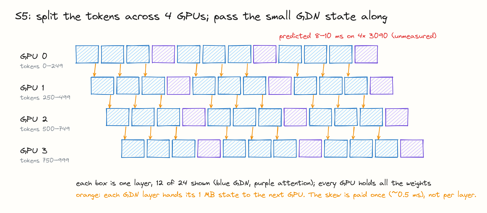

- **Background:**
  - Context parallelism splits the rows of a single request across GPUs, each holding a full copy of the weights.
  - Work done row by row (all matrix multiplies, norms and MLPs) needs no communication; only token mixing crosses GPU boundaries.
  - For an all-attention transformer that means gathering other GPUs' keys and values at every layer.
- **Motivation / intuition:**
  - hobson's hybrid makes the split cheap.
    - **GDN layers:** each summarizes everything before a point in a fixed recurrent state of 1 MB (16 heads × 128 × 128 values in fp32). So GPU r needs only that state from GPU r−1, plus a 3-row convolution halo (49 KB).
    - **The 6 attention layers:** each GPU needs the keys and values of the GPUs before it, 2 KB per token.
  - All dependencies point to earlier tokens, because the model is causal. Handing the state along GPU by GPU therefore forms a wavefront. The delay between neighbouring GPUs is set once, at the first GDN layer, and stays constant after that, so the total overhead is about (P − 1) × (one GDN pass + one transfer) once, not once per layer: about 0.5 ms at 1,000 tokens on 4 GPUs.
  - The function is unchanged by construction. The state is carried in fp32, as one long kernel would carry it, and chunk boundaries are aligned to 64 tokens so fla's chunk grid matches the single-GPU run.
- **What we did** (F6):
  - wrote a context-parallel runtime on the fused per-GPU engine (S1), including:
    - an NCCL wrapper designed for CUDA-graph capture;
    - three GDN modes: hop-by-hop relay; an affine relay as in ZeCO; fla's all-gather scheme;
    - a layer-split pipeline as an alternative;
    - unit tests;
    - a driver that checks exactness against the single-GPU engine;
  - recorded latency predictions before any run.

  No 4-GPU instance (g5.12xlarge, g5.24xlarge, g6e.12xlarge) became available in us-west-2 in about 8 hours of retries, so nothing ran on a GPU. The code lived in the `/tmp` tree that a laptop reboot later wiped; a measurement would need it rewritten.
- **Results** (pre-registered predictions; arithmetic on d1's measured single-GPU anchors; forward pass only, host adds about 1.2 ms):

  | configuration | 1,000 tokens | 4,000 tokens |
  |---|---|---|
  | 1× A10G (measured) | 52.7 ms | 200.5 ms |
  | 4× A10G | 15–17 ms | 56–58 ms |
  | 4× RTX 3090, fp16 accumulation (S7) | 8–10 ms | 30–35 ms |
  | 4× RTX 4090, fp16 accumulation (speculation) | 5–6 ms | 17–20 ms |

  - **GPU time per request** is 1.2–1.4x one GPU's (about 64 GPU-ms on 4× A10G against 52.7), because every GPU still streams all the weights.
  - **fla's all-gather scheme** was predicted to lose for two reasons. It synchronizes all GPUs at every GDN layer, and each GPU receives about 108 MB per forward. Its fp32 merges run as TF32 on Ampere, so it isn't bit-exact.
- **Conclusion:** the only route found to about 10 ms at 1,000 tokens on 3090-class cards with the function unchanged. It buys latency, not cost, and it is still unmeasured.

### S6 · One packed pass for several questions

- **Background:**
  - Real banking hook requests carry 1, 4, 8 or 15 questions over the same state, and question tokens are 10–40% of all tokens.
  - Sending each question as its own request repeats the entire state computation.
- **Motivation / intuition:**
  - Questions over one state can share it. The state rows run once, and each question's rows continue from the state's GDN states and attention keys and values, masked from the other questions.
  - Since a decision generates nothing, this is pure prefix sharing within a single forward pass, with no cache to manage across requests.
- **What we did:**
  - **D round:** built a packed multi-question forward in the lean runtime (`~/decider2/systems/`).
  - **J8:** later confirmed, in its pure-PyTorch port, that a state-once path is identical to separate passes.
- **Results:**
  - **Cost of extra questions:** 3 extra questions over a 1,000-token state add 14 ms in the fused runtime, against 64 ms with the stock engine. Decisions are identical to separate passes. For 15 questions, the packed pass is about 5x faster than 15 separate passes.
  - **What remains:** question rows still go through all 24 layers. In bf16 at 1,000 tokens, the 15 most frequent banking questions (3,720 question tokens) take 237.4 ms, against 57.0 ms for one question. On a 3090 the 15 questions add about 35 ms.
- **Conclusion:** use it. It makes the state's cost shared, which leaves the question rows themselves as the cost of multi-question requests. That is what the compiled-question ideas (A3, A4, A5) attack.

### S7 · fp16 matrix multiplies with fp16 accumulation: 2x on GeForce cards

- **Background:**
  - Tensor cores multiply 16-bit inputs and add the products into an accumulator. bf16 always accumulates in fp32.
  - GeForce cards (RTX 3090, 4090, 5090) run fp16 inputs with fp16 accumulation at twice the rate of fp32 accumulation: 142 against 71 TFLOPS on a 3090.
  - Data-center parts such as the A10G and A100 run both at the same rate. NVIDIA's libraries default to fp32 accumulation, so most inference stacks never use this 2x.
- **Motivation / intuition:**
  - fp16 sums keep about 11 bits of precision and overflow above 65,504, so for a general LLM the risk is hard to bound over every possible output.
  - A decision model's output is a few probabilities, so the question becomes concrete and testable: do any real decisions change?
- **What we did** (D round):
  - ran hobson's matrix multiplies in Triton with fp16 accumulation on the A10G, which gives the same numerics as a GeForce card without the speed;
  - compared decisions with the fp32-accumulating runtime on real questions;
  - checked on the A10G that both accumulation modes run at the same 67.5 TFLOPS there, confirming that the speedup can only be projected, not measured, on these boxes.
- **Results:**
  - **Per multiply:** fp16 accumulation raises relative error from 2.1 × 10⁻⁴ to 2.35 × 10⁻³ at an inner dimension of 2,048.
  - **Decisions:** 0 of 680 real decisions changed.
  - **Projected at 1,000 tokens:**

    | GPU | latency |
    |---|---|
    | RTX 3090 | 27.4 ms (bf16 with fp32 accumulation: about 51 ms) |
    | RTX 4090 | 13.7 ms |
    | RTX 5090 | 10.0 ms |
- **Conclusion:** use it on GeForce cards for any multiply not already in 8 bits. It is the only change found that doubles the arithmetic rate with no measurable effect on decisions and no change to the weights. It still needs confirming on real GeForce hardware.

### S8 · Rust tokenizer: host time sits directly on the critical path

- **Background:**
  - Before the GPU starts, the host renders the request, tokenizes it, finds the readout positions and copies the token ids to the GPU.
  - The Hugging Face Python tokenizer took 1.61 ms per 1,000 tokens and 6.23 ms at 4,000 tokens on the box's CPU.
- **Motivation / intuition:** a decision is a single pass, so nothing hides host time behind GPU work. Against a 10 ms budget, 1.6 ms of tokenizing would be 16%.
- **What we did** (d1):
  - tokenized with the Rust tokenizer's `encode_batch` over 8 line-aligned chunks of the request in parallel;
  - copied ids to the GPU as pinned 32-bit arrays instead of a Python list converted to 64-bit tensors.
- **Results:**
  - **Tokenizing:** 0.82 ms at 1,000 tokens and 2.14 ms at 4,000, with token ids identical to the Python tokenizer on 24 of 24 real banking states.
  - **Copy to the GPU:** 0.095 → 0.049 ms.
  - **All host preparation:** 1.74 → 1.18 ms at 1,000 tokens, and 6.32 → 2.42 ms at 4,000.
- **Conclusion:** use it. Host work is now about 1.2 ms at 1,000 tokens, carried as $t_{\text{host}}$ in the floor equation (see the subsection [The two limits](#the-two-limits-loading-weights-or-doing-arithmetic)). It is still about an eighth of a 10 ms budget, so moving tokenization onto the GPU is a possible later step.

### S9 · Activation sparsity and library 2:4 sparsity

- **Background:** two kinds of sparsity can skip arithmetic.
  - **Activation sparsity:** if most of an MLP's neurons output (near) zero for a token, the matching rows of the down projection can be skipped. Models with ReLU MLPs often have this, and "preview the activations and skip negligible sub-matrices at run time" is a common proposal for beating the arithmetic floor.
  - **2:4 structured sparsity:** Ampere tensor cores have a mode that skips 2 of every 4 weights, if the weights were pruned in that pattern. B11 describes it in detail.
- **Motivation / intuition:** if hobson's MLPs fired sparsely on decision inputs, a run-time skip could remove much of the MLPs' work, which is two thirds of the arithmetic.
- **What we did:**
  - measured how concentrated hobson's MLP activations are, including an oracle that splits each early-layer MLP (layers 0–7) into 16 neuron groups and keeps the best 4 per token;
  - timed NVIDIA's cuSPARSELt library for fp16 2:4 sparse multiplies at hobson's shapes, as kernels only.
- **Results:**
  - **Activations are dense.** The oracle's best 4 of 16 groups hold only 29–34% of the activation mass. Routing to them agrees with hobson on .51 of long tasks, and even a perfect router would save about 11% of the MLP work.
  - **The library's 2:4 kernels are shape dependent:**

    | projection | sparse against dense |
    |---|---|
    | down | 1.54x faster at 1,024 rows, about 2x at 2,048 |
    | gate/up | slower: 1,090 against 910 µs at 1,024 rows; 280 against 240 µs at 256 |
    | GDN input projection | no faster: 690 against 610 µs |

    The mix averages 1.0–1.3x.
- **Why it came out that way:** SwiGLU multiplies a smooth SiLU gate by a linear branch, so unlike ReLU it produces few exact zeros. The 2:4 slowdowns came from the library's tile configurations, not from the hardware. Q4's custom `mma.sp` kernels (B11) later beat dense int8 at every size from 140 rows up, by 1.32–1.71x at 1,125 rows. CUTLASS's sparse kernels also win on most shapes once their tiles fit the A10G's 99 KB of shared memory.
- **Conclusion:** skipping activations isn't worth it for hobson. 2:4 weight sparsity is, but with custom kernels and with the kept weights chosen by the decision's sensitivity (B11).

### S10 · Strassen–Winograd: fewer multiplies, but not faster on tensor cores

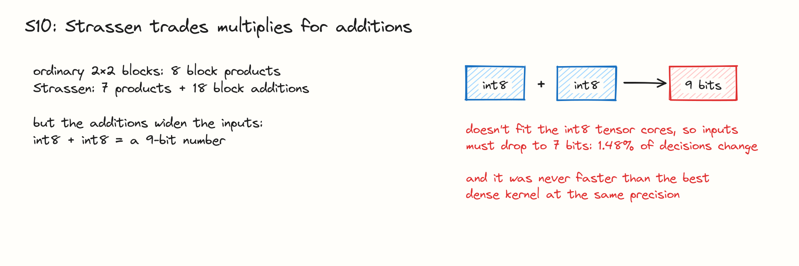

- **Background:**
  - Strassen's algorithm multiplies 2 × 2 block matrices with 7 block products instead of 8, at the cost of 18 block additions; applied recursively, it lowers the asymptotic cost below n³.
  - Winograd's variant needs fewer additions, but each of its sums adds four blocks rather than two.
- **Motivation / intuition:**
  - Matrix multiplies are 87% of hobson's time, and on tensor cores the multiplies are the expensive part.
  - If the additions could be folded into the kernel's operand loads, one level would cut the arithmetic to 7/8 and two levels to 49/64. The model and its weights would be unchanged.
- **What we did** (Q4):
  - wrote one-level Strassen fused into a single kernel, with the 7 products through one pipeline and combined in registers;
  - built it in int8 (on 7-bit codes), int4 (on 3-bit codes) and bf16, with integer results bit-exact;
  - ran two levels with the outer level unfused;
  - used Strassen's original two-term form for integers, because Winograd's four-block sums would cost two bits instead of one.
- **Results:**
  - **Speed** (A10G, hobson's shapes):
    - **The products alone:** one level against the identical kernel run dense, not counting the operand sums, is 0.86–1.21x at 1,125 rows and 0.34–0.95x at 140 rows.
    - **Including the sums,** against the best dense kernel at the same precision: never faster, at 0.32–0.98x. At 1,125 rows that is 0.67–0.86x for int8, 0.61–0.81x for int4 and 0.75–0.92x for bf16.
    - **Two levels:** 0.25–1.04x even before the sums are counted.
  - **Accuracy:**
    - The sum of two int8 blocks needs 9 bits, so the inputs must drop to 7 bits to fit the int8 tensor cores. Median per-multiply error rises from 1.04% to 2.12% (7-bit inputs) and to 2.29% with one Strassen level.
    - With 7-bit inputs, 1.48% of REAL decisions change (bar 0.7%; 8-bit inputs with the same plain rounding change 0.83%). CF retention is .945, and the McNemar test against the bf16 runtime gives p .007.
    - In int4, the 3-bit inputs change 61% of decisions.
- **Why it came out that way:** on a GPU the block additions are extra passes over memory, and the seven smaller products tile the GPU less efficiently than one large product. Integer tensor cores also have no spare bit for the wider sums.
- **Conclusion:** doesn't help on GPU tensor cores at any precision. Asymptotically faster algorithms have constants far too large for 2,048 × 6,144 matrices.

### S11 · Decisions computed as the conversation happens (proposed, not built)

- **Background:** today every gate request is processed cold. The full state goes through all 24 layers when the decision is asked, even though most of that state was already sent in earlier gate requests in the same conversation.
- **Motivation / intuition:**
  - **Agent traffic is not a stream of unrelated requests.** The state grows turn by turn, it exists before the gate fires, and a deployment asks the same few questions each time.
  - **Incremental encoding is exact for hobson.** The mask is causal and the state comes first, so encoding the conversation as it happens gives exactly the same result as encoding it at decision time.
  - **The state to keep is small.** Each GDN layer keeps a fixed-size summary (about 18 MB in all for the 18 layers), plus about 12 KB per token for the keys and values of the 6 attention layers. An all-attention model (M1) would need keys and values for all 24 layers, so here GDN is the cheaper design.
  - **The work left at decision time is the question.** Only the question's ~100–140 tokens remain, at any state length. That costs about what a short JevBench request costs: 7.4 ms measured on the A10G in W8A8, and about 4.8 ms projected on a 3090 (P1).
  - **Precomputed answers.** If the deployment's fixed questions are evaluated in the background after each turn, the answer is ready when the gate fires. The background work grows with new tokens only.
- **What we measured** (train-split gate requests, text comparison only, no model):
  - only 18% of state tokens exactly match the start of an earlier request on the same task;
  - with the hook-specific header ignored, the figure is still 19%;
  - the median request shares 3% of its conversation text with any earlier one.
- **Why it came out that way:** the request format, not the content, prevents reuse.
  - The renderer puts a hook-specific header first.
  - It cuts 35% of states from the front ("[earlier text omitted]").
  - It inserts knowledge-base documents as notes inside the conversation.
  - The records also carry no conversation id, so the true per-conversation overlap can't be measured from this data.
- **What it would take:**
  - a request format that only ever appends to the state, with the hook text placed after the state;
  - truncation by dropping whole segments, which M2's segment isolation keeps exact;
  - a runtime that keeps each conversation's GDN states and attention keys and values between gates.
- **Where it doesn't help:** JevBench, whose tasks are independent, single-question requests over short states (median 143 rows, of which 103 are the question). There is no earlier context to reuse, and the question is most of the work.
- **Conclusion:** the one idea found that removes the state's processing from the decision's critical path, exactly. It breaks the "cold, independent requests" scope used throughout this report, so it needs that decision first.

## P · Numeric precision

Precision sets the tensor-core rate $R_p$ in the floor equation (see the section [The floor on wall time](#the-floor-on-wall-time)). On Ampere GPUs (the A10G and the RTX 3090), int8 tensor cores run at twice the bf16 rate and int4 at four times. Blackwell (RTX 5090) adds NVFP4, a 4-bit floating-point format with block scales. At 1,000 tokens 87% of hobson's time is matrix multiplies, so halving the cost of every multiply nearly halves latency. For a decision model the question is how much rounding error a handful of output probabilities can absorb before an answer changes.

hobson runs 96 matrix multiplies (GEMMs) per pass, four per layer:
- the input projection: attention's q/k/v or GDN's q/k/v and gates;
- the output projection;
- the MLP's gate/up projection;
- the MLP's down projection.

Every precision result below is about how those 96 GEMMs are rounded.

**What we found:**
- **8-bit works.** Weights and activations in 8 bits (P1) keep hobson's decisions at the runtime's own noise floor and run 1.57x faster than bf16. It is the baseline for everything after it.
- **Uniform 4-bit doesn't.** It is 2.4x faster than bf16 but changes 2–13% of decisions (P2).
- **Where the 4-bit error is not:** it is not amplified through depth (P7), it is not fixed by a better rotation (P5), and it is not mainly in the weights (P3).
- **Where it is:** in the rounding of activations, first mostly in the question rows (P10), then in the state rows of layers 0–11.
- **What met the bar:** mixing 8 and 4 bits by GEMM and by row (P11) meets the fidelity bar at 0.877x of W8A8's latency. The B section continues this program with formats aimed by the decision.

**One measurement rule came out of this work.** 4-bit decisions are mostly set by rounding noise: two numerically equivalent W4A4 runtimes, differing only in the order of floating-point operations, disagree on 12% of decisions (H2). Emulated 4-bit results therefore don't predict deployed ones, so every 4-bit number here comes from the deployed kernels unless it is marked "emulated".

### P1 · 8-bit weights and activations with a Hadamard rotation: 1.57x faster than bf16, with hobson's decisions

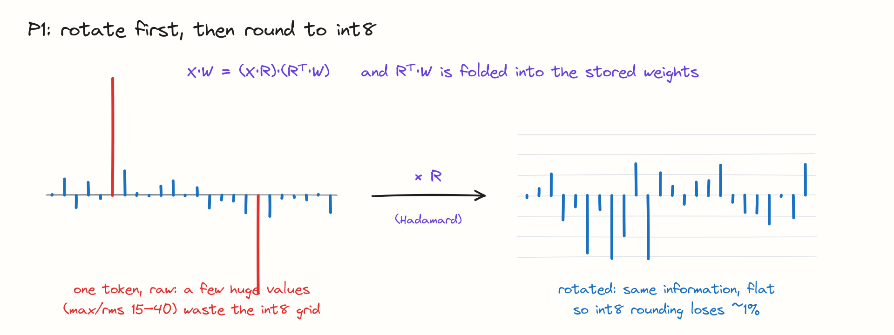

- **Background:** W8A8 rounds both the weights and the GEMM inputs (activations) to 8-bit integers, so the multiply runs on int8 tensor cores.
  - **Scales:** each activation row gets its own scale, chosen so that its largest absolute value maps to 127 ("per-token absmax"). Each output channel of the weights gets its own scale too.
  - **Why outliers hurt:** rounding error grows with the scale, so one very large value in a row coarsens the grid for every other value in that row.
  - **What the rotation does:** a Hadamard rotation (as in QuaRot) multiplies the activations by an orthogonal matrix of ±1/√n entries and the weights by its transpose. The product is unchanged, but each outlier's energy is spread evenly over all channels.
  - **GPTQ** rounds the weights one input column at a time and nudges the not-yet-rounded weights to cancel the error so far. It uses the second-moment matrix of real activations from a small calibration set.
- **Motivation / intuition:**
  - Doubling the GEMM rate is the largest change to $R_p$ available on Ampere without changing the model.
  - A decision is a few probabilities read at a few rows, so a small, unbiased rounding error should only change answers that were already close to a tie.
- **What we did** (H1 designed the format, H2 built the runtime, J5 built kernels for short inputs):
  - **The rotation:** the residual-stream rotation is folded into the weights offline. Online Hadamards sit before the attention and GDN output projections and before the down projection, where no fold is possible.
  - **Weights:** GPTQ codes with columns processed in order of activation size, calibrated on 64 real train-split states.
  - **The 8 bf16 GEMMs:** H1 measured how much each GEMM contributes to the change in the decision distribution (KL divergence from bf16). It kept in bf16 the 8 GEMMs that removed the most error per microsecond of extra time: layer 23's down projection and the output projections of layers 0, 7, 9, 10, 11, 12 and 23. This configuration is "W8A8-b8", or just "W8A8" or "b8" elsewhere in this report.
  - **The runtime:** H2 fused every quantize, rotate and dequantize step into a kernel that already touches the activation:
    - residual add + RMSNorm + per-token quantization;
    - the GDN convolution + SiLU + l2norm;
    - the GDN gated norm and the attention gate, each with its online Hadamard and quantization;
    - the online Hadamard before the down projection;
    - dequantization + SwiGLU in the gate/up GEMM's epilogue.
  - **Evaluation:** all 3,227 evaluation questions, through the deployed kernels.
- **Results:**
  - **GEMMs:** int8 GEMMs run 1.6–2.4x faster than cuBLAS bf16 at hobson's shapes (1,000–4,000 rows), at about 81% of the int8 tensor peak.
  - **End to end:** 36.3 against 57.0 ms for bf16 at 1,000 tokens (1.57x), and 142.1 against 203.6 ms at 4,000 tokens. Full table below.
  - **Short requests:** J5's kernels for small row counts take the median JevBench request (143 rows: 39 state tokens and a 103-token question) from 15.5 ms in the earlier fused bf16 runtime to 7.4 ms. Its decisions can't be told apart from the bf16 runtime's (McNemar test, p .38). That projects to 4.8 ms on a 3090 (projected).
  - **Accuracy:**
    - 0.18% of REAL decisions differ from hobson's, below the bf16 runtime's own 0.37–0.46%;
    - CF retention 1.000 and CF-probe retention .971;
    - JB-hard .523, the same as hobson's (no task lost or gained);
    - REAL-label .785.
- **Why it came out that way:**
  - **Weights and activations matter equally at 8 bits.** Weight rounding alone gives 0.77% relative error at the readout rows, and activation rounding alone 0.74%.
  - **GPTQ is the biggest single step.** Plain round-to-nearest W8A8 changes 1.20% of REAL decisions, GPTQ on all 96 GEMMs 0.83%, and GPTQ with b8 0.18%.
  - **The decision error is concentrated.** Layer 23's down projection alone carries 23% of it, while layers 14–21 together carry about 2%.
  - **Question rows carry much of the rest.** Running them in bf16 brings the change in output probabilities down to the bf16 runtime's own level: a total-variation distance between hobson's and the model's answer probabilities of .0036, against .0031.
- **Caveat on the noise floor:**
  - Running a single GEMM in fp32 with no quantization at all changes decisions about as much as one W8A8 GEMM. Any change in arithmetic re-rolls the bf16 rounding of the residual stream.
  - J15 regenerated the GPTQ codes with three calibration draws and got 1.11%, 1.02% and 0.65% REAL flips. The draws couldn't be told apart on the train-split dev set (4 against 6 flips), so a good draw can't be picked in advance. The 0.18% was a favourable draw.
- **Conclusion:** use rotated W8A8 with GPTQ and 8 GEMMs in bf16, and score each calibration draw on the full kit. It is the baseline that every later speedup is measured against.

**The low-bit runtime end to end** (A10G, median ms; the 15-question bundle is the 15 most frequent banking questions, 3,720 tokens). "Compiled questions" is the layout of A3, which needs a retrained model; it is shown here only for its speed.

| state tokens | questions | layout | bf16 | W8A8-b8 | W4A4 (fails accuracy, P2) |
|---|---|---|---|---|---|
| 1,000 | 1 | hobson | 57.0 | 36.3 | 23.5 |
| 1,000 | 1 | compiled questions | 52.8 | 33.5 | 21.7 |
| 1,000 | 15 | hobson | 237.4 | 166.4 | 103.4 |
| 1,000 | 15 | compiled questions | 56.6 | 37.4 | 25.6 |
| 4,000 | 1 | hobson | 203.6 | 142.1 | 84.7 |
| 4,000 | 15 | compiled questions | 212.2 | 151.7 | 95.9 |

### P2 · 4-bit weights and activations (W4A4): 2.4x faster than bf16, but rounding changes 2–13% of decisions

- **Background:**
  - Int4 has only 15 levels (−7 to 7), so each value is rounded to a grid of the row's largest value divided by 7.
  - Int4 tensor cores run at 4x the bf16 rate, twice int8's.
  - The same rotation and GPTQ machinery as P1 applies.
- **Motivation / intuition:**
  - W4A4 projects to about 12.5 ms at 1,000 tokens on a 3090 (arithmetic, from the A10G measurements). That is the only single-GPU route near 10 ms on a 3090 that keeps the model unchanged.
  - If the decision tolerates the rounding the way it tolerated 8 bits, it would be the biggest speedup available.
- **What we did:**
  - **H1:** the 4-bit format and per-GEMM sensitivity;
  - **H2:** deployed int4 kernels;
  - **H3:** measured how rounding error propagates;
  - **H6:** mixed 4/8-bit maps through the deployed kernels;
  - all scored on all 3,227 questions.
- **Results, speed:**
  - int4 GEMMs run 2.75–4.3x faster than cuBLAS bf16;
  - end to end, 23.5 ms at 1,000 tokens (2.4x bf16, 1.54x W8A8) and 84.7 ms at 4,000;
  - at 4 bits, 44–47% of the remaining time is memory-bound work outside the GEMMs.
- **Results, accuracy:**

  | configuration | share of GEMM work in 4 bits | REAL flips | CF retention | CF-probe retention | JB-hard |
  |---|---|---|---|---|---|
  | bf16 runtime (noise floor) | 0 | 0.37% | 1.000 | .971 | .538 |
  | W8A8-b8 (P1) | 0 | 0.18% | 1.000 | .971 | .523 |
  | W4A4, rotation + GPTQ | 100% | 8.6–9.2% | .70–.83 | .63–.71 | .46–.52 |
  | W4A4, 48 most sensitive GEMMs in W8A8 ("k48") | 53% | 2.2–2.6% | .94–.97 | .85–.91 | .54 |
  | k48 + question rows in bf16 | 53% | 1.20% | 1.000 | .924 | .538 |
  | k64 + question rows in bf16 + GDN gates in bf16 | 38% | 0.46% | 1.000 | .962 | .523 |

  - **The best mixed configuration** (last row, H6) passes every test against the in-runtime bf16: 0.28% flips, CF .973, CF-probe .971. Against hobson's own references it misses the CF-probe bar then in use (.97) by one pair.
  - **It is no faster than W8A8.** It takes 40.4 against 36.2 ms in hobson's layout, and 34.2 against 33.6 ms in the compiled-question layout. The bf16 question rows read a bf16 copy of every weight and add about 1,100 small kernels, together about 5 ms.
  - **The boundary:** the pass/fail line sits between 38% and 46% of GEMM work in 4 bits.
- **Why it came out that way** (H3):
  - **The error does not grow through depth.**
    - Relative error injected at one layer decays to 0.2–0.36x by layer 23.
    - Inside each block it stays at 0.45–1.2x the error at the block's input. The submission behind P7 reports about 30x at a standard transformer's attention output.
    - hobson's mixers are already bounded: L2-normalized GDN queries and keys, a gated RMSNorm, attention q/k norms and a sigmoid output gate.
  - **The damage is local, set by the crest factor** (a row's largest value divided by its root-mean-square).
    - At hobson's GEMM inputs the median crest factor is 15–40, so per-token int4 loses 50–70% of each activation.
    - After the Hadamard rotation the crest factor is 3.2–3.8, and the loss is 13–16%. For scale, even an ideal 4-bit code of Gaussian values has at least 6.25% relative error (2⁻⁴).
    - The crest factor doesn't change when a row is rescaled, so no normalization can lower it.
  - **Sensitivity by GEMM:**
    - layer 0's output projection, the attention input projections at layers 7 and 11, and layer 23 are the most sensitive;
    - layers 12–22 are almost insensitive;
    - by GEMM type, gate/up is the most sensitive, and the GDN gate projections the least;
    - 8-bit activations alone are nearly lossless.
- **Conclusion:** uniform 4-bit is too inaccurate on Ampere. P10, P11 and the B section all start from this finding: 4-bit error is a local rounding problem that can be placed precisely.

### P3 · 4-bit weights with 16-bit activations (W4A16): smaller weights don't help past about 150 rows

- **Background:** weight-only quantization stores weights in 4 bits and converts them to bf16 inside the kernel before multiplying, so the arithmetic stays bf16. It saves memory traffic, not arithmetic, and it is the standard trick for LLM token generation, where each step loads all the weights to process a single row.
- **Motivation / intuition:**
  - Below the crossover row count $N^{*}$ (about 150 rows on a 3090 in bf16; see the section [The floor on wall time](#the-floor-on-wall-time)), a GPU waits on weight loads rather than arithmetic, and 4-bit weights lower that crossover to about 38 rows.
  - JevBench's median request is short, so it looked weight-bound.
- **What we did** (J5): GPTQ weight-only formats (8-bit; 4-bit with groups of 64 or 128 values per scale; 3-bit; 4-bit MLPs with 8-bit mixers), scored on all 3,227 questions. Short-input kernels covered all formats.
- **Results:**
  - **Speed:** W4A16 was slower than bf16 at every length from 32 to 400 state tokens. For example, 33.1 against 27.7 ms at 400 tokens, with the same kernel family.
  - **Accuracy:**
    - every 4-bit weight-only format changes 2.2–3.2% of decisions (bar 0.7%), and plain rounding 10.8%;
    - halving the group size doesn't help;
    - 8-bit weight-only sits at the noise floor (0.37% REAL flips).
  - **The same result elsewhere:** J10 saw 4x fewer weight bytes buy only 3% at 149 rows and 7% at 1,085 rows.
- **Why it came out that way:** a decision request always carries its question, about 105 rows, so even a request with a tiny state is about 140 rows. That is at or above the crossover, where arithmetic sets the time.
- **Conclusion:** no benefit on these GPUs. Weight bytes matter only on GPUs with a much higher arithmetic-to-bandwidth ratio (an RTX 4090 for very short requests).

### P4 · NVFP4 block scales: halves int4's rounding error, needs Blackwell hardware

- **Background:** NVFP4 stores 4-bit floating-point values (E2M1: ±0, 0.5, 1, 1.5, 2, 3, 4, 6) with one 8-bit scale shared by each block of 16 values. Blackwell tensor cores (RTX 50-series) multiply it natively; Ampere and Ada can only emulate it.
- **Motivation / intuition:** with a scale per 16 values, an outlier coarsens the grid only for its own block instead of the whole row, which attacks the crest-factor problem of P2 directly.
- **What we did** (H5, H3): exact emulation on the A10G, all 3,227 questions, with and without rotation, and with question rows kept in bf16.
- **Results:**
  - **Rounding error:** NVFP4 halves int4's change in the decision distribution (paired test against int4, p .0003) and works best with no rotation at all. Per-activation rounding error is 7–9%, against 13–16% for rotated int4.
  - **Decisions:** it still changes 5.17% of REAL decisions with every GEMM in NVFP4 (CF retention .835, CF-probe .781), and 4.16% with question rows in bf16.
  - **Elsewhere:** on BitNet (P9) the same block scales cut 4-bit flips, against its 8-bit version, from 16.2% to 3.5%. A GDN hybrid has been reported to match bf16 at NVFP4 W4A4 (arXiv 2609.04098).
  - **Projection:** W4A4 projects to about 5.3 ms at 1,000 tokens on a 5090 (arithmetic).
- **Conclusion:** the only format change that clearly helped, but it can only be measured for real on Blackwell, and emulation doesn't predict deployed 4-bit results. H5's proposed test is untested:
  - NVFP4 with the sensitive GEMMs in FP8;
  - full-weight distillation;
  - real Blackwell kernels;
  - pass if it reaches under 1% flips with CF-probe retention ≥ .95.

### P5 · Learned rotations (SpinQuant): no better than a fixed Hadamard

- **Background:** SpinQuant learns the rotation matrices of P1 by optimizing the quantized model's error instead of using a fixed Hadamard matrix.
- **Motivation / intuition:** a Hadamard rotation is generic. A rotation fitted to hobson's own outlier pattern might lower the 4-bit error enough to matter.
- **What we did** (H5):
  - **What couldn't be learned:** SpinQuant's per-head rotation between the value and output projections can't be folded into hobson, because the attention output gate and the GDN gated RMSNorm sit between them.
  - **What was learned:** the residual-stream rotation (folded into the weights offline, so free at run time), per-GEMM Kronecker-factored rotations, and a clipping level.
  - **The objective:** a local, activation-weighted rounding error. The end-to-end KL objective was too noisy to train on.
- **Results** (all 3,227 questions):
  - the learned rotations lowered the 4-bit decision error by 14–25%, against the roughly 10x needed;
  - W4A4 changes 8.59% of REAL decisions with the learned rotation and 9.23% with Hadamard, and the two can't be told apart (McNemar 51 against 58, p .57);
  - in the k48 mixed map, adding the Kronecker rotations lowered flips from 3.14% to 2.22% (p .05), still 3x the bar.
- **Conclusion:** no benefit. The rotation is not what limits 4-bit accuracy here.

### P6 · LoRA quantization-aware training for 4-bit: training loss falls, evaluations don't move

- **Background:**
  - **Quantization-aware training (QAT)** fine-tunes a model with the rounding in its forward pass, passing gradients through the rounding as if it were the identity (the straight-through estimator).
  - **LoRA** trains a small low-rank update to each weight matrix instead of the full matrix.
- **Motivation / intuition:** if the model can see its own rounding during training, it might move its weights to where rounding hurts the decision less.
- **What we did:** five runs across three agents, all distilling toward bf16 hobson's decision distribution on train-split data:
  - **H1:** W4A8 and W8A8;
  - **H5:** W4A4 with learned rotations;
  - **H6:** all rows, and state rows only.
- **Results:**
  - **H1:** the W4A8 run cut training KL 3.5x with no gain on any evaluation, and the W8A8 run at learning rate 1e-4 got worse.
  - **H5:** dev KL went from .0372 to .0369.
  - **H6:** on all rows it got worse (5.6% flips at step 300). On state rows only, decisions reshuffled within noise, with the output change unchanged (total variation .010–.011).
- **Why it came out that way:** our reading is that activation rounding error differs on every token of every request, and a small fixed change to the weights can't cancel it. The training loss fell with no evaluation gain, which suggests the runs fit their training states rather than the rounding.
- **Conclusion:** no benefit at budgets of a few million tokens. B4 retried with decision-level losses, per-channel scales and full-weight distillation, with small gains.

### P7 · Hyperspherical (normalized) layers: the paper's premise doesn't hold for hobson

- **Background:** an ICLR 2026 submission argues for nGPT-style layers that keep weights and hidden vectors on the unit sphere. Its claims:
  - this stops a layer from amplifying the errors at its input, which makes 4-bit accurate;
  - retrofitting an existing model works as well as quantization-aware training.
- **Motivation / intuition:** if hobson's 4-bit errors were being amplified inside its layers, bounding the layers would fix the cause rather than the symptom.
- **What we did** (H3):
  - measured how rounding error propagates through hobson;
  - built two retrofits (a normalized head, and L2 normalization in place of RMSNorm) and compared them with plain QAT at the same training budget;
  - pretrained a tiny 35M-parameter model of each kind from scratch on 33M tokens.
- **Results:**
  - **No amplification:** hobson's relative error inside a block is 0.45–1.2x the error at its input (GDN input projection 0.50, GDN core 0.45, GDN output 0.98, MLP output 1.21, attention core 0.47), against about 30x in the paper's standard transformer.
  - **The retrofits are costly before any rounding.** They cost 5–7.6% flips in bf16. They did lower their own quantization flips (NVFP4: 9.3% to 5.4% and 4.3%), but doubling the training budget didn't recover the retrofit's own cost.
  - **QAT beat the retrofit** at equal budget (int4 p 3e-4, NVFP4 p .045).
  - **The tiny pretrained model** lost less under quantization in relative terms, but wasn't better in absolute terms. At that scale there are no outliers to fix.
- **Why it came out that way:** hobson's mixers are already bounded (see P2), and the error that remains is set by the crest factor, which no normalization can change.
- **Conclusion:** no benefit for hobson.

### P8 · Speculative precision: decisions have no generation to spread the re-run over

- **Background:** speculative decoding drafts several tokens with a cheap model and checks them all in one pass of the expensive one. That's cheap because generating a token is limited by loading weights, so checking k tokens costs about as much as generating one.
- **Motivation / intuition:**
  - Answer every request with W4A4, which costs 0.645x of W8A8 at 1,000 tokens (measured), and re-run W8A8 only when the 4-bit answer's margin between its top two options is small.
  - If 4-bit errors only flip near-ties, this would give 4-bit speed at 8-bit fidelity without first making 4-bit accurate.
- **What we did** (J15):
  - the deployed kernels;
  - a margin threshold fitted on 1,736 train-split dev questions;
  - a learned uncertainty predictor as an alternative to the margin;
  - all 3,227 eval questions, and J15's 120 real requests timed end to end.
- **Results:**
  - **Matching W8A8:** reproducing W8A8's decisions required re-running 71% of requests. The cascade took 1.27x W8A8's latency end to end (101.2 against 79.7 ms mean over 120 real requests).
  - **An oracle wouldn't be enough:** knowing exactly which 8.5% of decisions would change gives 0.71x, against a target of 0.65x.
  - **The learned predictor** did no better than the margin, and was worse on eval.
  - **Re-running only the late layers fails:** running layers 0–11 in W4A4 and layers 12–23 in W8A8 still changes 9.1% of decisions against W8A8 (10.0% for pure W4A4). The error is made in the early layers.
- **Why it came out that way:**
  - **Verifying is a full re-run.** A decision is a single pass limited by arithmetic, and the draft's partial products can't be reused, because its inputs differ from the verifier's after layer 0.
  - **The draft can't see its own error.** Flipped decisions do have smaller margins (median .10 against .44), but their 95th percentile is .35, so a safe threshold catches most requests.
  - **Newer GPUs make it worse,** because the time outside the GEMMs doesn't shrink with precision.
- **Conclusion:** slower than plain W8A8, so we dropped it. The version that works speculates on depth instead of precision: answer from layer 16 and continue only when unsure (R1).

### P9 · A natively ternary 2B model (BitNet b1.58): slower and less accurate than hobson

- **Background:** BitNet b1.58 2B4T is a 2B model trained from scratch with ternary weights (−1, 0, +1) and 8-bit activations, on 4 trillion tokens.
- **Motivation / intuition:**
  - Ternary weights are exact in int4 and FP4.
  - If activations trained low-bit from the start were also safe at 4 bits, a 2B decider would run at the int4 rate with none of the rounding damage of P2.
- **What we did** (J10):
  - **The decider:** trained by F7's recipe, 30.2M tokens distilled from hobson, with LoRA updates applied to the latent full-precision weights before ternary rounding, so the deployed weights stay exactly ternary.
  - **The runtime:** its own prefill runtime, because bitnet.cpp's GPU kernel only handles single-token generation. It includes a GEMM that unpacks 2-bit weights to int8 in registers.
  - **The 4-bit study:** crest factors, 4-bit emulation and a short 4-bit QAT.
- **Results:**
  - **Speed:**
    - 48.3 ms at 1,000 tokens in its accurate 8-bit form, against 36.3 ms for hobson in W8A8;
    - 30.1 ms with every activation in 4 bits, against hobson W4A4's 23.5 ms;
    - at 4,000 tokens, its 30 attention layers alone take 45 ms.
  - **Accuracy:**
    - JB-hard .385 against .523 (p .003), JB-all .619 against .723 (p .0003), REAL-label .733 against .785 (p .003);
    - this is below F7's 0.8B decider.
  - **Activations:** they weren't 4-bit-safe either. The down projection's input (after the ReLU² activation) has a median crest factor of 30.7, as peaked as hobson's worst. Against its own 8-bit version, per-token 4-bit activations change 16.2% of decisions, and 16-value block scales 3.5%.
- **Why it came out that way:**
  - GPUs have no ternary tensor cores, so ternary weights run on int8 hardware at hobson's W8A8 rate.
  - BitNet does 1.5x hobson's arithmetic per token and has full attention in all 30 layers.
  - Ternary weights can't absorb a Hadamard rotation (a rotated ternary matrix is no longer ternary), and the rotation is what made hobson's 8-bit work.
- **Conclusion:** slower and less accurate, so we dropped it. A ternary model with block-scaled 4-bit activations trained from the start, on a base as strong as Qwen3.5-2B, doesn't exist.

### P10 · Precision by row role: question rows in 8 bits, state rows in 4

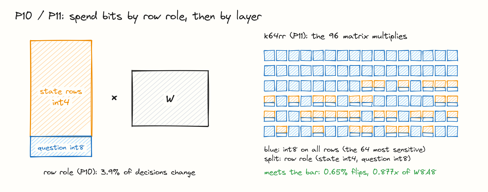

- **Background:** a GEMM multiplies a matrix with one row per token by a weight matrix, and nothing forces every row to use the same precision. "Row role" chooses each row's precision by what the row is:
  - **state rows** (the conversation, tool outputs and documents) in W4A4;
  - **question rows** (the question's text, options and `<answer>`) in W8A8.

  This is "w4q8".
- **Motivation / intuition:**
  - Q1 measured where W4A4's decision error comes from: question rows carry 79% of it, yet a one-question request at 1,000 tokens has only 125 question rows out of 1,125 (11%).
  - Question rows are the rows the pointer head reads, and the rows that do the reading of the state (A5).
  - An LLM has no such split, because every token is equally a potential output position. A decision model knows in advance which rows matter most.
- **What we did:**
  - **The kernels** (Q2): state rows run on CUTLASS int4 kernels, and question rows on an int8 GEMM on a second CUDA stream.
  - **Why the weights are stored twice:** int4 and int8 tensor cores need weights in different code formats, so each weight matrix is stored once as int4 codes for the state rows and once as int8 codes for the question rows.
  - **Evaluation:** Q1 emulated the arithmetic exactly; Q2 scored the deployed version on all 3,227 questions.
- **Results:**
  - **Accuracy:**
    - deployed, 3.88% of REAL decisions differ from hobson's (bar 0.7%), significantly more than the bf16 runtime (McNemar p < .001);
    - CF retention .835 and CF-probe retention .762;
    - Q1's exact emulation agrees closely (3.69%, .798, .676).
  - **Speed:**
    - 26.3 against 36.4 ms for W8A8 at 1,000 tokens (0.724x), 88.8 against 142.6 ms at 4,000 (0.62x), and 0.81x at 256 tokens;
    - at 64 tokens it is slower than W8A8 (9.9 against 8.6 ms), and with 15 questions it is 0.78–1.02x.
  - **Where the time goes:** GEMM time is 0.73–0.80x W8A8's, depending on the kernel build. The second weight copy costs about 2.3 ms per request, and the 125-row question GEMMs are too small to fill the GPU.
- **Why it came out that way:**
  - With question rows in 8 bits, their share of the decision error falls 200x, and state rows hold 98% of what is left.
  - **By layer:** layer 0 holds 18%, layers 1–11 hold 5–10% each, and layers 12–23 under 1% each.
  - **By source:** activation rounding alone produces a decision-margin error of 0.196 logit units, nearly the 0.200 of both together, while weight rounding alone produces 0.085.
- **Conclusion:**
  - Fast enough (inside the program's 0.75x speed bar at 1,000 tokens), but 5x the allowed flips.
  - Its lasting result is the location of the 4-bit wall: activation rounding of state rows in layers 0–11. The B section (B1–B5) attacks exactly that, and P11 avoids it.

### P11 · k64rr: 8 bits for the 64 most sensitive matrix multiplies, row role for the rest

- **Background:** H1 ranked the 96 GEMMs by sensitivity.
  - **How:** on train-split calibration questions, it ran one GEMM at a time in W4A4 and measured how far the decision distribution moved from bf16 (KL divergence).
  - **Why a ranking works:** at 4 bits these single-GEMM effects roughly add up, so a ranking is meaningful.
  - **The top of the ranking:** layer 0's output projection, layer 23's down projection, the gate/up projections of layers 8 and 2, and the attention input projections of layers 11 and 7. The sensitivity is spread out, with the top 16 GEMMs holding about half of it.
  - **The naming:** "kN" means the top N GEMMs in the ranking stay in 8 bits; "kNrr" means the other 96 − N run in row-role precision (P10).
- **Motivation / intuition:**
  - Combine the two placements that each worked partially: spend 8 bits by GEMM where the ranking says error matters (mostly layers 0–12), and by row elsewhere.
  - H6 had shown that k64 with bf16 question rows was accurate (0.46% flips) but no faster than W8A8, because of the bf16 weight copy and about 1,100 small kernels.
  - Running those question rows in int8 inside Q2's kernels removes most of that overhead.
- **What we did** (Q2):
  - k48rr, k56rr and k64rr through the deployed kernels, on all 3,227 questions;
  - in k64rr the 32 row-role GEMMs are mostly in layers 13–22, and 37.9% of the GEMM arithmetic is in 4 bits.
- **Results:**

  | map | REAL flips | McNemar against bf16 runtime | CF retention | CF-probe retention |
  |---|---|---|---|---|
  | k48rr | 1.29% | p .021 | .982 | .914 |
  | k56rr | 0.65% | p .375 | .991 | .943 |
  | **k64rr** | **0.65%** | **p .51** | **1.000** | **.962** |
  | W8A8-b8, Q2's calibration draw | 1.11% | p .039 | 1.000 | .962 |

  - **Fidelity:** k64rr meets the bar. JB-hard is .523 with no task lost or gained, and REAL-label is .790. Its decisions are closer to the bf16 runtime's than those of Q2's own draw of W8A8-b8 (1.11% flips).
  - **Speed:**
    - 31.9 against 36.4 ms for W8A8 at 1,000 tokens (0.877x);
    - 119.8 against 142.6 ms at 4,000 (0.84x);
    - 159.6 against 165.6 ms with 15 questions (0.96x).
- **Caveat:** the maps are prefixes of one ranking, and k56 was tried after k48 failed and k64 passed, so the choice between maps was made on the evaluation kit.
- **Why it came out that way:**
  - The speedup is modest because the GEMMs that can take 4 bits are the late, insensitive ones.
  - Layers 0–12 stay in int8 because they are where state-row rounding hurts (P10). Only 37.9% of the arithmetic moves to the 4x rate.
- **Conclusion:** accurate 4-bit arithmetic with a modest speedup. With the layer-16 exit (R1) it becomes C1, which meets both the fidelity and the speed bar, though most of C1's gain comes from the exit. The exit skips 25 of k64rr's 32 row-role GEMMs, which leaves layers 0–12 as the place where cheaper arithmetic would matter next.

## R · Reducing work per token

Every row of a request passes through all 24 layers, and every layer applies all of its weights to every row. The section [The floor on wall time](#the-floor-on-wall-time) writes the matrix-multiply time as proportional to $\sum_i \ell_i$, the total number of row-layers, times the weights per layer $P/L$. The ideas here try to shrink one of those factors without making the model smaller:
- **fewer layers for some rows:** R1, R2, R6;
- **fewer rows in the deep layers:** R3, R4, R5;
- **cheaper layers:** R7, R8, R9.

R10 is a reference point rather than a candidate: smaller models, measured so that the other ideas can be compared with them at equal latency.

There is a reason to expect room here that is specific to decisions. An LLM generating text needs every position's top-layer output, because any position may emit the next token. A decision model reads out only K + 1 rows per question, at the very end: the option ends and `<answer>`. A state row's deep layers matter only through what the question rows later read from them.

Cutting depth worked:
- **The layer-16 exit (R1)** changed none of 6,216 real decisions.
- **The depth split (R2)** meets the accuracy bar, with a measured loss on multi-step deduction.

Cutting rows or width did not. Every design that sent less of the state through full-width layers lost exact values such as amounts, dates and ids (R3–R6, R8).

### R1 · Exit at layer 16: the last third of hobson almost never changes a decision

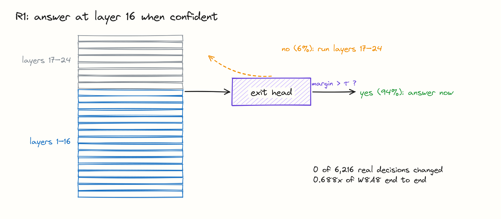

- **Background:** early exit attaches a small classifier to an intermediate layer and stops the forward pass there when that classifier is confident. CALM and LayerSkip apply it per generated token in LLMs. There, each skipped layer leaves a hole in the key/value cache that later tokens need.
- **Motivation / intuition:**
  - **A decision has no later tokens,** so stopping a pass early leaves nothing behind. If the answer is already settled in the middle of the network, layers 16–23 are pure cost.
  - **There was direct evidence before we started:** a pointer head refit on layer 15's output scores .724 on JB-all, against hobson's .723.
- **What we did (J15):**
  - **The exit heads:** J15 trained heads at layers 4–20. Each starts from hobson's pointer head plus a rank-512 adapter, reads the W8A8 model's residual stream after layer L, and is trained on train-split traffic to match the full model's output distribution (a KL-divergence loss).
  - **At inference,** the request runs the first 16 layers (0–15) and the head answers if its margin clears a threshold fitted on a train-split dev set. Otherwise the pass continues through layers 16–23 from the saved residual.
  - **Nothing is recomputed:** running layers 0–15 and then 16–23 costs the same as one full pass to within 0.5%.
- **Results:**
  - **Agreement with the full model:** the exit head alone agrees with full W8A8 on 80.0% of eval decisions at layer 8, 89.5% at layer 12 and 98.8% at layer 16. The layer-16 head's KL divergence to the full model on dev is .0004. For scale, bf16 and W8A8 differ by .00011.
  - **Fidelity:** the layer-16 cascade changed 0 of 6,216 real decisions (REAL + LONG) relative to the model it was attached to. This held on four base models: three GPTQ calibration draws of W8A8, and bf16.
    - CF retention was 1.000 on every base, and CF-probe retention stayed within one pair of the base's.
    - On the bf16 base it meets the full fidelity bar: 0.46% REAL flips against hobson, CF 1.000, CF-probe .971, JB-hard .538.
  - **Exit share:** 93% of questions exit at layer 16 in J15's cascade, and 94.2% in C1.
  - **Latency on J15's 120 real requests** (54 REAL, 18 LONG and 48 JevBench, at exact lengths):
    - mean 54.8 ms against 79.7 ms for W8A8 alone (0.688x);
    - median 42.8 against 64.3 ms;
    - p95 146 against 217 ms.

    Always exiting at layer 16 takes 24.1 ms against 36.3 ms at 1,000 tokens.
  - **Projected at 1,000 tokens:** 13.8 ms on an RTX 3090, 8.0 ms on a 4090 and 5.5 ms on a 5090, against W8A8's 19.9, 11.6 and 7.9 ms. The saving is a fraction of layers, so it carries over to every card.
  - **Calibration:** JevBench Brier worsens slightly (.349 to .354), because JevBench is outside the exit heads' training traffic. REAL-label Brier is unchanged.
- **Why earlier exits fail:**
  - **The probe blind spot:** exits at layer 14 or below are confidently wrong on JSON-record probes whose record sits deep in the state. The dev set used to fit the threshold is real traffic with no such probes, so the threshold can't detect the problem.
  - **The two-exit cascade:** with exits at layers 8 and 16 it reaches 0.603x of W8A8's latency. It changes 9 of 6,216 decisions, all of them losses (sign test p .004).
  - **How layer 16 was chosen:** after seeing eval results. A rule that uses only train-split data picks the same layer: exit only where the head's dev KL is within about 4x of the KL caused by 8-bit rounding.
- **Conclusion:** use it. It is the largest saving after W8A8 that keeps hobson's decisions, and it stacks with W8A8 and with P11 (see C1). J15 estimates that a layer-12 or layer-14 exit trained against edited amounts, ids and record fields would take the cascade to about 0.52x (speculation).

### R2 · Depth split: state rows stop at layer 8, question rows go on to 24

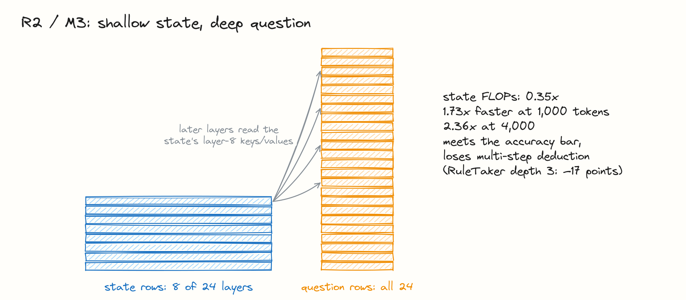

- **Background:** in hobson's layout the state comes first and the mask is causal, so state rows never see the question. A state row's deep outputs matter only through the keys, values and GDN recurrent states that later question rows read from it.
- **Motivation / intuition:**
  - **Most of the arithmetic is never read directly:** about 89% of a 1,000-token request's arithmetic is deep processing of state rows, and no output reads those rows (J3's arithmetic).
  - **The proposal:** if question rows could read a shallow version of the state, the dominant cost would scale with the state's depth $L_s/24$ instead of with 24 layers.
  - **What it keeps:** unlike selection or pooling (R3, R4), every state token stays at full width and remains readable by every deep layer. Only its depth changes.
- **What we did (J3, which calls the design DT, the depth-split decision transformer):**
  - **The layout:**
    - state rows go through hobson's first $L_s$ layers;
    - question rows go through all 24;
    - each deep layer reads the frozen layer-$L_s$ state through its own key/value projections plus a small trained memory adapter, a pattern from SwiftKV and YOCO;
    - deep GDN layers run their recurrence over question rows only.
  - **Training:**
    - LoRA (low-rank adapters) of rank 16 on every projection, plus rank-32 memory adapters;
    - distilled from hobson running in the same process, with the F7 recipe, counterfactual augmentation and a dense loss on the question rows' hidden states;
    - 700 updates (about 26M tokens, 2.45 h on one A10G).
  - **A variant, DT-set, reads the options as an unordered set:** each option is its own branch at the same position, so option order can't matter by construction.
- **Results:**
  - **DT-A8 (R2a, state rows through 8 layers):**
    - 0.35x the state FLOPs;
    - 33.0 against 57.1 ms at 1,000 tokens (1.73x), and 85.3 against 200.8 ms at 4,000 (2.36x);
    - with 4 questions, 60.4 against 95.1 ms at 1,000 tokens.

    It meets the accuracy bar:
    - JB-all .684 against .723 (McNemar test p .20), JB-hard .477 (p .41), REAL-label .782 (bar .78);
    - CF pair accuracy .719 and CF-probe .988. These come from the counterfactual training data: H7's fine-tune in hobson's own layout gets similar gains, so they belong to the recipe, not the layout.

    State-dependent agreement with hobson is .83 on REAL and .88 on LONG.
  - **DT-set12 (R2b, 12 layers, options as a set):**
    - 0.51x the state FLOPs;
    - 42.7 ms at 1,000 tokens (1.34x) and 119.1 at 4,000 (1.69x).

    It also meets the bar: JB-all .688 (p .12), REAL-label .787, REAL-label Brier .328 against hobson's .347. Under option reordering it gives the same answer .999 of the time, against hobson's .919.
  - **Untrained:**
    - the split at layer 16 is within the bf16 noise floor (0.4% REAL flips, CF retention 1.000);
    - at layer 12 with a GDN memory scan it changes 0.7% of REAL decisions (CF-probe retention .952) and runs 1.20x faster at 1,000 tokens.
- **Where it loses:**
  - **Multi-step deduction.** On RuleTaker, held-out problems that chain stated facts and rules (training has only depths 0–2), DT-A8 scores .647 against hobson's .860 at depth 3 and .560 against .720 at depth 5.
    - 38 minutes of extra RuleTaker-heavy training recovers depth 5 (.700) but leaves depth 3 at .687.
    - DT-set12 scores .800 and .673.
  - **Short states.** Below 256 tokens DT is 1–6 ms slower than hobson. The cause is unfused code in the separate question pass, not the layout. J3 estimates about 26 ms at 1,000 tokens once fused (arithmetic).
- **Projected:** at 1,000 tokens in bf16 with fp16 accumulation, DT-A8 takes 17.9 ms on a 3090 and 10.8 ms on a 4090, against hobson's 29.7 and 15.1 ms (J3's arithmetic, whose assumptions differ slightly from the projections table's 27.4 and 13.7 ms). With W8A8 it would be about 11–12 ms on a 3090 (speculation).
- **Conclusion:** a real speedup at the same model size, with a measured cost on deduction that chains facts across the state. M3 tests the same idea inside M2's segment layouts, where 12 state layers is the working point and 8 loses JevBench.

### R3 · Token selection and routing: the needed facts are few, but finding them requires the answer

- **Background:**
  - **Token selection, routing and eviction** keep only some tokens in the later layers, as in token-dropping, mixture-of-depths and KV-cache eviction methods.
  - **The eval kit's two reference cuts,** from layer 7 on, measured by state-dependent agreement with hobson:

    | rows kept | agreement |
    |---|---|
    | a random 50% of state rows | .870 |
    | the 10% with the most question attention | .853 |
- **Motivation / intuition:**
  - **A decision usually turns on a few facts in a long state.** An oracle confirms it: choose 10% of 32-token chunks by how much removing each one would change the decision, and it preserves .89–1.00 of real decisions, even when applied at the input.
  - **What it would save:** if a cheap locator could find those chunks, most state rows could skip most layers.
- **What we did (F1, F2):**
  - **Trained locators,** aiming to reproduce the oracle's chunk choices.
  - **A question-routed router:** layers 0–3 run dense, then a trained router keeps 10% of state rows per question for the remaining 20 layers.
  - **Training-free selection** using hobson's own attention, with a single cut or a cascade of cuts.
- **Results:**
  - **The trained locator** recovered only 73% of the oracle's chunks.
  - **The router:**
    - 23.7 ms at 1,000 tokens against 57.0 ms dense in the same runtime, and 0.32x dense at 4,000;
    - state-dependent agreement .76 on REAL and .86 on LONG (bar .95);
    - CF retention .56, CF-probe retention .52.
  - **The best training-free selection** (hobson's attention, as a cascade):
    - 30.1 ms;
    - agreement .88 on REAL and .83 on LONG;
    - CF and CF-probe retention .93 and .72.

    Reaching .95 agreement needed 0.45–0.53x of the dense FLOPs, too little saving to matter.
- **Why it came out that way:**
  - **What gets lost is exact values:** amounts, dates and ids. The chunks the router drops still carry details the decision depends on.
  - **Per-question routing breaks state sharing:** the state can no longer be shared across a request's questions.
  - **There is a floor on the saving.** With 90% of state rows gone, most of the late layers' work is the roughly 100 question rows. Below about 10% of state rows kept, they are limited by loading their weights (about 0.22 ms per layer on a 3090), so more sparsity buys nothing.
- **Conclusion:** too inaccurate at the budgets tried, 3–40M training tokens for the parts that do the cutting (published counterparts use billions). The oracle shows the decision's information is concentrated in a few places. The same concentration reappears in B1, where the top 5% of state rows carry 63% of the decision's sensitivity to rounding.

### R4 · Learned pooling: summaries lose exact values

- **Background:** pooling compresses a span of tokens into a few learned summary vectors, as gist tokens and activation beacons do for long LLM contexts.
- **Motivation / intuition:** much of a gate state is background (old turns, boilerplate tool output). If that background could be summarized into a few vectors, only the recent raw rows and the summaries would need deep processing.
- **What we did (F3):**
  - **The "funnel" or "foveated" layout:** 128 state rows stay raw, and the rest are pooled into summary rows ("beacons") from which the deep layers read.
  - **Training:** trained by distillation from hobson.
  - **A pre-registered test** checked whether the beacons carried the information they were meant to.
- **Results:**
  - 18.1–21.4 ms at 1,000 tokens;
  - state-dependent agreement .71–.78 on REAL and .64–.81 on LONG (bar .95);
  - CF retention .42–.57, CF-probe retention .15–.22;
  - the beacons failed their pre-registered test.
- **Why it came out that way:** a summary vector can hold the gist of a span but not its exact amounts, dates and ids, and decisions turn on exactly those.
- **Conclusion:** too inaccurate.

### R5 · A small reader feeding the 2B: exact values don't cross the interface

- **Motivation / intuition:** let a cheap model read the long state, and let the 2B do the reasoning over the reader's output and the question rows. The 2B's cost would then scale with the question, not the state.
- **What we did:**
  - **F4:** a small reader and the 2B trained jointly, with the 2B running only over question rows.
  - **Earlier retrofits** onto the frozen 2B, with about 20 minutes of training each:
    - a reader that supplies the 2B's per-layer GDN states directly;
    - residual-delta injection, where the reader adds a correction to the 2B's residual stream at one layer.
- **Results:**
  - **Joint training:**
    - 47.9 ms unfused (0.51x of hobson);
    - state-dependent agreement .66 on REAL and .70 on LONG, against .85 for F4's matched control;
    - CF retention .43, CF-probe retention .22.

    Learning plateaued by 4,000 training examples.
  - **Supplying GDN states:** the frozen 2B needs each GDN state to within about 1% relative error, and the trained readers reached 25–60%.
  - **Residual-delta injection:** at layer 15 one number per row would suffice, but that number is effectively the decision itself. At layer 11 the correction needs about 256 dimensions.
- **Conclusion:** too inaccurate at these budgets. Exact values didn't make it through the hand-off from reader to reasoner, the same failure as R3 and R4.

### R6 · Token-adaptive width: low-information tokens can't take a thin path in the middle layers

- **Background:** a rank-r version of a layer multiplies by two thin matrices instead of one full one. Its cost is r(K+N)/(KN) of the full layer, because the output must be rebuilt at full width for the GDN, SwiGLU and residual stream: 0.08, 0.16 and 0.32 of a layer at ranks 128, 256 and 512.
- **Motivation / intuition:** half the state tokens carry under 0.5 bit of information about the decision. If those tokens took a low-rank path through each layer from some depth on, while informative tokens and all question rows stayed full width, cost should fall about 2x at every length. The model would stay the same 24-layer 2B, and the saving would stack with W8A8.
- **What we did (J13):**
  - **Rank spectrum first:** measured how many dimensions state tokens actually use at each depth.
  - **An oracle router before training anything:** one forward and backward pass per question computes how much each 32-token chunk's thin path moves the decision. The most important chunks, plus attention sinks and all question rows, then run at full width. The oracle cheats (it uses hobson's answer), so it bounds what any trained router could do.
  - **Kernels:** a mixed-width layer in the fused runtime, to measure real latency.
- **Results:**
  - **Mid-depth tokens don't share a low-rank subspace:** in layers 4–12, 95% of the residual's energy needs 750–1,160 of 2,048 dimensions. Projecting one early layer's state rows to rank 64 changes 7–53% of state-dependent decisions. The same projection in layers 13–23 changes at most 1 in 30.
  - **The oracle router meets no bar.** No setting at ≤ 0.6x of hobson's FLOPs reached the bar (state-dependent agreement ≥ .95 on REAL and LONG, CF-probe retention ≥ .90). The best, 20% of chunks at full width from layer 8 with rank 256 elsewhere, reached .965 on REAL, .945 on LONG and .848 CF-probe retention.
  - **The oracle does choose well:** at equal FLOPs, random chunks give .724 CF-probe retention against the oracle's .848. Even so, keeping the right chunks at full width doesn't save the decision.
  - **A plain cut with no routing:** thinning every state row to rank 64 from layer 13 on is 1.40x faster at 1,000 tokens (40.7 against 57.0 ms) and 1.50x at 4,000. It passes REAL, CF and CF-probe, but misses LONG (.933).
  - **Realized speed trails the FLOPs:** 0.61x of the FLOPs buys 1.40x, not 1.64x, because mixers and norms are unchanged and small thin GEMMs run below peak.
- **Why it came out that way:** the FLOPs a thin path could remove sit in layers 4–12, where state rows use about 1,000 dimensions. Projection error there corrupts the keys and values that question rows read later, which breaks amount comparisons and id or status bindings. Errors on the context outside the chosen chunks still flip the decision.
- **Conclusion:** too inaccurate, even with an oracle. The late-layer result (state rows need little in layers 13–23) matches R1, R2 and the later B11–B12 work.

### R7 · MLP pruning and mixture-of-experts: batch-1 decisions load every chosen expert

- **Background:**
  - **What MoE is:** a mixture-of-experts (MoE) layer splits the MLP into many small "experts" and runs each token through only a few of them.
  - **The literature result:** fine-grained MoE trained from scratch is the only design with ≥ 3x quality per inference FLOP at matched quality. Ling-mini's 0.85B active parameters match a 6.1B dense model, at about 17B total parameters.
- **Motivation / intuition:**
  - **MLPs are about two thirds of hobson's arithmetic.** If most tokens needed only part of each MLP, pruning or routing could cut the largest term.
  - **Deployments are narrow,** so a decision model might need fewer active neurons than a general LLM.
- **What we did:**
  - **Early round:** pruned MLP neurons and split existing MLPs into experts ("MoEfication").
  - **G3** planned to fine-tune pretrained small MoE models (granite-3.1-1b/3b, SmallThinker-4B-A0.6B) into deciders with the F7 recipe, and to time them in a grouped-GEMM runtime.
- **Results:**
  - **Pruning:** layers 0–12 use their MLPs densely. Every cut that kept accuracy was in layers 13–23, and early-layer activations are dense.
  - **MoE at batch 1:** every expert some token chooses must have its weights loaded once per request. So MoE pays only when each chosen expert sees about 150 rows or more.

    G3's arithmetic, at about 510 GB/s on an A10G, with the dense 0.8B decider taking 23.9 ms in total:

    | model | weights read per request | time to read them |
    |---|---|---|
    | granite-3.1-3b-a800m | 6.4 GB | 12.5 ms |
    | OLMoE-1B-7B | 13.8 GB | 27 ms |
    | Ling-mini's roughly 17B parameters | about 34 GB | not computed |
  - **G3 measured nothing:** the agent was lost in a laptop reboot before its box produced results.
- **Conclusion:** untested at the scale where it could work. The pruning result was later sharpened by B12: decision-weighted neuron removal meets the fidelity bar at 60% of layer 12–23 neurons, and nothing works in layers 0–11 without training.

### R8 · Structured matrices: fast as predicted, but narrowing loses details

- **Background:**
  - **The methods:** Monarch, block tensor-train (BTT) and low-rank factorizations replace a dense d × d multiply with products of smaller or block-diagonal matrices. That cuts the cost from about d² toward d^1.5 or less at the same width.
  - **Published quality per inference FLOP** for structured or low-rank operators is at most about 2x, on undertrained models.
- **Motivation / intuition:** if hobson's weight matrices were close to a structured form, swapping them would reduce $P/L$ directly, with no change to the rows or the layout.
- **What we did (G1):**
  - **Kernels:** fused kernels at hobson's MLP shapes.
  - **One trained arm:** every MLP matrix in all 24 layers replaced by a low-rank factorization at half its arithmetic, initialized by a data-aware factorization, then trained for 200 updates (about 27 minutes).
  - **A control:** dense LoRA trained for the same 200 updates.
  - The laptop reboot cut G1 short, but a copy of its box directory was recovered (`~/decider2/recovered/g1/`), and its saved predictions were scored for this report.
- **Results:**
  - **Speed** (MLP gate/up shape, 1,000 rows, bf16): low rank at a quarter of the FLOPs runs 3.42x faster than dense, and BTT at a quarter runs 3.5–3.6x faster. These matrices run as fast as their FLOP count predicts.
  - **Accuracy** (half the MLP arithmetic removed, against the dense control):

    | metric | low rank | dense control | hobson |
    |---|---|---|---|
    | JB-all | .654 | .706 | .723 |
    | REAL state-dependent agreement | .867 | .896 | – |
    | LONG state-dependent agreement | .891 | .915 | – |
    | CF-probe retention | .429 | .657 | – |
- **Why it came out that way:** low rank makes each layer narrower, and R6 showed that narrowing state rows in layers 4–12 corrupts exact values.
- **Conclusion:** the kernels deliver their FLOP savings. The one short training run lost detail reading, and longer training is untested.

### R9 · Looped layers: fewer parameters, the same arithmetic

- **Motivation / intuition:** recursive or looped transformers reuse the same block several times, buying depth without new parameters.
- **What we did:** toy-scale tests, from scratch, in the early round. J11's "belief" arm later ran a weight-tied block for three rounds over the answer and option slots only (A11).
- **Results:**
  - Looping saves parameters, not arithmetic: each pass through a shared block costs as much as a distinct layer, so latency doesn't fall.
  - The toy tests showed no accuracy gain.
  - In J11, the belief arm recovered part of the slot model's real-traffic gap at the 38M-parameter scale (state-dependent agreement .442, against .390 for the plain slot model and .457 for the decoder). It was latency-bound: 6.2 ms against 3.2 ms at 1,000 tokens.
- **Conclusion:** no benefit for latency, which is set by arithmetic per row.

### R10 · Smaller models: the control any idea has to beat

- **Motivation / intuition:** not a candidate, because every idea in this report keeps hobson's size. These smaller models show what a given latency buys, so the other ideas can be compared with them.
- **What we did (F7):** distilled hobson into three smaller deciders with hobson's own recipe:
  - **The recipe:** pointer head, LoRA rank 16 on every projection, and a loss of CE on gold labels plus KL to hobson.
  - **The data:** 108,547 rows, 39.8M tokens, one epoch.

  All arms plateaued over the last quarter of training.
- **Results** (A10G, fused runtime):

  | model | 1,000 tokens | JB-hard | REAL state-dependent agreement | CF retention |
  |---|---|---|---|---|
  | hobson-v19 | 52.9 ms | .523 | 1 | 1 |
  | hobson's first 12 layers, distilled | 26.6 ms | .546 | .884 | .780 |
  | Qwen3.5-0.8B decider, same recipe | 24.1 ms | .469 | .824 | .661 |
  | the 0.8B cut to 12 layers | 12.1 ms | .415 | .766 | .532 |

  CF-probe retention is .571 for the 12-layer 2B and .543 for the 0.8B.
- **Why these controls look deceptively good:**
  - JB-hard barely moves, and the 12-layer 2B even scores higher than hobson, because JevBench contains almost no items where depth matters. hobson itself is at chance on multi_hop, temporal_numeric and long_policy.
  - The stricter suites show the loss: 12% of state-dependent decisions change, and a fifth of counterfactual pairs are lost. JevBench alone would hide it.
- **Depth against width:** the 12-layer 2B beats the 0.8B everywhere for 10% more time. Width buys less than its FLOPs suggest, because the GDN and attention kernels have the same dimensions in both models.
- **Conclusion:** the comparison point. An idea that keeps hobson's size has to beat about 27 ms for .88 state-dependent agreement at 1,000 tokens on the A10G.

## B · Decision-specific numerics and structure

This theme is the 4-bit program: BRIEF10, hypotheses B1–B14, agents Q1–Q5, run on 2026-10-06 and 07.

**Why it differs from LLM quantization.** An LLM has to preserve a distribution over about 250,000 tokens at every step of generation, so every rounding error matters somewhere. hobson has to preserve only which of K options wins, and by roughly how much. Most of the network's numerical error could be invisible to that answer. If so, rounding, sparsity and pruning can be aimed by the decision's own sensitivity rather than by the per-layer reconstruction error that GPTQ, SparseGPT and similar methods minimize.

**Which part of the floor it attacks.** The ideas target the arithmetic rate $R_p$ (4-bit activations, 2:4 sparse tensor cores) and the weights per layer $P/L$ (neuron removal, exact eliminations).

**Why formats alone can't solve it.** After a Hadamard rotation, GEMM input activations are roughly Gaussian. Rate-distortion theory then bounds any 4-bit code at no less than 6.25% relative rms error per value, against 0.39% at 8 bits. Practical formats measured 13–16% (rotated int4) and 7–9% (NVFP4). A 4-bit model at the noise floor therefore has to come from the decision not depending on most of that error.

**Terms used throughout:**
- **Decision sensitivity.** The gradient of the decision loss with respect to a GEMM's input or output. The loss is the KL divergence between hobson's decision distribution and a perturbed one; for small perturbations this is the Fisher information of the pointer head's softmax. A direction, row, neuron or weight is "sensitive" if perturbing it moves the decision.
- **Decision-gradient covariance.** G = E[gᵀg], the second moment of that gradient over many requests, computed per GEMM and separately for state and question rows. Its eigenvectors are the directions the decision cares about, and its effective rank (the number of directions holding 90% of the trace, "r90") says how concentrated that care is.
- **Decision-margin error (rms dm).** The rms change in the gap between the top two option logits, in logit units, on Q1's DEV set of 300 train-split requests. On this scale W8A8-b8 is 0.030, W8A8 on all 96 GEMMs 0.038, and row-role 4-bit (P10) 0.200.
- **Decision KL on dev.** The mean KL from the bf16 model's decision to the modified model's, on Q5's 256 held-out train-split requests. On this scale b8 is 9.5e-5, and row role, which fails the full kit, is 3.7e-3.

Dev numbers are screens; every claim of meeting or missing the bar comes from all 3,227 evalkit questions.

**What we found:**
- **Late layers work.** Aiming structure by decision sensitivity meets the fidelity bar in layers 12–23: 2:4 sparsity (B11) and neuron removal (B12) beat the usual per-layer criteria by 2–40x in decision error. Two exact eliminations (B13) are free.
- **Early state rows don't.** No format, training or certificate made 4-bit rounding of state rows in layers 0–11 accurate enough. That error is spread over about 1,000 directions and is independent from row to row.
- **The open lead.** The same error is concentrated in a few *rows* (B1), which points to precision chosen per row by the question.

### B1 · Precision where the decision looks: the sensitivity is concentrated in rows, not directions

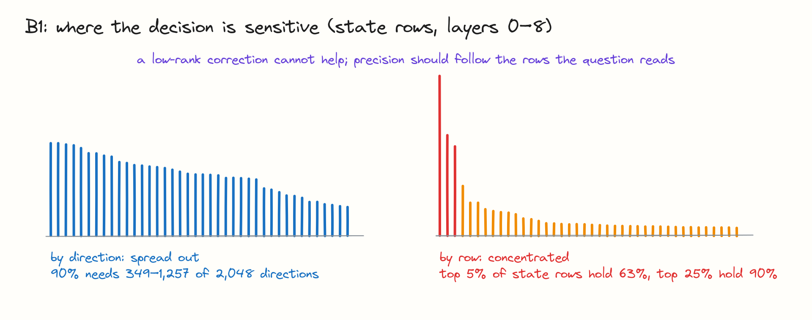

- **Background:**
  - each GEMM's rounding error is a vector per row;
  - if the decision reacts to only r of its 2,048 directions, the error in those r directions can be computed and added back exactly, at about 2r/2,048 extra work: Y = Y_int4 + ((X − deq(Q(X)))·(W·P))·Pᵀ, with P the top-r sensitive subspace;
  - the rest of the error would be invisible to the decision.
- **Motivation / intuition:**
  - an LLM's output is a 250,000-way distribution, so its sensitivity is spread over every direction;
  - hobson's output is a handful of probabilities, so each GEMM's influence on it could be low-rank;
  - if it were, 4-bit arithmetic plus a small exact correction would behave like 8-bit as far as the decision is concerned.
- **What we did** (Q1):
  - computed the decision-gradient covariance for all 96 GEMMs, on both the input and output side and separately for state and question rows, over 256 train-split requests (437,000 tokens), with 64 more requests from other tau tasks held out;
  - built the rank-128 exact correction in emulation;
  - Q2 built the fused kernel for it.
- **Results:**
  - **Question rows in layers 13–23 are low-rank.** They hold 96–100% of the trace there. 90% of it lies in 2–63 directions, and only 2–5 in layers 18–23. These subspaces transfer: 8 directions capture 98–99.6% on held-out tasks.
  - **State rows in layers 0–8 are not.** They hold 18–39% of the trace in those layers. Covering 90% of it takes 349–1,257 of 2,048 directions, and on held-out tasks 64 directions capture only 22–34% at layer 0.
  - **The correction on state rows** (r = 128) cut DEV margin error from 0.200 to 0.177 (7 of 300 decisions changed, against 9 for row role).
  - **Cost:** the correction path costs 20–90 µs per GEMM input, so applying it to all GEMMs would add 3.5–5.5 ms per request at 1,000 tokens (measured per GEMM, summed by arithmetic). That is roughly a third of the 12.8 ms plain W4A4 saves over W8A8.
- **What the measurement found instead.** State-row sensitivity is concentrated by row:
  - the top 1% of state rows hold 35% of it, the top 5% hold 63%, and the top 25% hold 90%;
  - the last 256 rows of the state (16% of rows) alone hold 45%;
  - an oracle that puts the 20% most sensitive state rows in int8 cuts the margin error 2.4x (0.202 → 0.085, 150 DEV requests).
  - **A real selector:** the question rows' attention to the state at layer 7 picks nearly the same rows (0.092 at 20%). It arrives too late, though. Layers 0–7 hold about 73% of the state-row rounding variance, so computing the attention first means a pre-pass that puts GEMM time near 0.77x W8A8's (arithmetic).
- **Conclusion:** the right idea on the wrong axis. Precision should follow rows chosen by the question, and the open problem is predicting those rows before layer 1, cheaply. That is step 2 in the section [Recommended next steps](#recommended-next-steps).

### B2 · Dithered rounding: the errors already behave like independent noise

- **Background:** round-to-nearest gives the same error every time it sees the same input. Dithering or stochastic rounding adds random noise before rounding, so the errors become unbiased and average out when many of them are summed.
- **Motivation / intuition:**
  - state rows affect the decision only through attention and GDN sums over many rows;
  - agent states are repetitive (JSON keys, boilerplate). If the same content rounds the same way in many rows, the errors would add up coherently, like a bias;
  - unbiased, decorrelated rounding would then shrink with the number of rows aggregated.
- **What we did** (Q1):
  - measured the coherence factor κ = E[(Σ_t a_t)²] / E[Σ_t a_t²] of each GEMM's first-order decision error across rows. κ = 1 means the per-row errors are independent; κ ≫ 1 means they add up like a bias;
  - then emulated stochastic rounding on state rows, with question rows in int8.
- **Results:**
  - κ is 0.95–1.29 for state rows in every layer band, so the errors are already independent;
  - stochastic rounding, which adds variance, raised DEV flips from 9 to 20 of 300 (margin error 0.200 → 0.322).
- **Conclusion:** the premise is false for hobson, so drop it. The same measurement predicted B9's failure: when the errors are already independent, added sampling noise doesn't average away either.

### B3 · Prototype subtraction: quantize only what's new about each row

- **Background:** if an activation row is close to a known prototype c, its residual x − c is smaller than x, so the same 4 bits represent it more precisely. The prototype's share of the output, c·W, can be precomputed per prototype and added back exactly.
- **Motivation / intuition:**
  - agent states repeat the same tool formats, JSON keys and boilerplate across requests and deployments;
  - the large systematic values that set the 4-bit scale (max/rms of 15–40 per token) might live mostly in a small set of prototypes;
  - quantizing only the residual would then cut the error that rotation leaves.
- **What we did** (Q1, kernels by Q2):
  - k-means codebooks of 64 or 256 prototypes per GEMM input, fit on calibration state rows;
  - nearest-prototype search per row, 4-bit residual, an exact c·W table in the epilogue;
  - question rows in int8.
- **Results:**
  - **Per-value error:** plain rotated int4 has 12.2–14.3% relative error per GEMM input. With 256 prototypes the residual's error is 0.59–0.85x of that, because the residual's norm is 0.58–0.84x of the row's (its crest factor stays at 3.6).
  - **DEV:** margin error 0.152 against row role's 0.200, and 8 of 300 decisions changed.
  - **Full kit:** 3.79% of REAL decisions differ from hobson's (bar 0.7%), with CF retention .927 and CF-probe .829. Those are better than row role's .80 / .68, but no better on flips.
  - **Cost:** in arithmetic the search is only 5.5% of the GEMM's work at 256 prototypes, but Q2's measured search kernel took 0.4–6x the time of the GEMM it feeds (111–486 µs).
- **Conclusion:** a real accuracy gain at too high a cost.
  - The untested variant removes the search. In the first layers, before much mixing, a row's prototype could simply be its token id's mean activation, looked up in a table.
  - It could only work in the first few layers, where a row is still mostly a function of its token (speculation).

### B4 · Decision-level rounding and QAT: weights can't cancel activation error

- **Background:**
  - GPTQ chooses each 4-bit weight to minimize the error of that layer's own output on calibration data;
  - AdaRound-style methods learn each weight's rounding direction against a loss;
  - quantization-aware distillation (QAD) trains the full-precision weights through a simulated quantizer, with a straight-through estimator for the gradient, so the model adapts to its own rounding.
- **Motivation / intuition:** GPTQ treats every output channel as equally important. Choosing rounding, scales or weights by the end-to-end decision KL should spend the error where the decision doesn't look, which per-layer methods can't know.
- **What we did** (Q3):
  - a differentiable student in the exact deployed int4 arithmetic, trained against frozen bf16 hobson;
  - the loss was decision KL plus a hidden-state term at layers 5, 11, 17 and 23;
  - three parametrizations: per-channel scales only (0.6M parameters, codes fixed); soft rounding of all 1.37B weights; and full-weight QAD with an L2 pull toward the starting weights;
  - all scored through the deployed kernels on all 3,227 questions.
- **Results:**
  - **Decision-level scales,** 1.5M tokens: plain W4A4 flips fell from 9.23% to 6.56% (64 decisions gained, 35 lost against GPTQ, p .005), and total variation from .082 to .060. On row-role precision the change was not significant (3.05% → 3.60%).
  - **Full-weight QAD,** 10–20M tokens: no further measurable gain. Plain reached 6.09%; row role reached 3.69% after 8M tokens.
  - **Learned rounding:** no weight changed its rounding in 1M tokens. With the soft value starting at GPTQ's choice, flipping one weight needs at least about 220 consistent steps (arithmetic).
  - **The trend:** QAD lowered total variation by about 5% per 10M tokens. Extrapolated to 50M tokens it would still be about 10x W8A8's (arithmetic).
- **Why it came out that way:**
  - the remaining error is state-row activation rounding, about 13% per row after rotation;
  - no choice of weights cancels an error that depends on each new input;
  - per-weight gradients carry too little signal at 10–20M tokens, and each of the 0.6M scales sees about 2,000x more gradient than a single weight;
  - on row role, the question rows are already int8, which suggests the scales' gain on plain W4A4 came mostly from question-row error.
- **Conclusion:** stop spending tokens on per-weight 4-bit training at this scale. Training the activation transforms (B5) against the decision loss is untested; it is step 6 in the section [Recommended next steps](#recommended-next-steps).

### B5 · Decision-weighted transform coding: the most accurate 4-bit format, but too slow as built

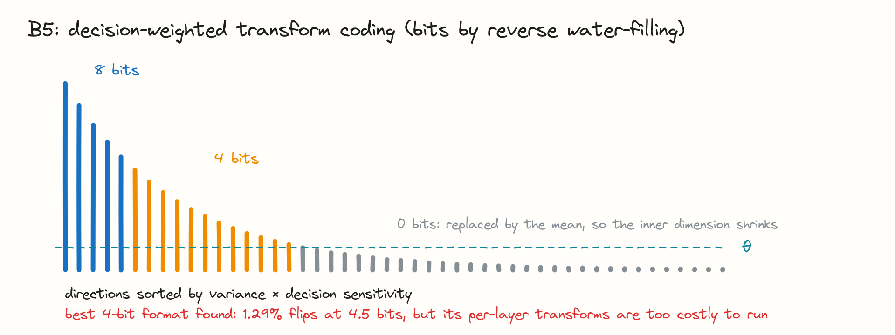

- **Background:**
  - rate-distortion theory says how to split a bit budget across the coordinates of a signal: rotate into a basis where they are uncorrelated, then give each direction about ½·log₂(variance / θ) bits ("reverse water-filling");
  - directions below the threshold θ get zero bits and are replaced by their mean;
  - a change of basis costs nothing in exact arithmetic because it folds into the weights: xW = (xR)(R⁻¹W).
- **Motivation / intuition:**
  - for a decision the right distortion isn't plain squared error but squared error weighted by decision sensitivity;
  - so choose the basis from activation variance × sensitivity, and allocate 8, 4 or 0 bits per direction;
  - 0-bit directions also shrink the GEMM's inner dimension, so this means fewer multiplies, not just cheaper ones;
  - it differs from the low-rank cuts that failed in R6: those dropped directions by variance alone, blind to what the decision reads.
- **What we did:**
  - Q1 planned allocations per GEMM, emulated them on all 3,227 questions, and also tried deployable shared-basis variants;
  - Q2 built and timed the K-slice kernel: an int8 slice, an int4 slice, and the 0-bit slice skipped.
- **Results:**
  - **Per-GEMM bases at 4.5 bits:**
    - 1.29% of REAL decisions differ from hobson's (bar 0.7%; McNemar against the bf16 runtime p .077);
    - CF retention .890, CF-probe .914, REAL-label .790;
    - the most accurate 4-bit format found, but it misses the bar on flips and both retentions.
  - **Per-GEMM bases at 4 bits** (int4 MAC time): 2.68% flips.
  - **The cost of per-GEMM bases:** they need an online dense K×K transform before each output and down projection, about 46 ms per request in bf16. That is more than W8A8's whole forward pass (36 ms).
  - **Deployable variants** (one shared basis, Hadamard transforms inside slices): 3.14% flips on the full kit, only slightly better than row role's 3.69% in the same emulation.
  - **The K-slice kernel:** 0.613x W8A8's GEMM time for 256 int8 + 1,280 int4 columns with the rest skipped.
  - **Combined with B1's row selection** (20% of state rows in int8, chosen by layer-7 question attention): DEV margin error 0.050, against 0.038 for W8A8 on all GEMMs and 0.200 for row role. This is the closest any 4-bit combination came, but it needs both the dense transforms and the pre-pass, so it is not deployable.
- **Conclusion:** the best accuracy result in the 4-bit program, undeployable as built. Factoring each transform as a Kronecker product of two small matrices, as FlatQuant does, would cost about 1–8% of a GEMM (arithmetic for K = 2,048 as 32 × 64). Whether factored transforms keep the gain is untested.

### B6 · Self-certifying 4-bit decisions: the visible error doesn't predict the flip

- **Background:** a cascade runs the cheap model and re-runs the expensive one only when the cheap answer might be wrong (P8, R1, C1). The test for "might be wrong" sets its cost.
- **Motivation / intuition:**
  - J15's speculative precision (P8) failed because the 4-bit answer's confidence didn't reveal its own rounding error;
  - inside the fused quantize step, the runtime holds both X and its rounded Q(X), so it knows the rounding error exactly;
  - weighting that error by B1's static sensitive subspaces gives a per-request statistic. Calibrated on train-split traffic, it could bound how far the decision margin moved, and the request's own margin would then certify the 4-bit answer.
- **What we did** (Q1): computed the sensitivity-weighted error energy per request in emulation, calibrated the bound on half the DEV requests, and tested it on the other half.
- **Results:**
  - the known error energy correlates with the actual margin change at only −0.04 to 0.06;
  - the bound certifies 18–42% of requests;
  - the plain margin rule (accept when the 4-bit answer's top-two gap is large) certifies 69–83%.
- **Why it came out that way:** the error energy barely varies from request to request. What varies is each request's own sensitivity to that error, and seeing it needs a backward pass, which costs more than the forward pass it would save.
- **Conclusion:** doesn't work as specified; drop it.

### B7 · Per-deployment calibration: a mismatch costs more than matching gains

- **Background:** quantization codes, sparsity masks and neuron rankings are all fit on calibration traffic, usually a generic mix.
- **Motivation / intuition:**
  - a decision model is deployed against one narrow, stationary distribution: a banking assistant sees banking states and the same 5 question specs on every request;
  - calibrating on that deployment's own traffic should fit its statistics better than a generic pool.
- **What we did** (Q5): calibrated neuron removal (B12), 2:4 masks (B11) and GPTQ codes on banking-only, retail-only or mixed train-split traffic, and scored each on the other domains.
- **Results:**
  - **Neuron removal at 75%** (320 calibration requests): banking-only calibration gives 12% lower banking dev KL than mixed, and retail-only gives retail 30% lower. Retail-only calibration applied to banking is 44x worse than banking-only.
  - **2:4 masks:** banking-only and generic masks differ by 1–2 items on the full kit.
  - **GPTQ for W8A8:** no gain from per-deployment calibration.
  - **GPTQ for row role:** matched calibration helped only the domain the pool under-represents (retail flips 5 → 2 of 96).
- **Conclusion:** what costs is a calibration mismatch, and matching helps mainly neuron removal. A deployment should calibrate on traffic that includes its own domain, but a separate calibration per deployment is not worth it for precision or 2:4.

### B8 · More bits for value tokens: structural tokens matter more

- **Motivation / intuition:**
  - decisions turn on exact amounts, dates and ids, which a handful of tokens carry;
  - CF and CF-probe edits change exactly those tokens;
  - if rounding hurt those rows most, putting only value-bearing tokens in int8 would buy accuracy for a few percent of the rows.
- **What we did:**
  - Q1 measured per-row first-order decision sensitivity by token class across the state;
  - Q2 then ran digit rows in int8 on top of k48rr (48 sensitive GEMMs in W8A8, the rest row role) through the deployed kernels.
- **Results** (rounding sensitivity relative to the average state row):
  - **value tokens are less sensitive:** amounts 0.52x, digits 0.32x, ids 0.24x, dates 0.22x, phone numbers 0.15x;
  - **JSON keys** are 0.08x;
  - **the most sensitive rows are structural:** newlines are 3.06x (4.7% of rows), emails 1.68x, punctuation and special tokens 1.43x. The attention-sink rows and the most recent rows also stand out;
  - **digit rows in int8** raised CF-probe retention from .914 to .952, but flips didn't fall (1.29% → 1.66%; McNemar against bf16 p .001).
- **Why it came out that way:** the likely reason is that hobson aggregates the state through structural tokens (line ends, separators, the latest turn), and value tokens reach the decision through them. Rounding a value token perturbs one input, while rounding a newline perturbs something many later rows read.
- **Conclusion:** the premise is false for rounding error, although value rows still matter for the detail probes.

### B9 · Sampled matrix multiplies: far too noisy

- **Background:** a GEMM can be estimated without bias by keeping a random fraction f of its inner-dimension tiles and scaling by 1/f.
- **Motivation / intuition:**
  - if the state's influence on the decision averaged out unbiased noise across many rows, a cheaper unbiased estimate of each state-row GEMM would be good enough;
  - question rows would stay exact.
- **What we did:** Q1 emulated keeping 75% and 50% of 64-wide K tiles on state rows; Q2 built a tile-skipping kernel driven by a per-request mask.
- **Results:**
  - at 75% of tiles, 81 of 300 DEV decisions changed, with margin error 1.50 against 0.200 for row role;
  - the kernel ran at 0.525x W8A8's GEMM time at 75%.
- **Why it came out that way:** sampling adds about (1 − f)/f relative variance per output, about 10x int4's rounding variance. B2 showed nothing averages it away (κ ≈ 1).
- **Conclusion:** far too noisy; drop it.

### B10 · Precision only on the differences between options

- **Background:** the pointer head turns option scores into probabilities with a softmax, and a softmax ignores any shift shared by all options.
- **Motivation / intuition:** error common to every option row cancels, so only the component that differs between options needs precision. That component might occupy only a few directions.
- **What we did** (Q1): split the option rows' sensitivity at the late layers into a common-mode part and a difference part, and measured each part's rank.
- **Results:**
  - the common-mode sensitivity is only 0.1–2% of the difference component;
  - the difference component spans 3–10 directions (99% of its trace).
- **Conclusion:** true, but it saves nothing. Option rows are question rows, which already run in int8 in every accurate format, and they are a small share of the arithmetic.

### B11 · Decision-aware 2:4 sparsity: the hardware skips half the multiplies at full precision

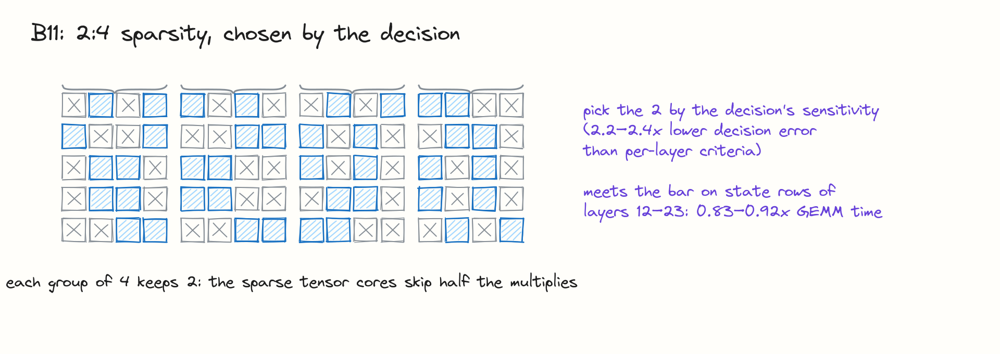

- **Background:**
  - Ampere tensor cores have a sparse mode (the `mma.sp` instruction). If every group of 4 consecutive weights along the inner dimension holds at most 2 non-zeros, the hardware does half the multiplies for the same output, at twice the math rate;
  - int8 2:4 keeps 8-bit values, so there is no 4-bit rounding;
  - on Ampere, int4 "2:4" actually keeps 2 of every 4 adjacent *pairs* of 4-bit values, a fact Q4 established with a one-instruction probe;
  - all GeForce generations since Ampere (3090, 4090, 5090) have the sparse mode.
- **Motivation / intuition:**
  - LLMs rarely use 2:4 because pruning half the weights costs noticeable perplexity: every weight matters for some token somewhere;
  - a decision model on a narrow deployment may have many weights that matter to almost no decision;
  - so choose the 2 weights to keep in each group by the decision's sensitivity on train-split traffic, instead of by weight magnitude or per-layer output error;
  - start where the decision is least sensitive. Layers 12–22 were nearly inert to rounding in the H round.
- **What we did:**
  - Q5 compared mask criteria on dev:
    - magnitude;
    - Wanda;
    - SparseGPT with the layer's own Hessian;
    - SparseGPT with a decision-weighted Hessian H_d = Σ_t w_t x_tᵀx_t, where w_t is each row's decision sensitivity;
    - the decision Fisher;

    then ran the best masks on the full kit, on state rows only (question rows dense) and on all rows. The int8 masks were applied in the unrotated basis, because a Hadamard rotation makes the weights dense again;
  - Q4 wrote raw-PTX `mma.sp` kernels for int8 and int4, bit-exact, and timed them at hobson's shapes and end to end.
  - The earlier finding that 2:4 is slower than dense (S9) came from NVIDIA's cuSPARSELt library at small row counts, so this needed custom kernels.
- **Results, mask quality** (dev KL, all rows, layers 12–22):
  - magnitude 4.5e-2; Wanda 2.5e-2; SparseGPT with the layer Hessian 2.3e-3;
  - SparseGPT with the decision-weighted Hessian 9.6e-4; the decision Fisher 9.8e-4;
  - so decision weighting gives 2.2–2.4x lower decision error than the best per-layer criterion, and about 47x lower than magnitude;
  - sparsifying only state rows drops the dev KL to 1.0e-4, because question rows carry the late-layer sensitivity;
  - per layer, each of layers 8–11 costs 1.5–2.0e-3, against under 1e-5 for each of layers 14–23 on state rows.
- **Results, accuracy** (all 3,227 questions):
  - **int4 2:4 on state rows in layers 14–23** meets the fidelity bar: 0.28% of REAL decisions differ from hobson's (bar 0.7%), CF retention .991, CF-probe .962, JB-hard .531 (not significantly different), REAL-label .790;
  - **int8 2:4 on state rows in layers 12–22** also meets it: 0.55% flips, CF .991, CF-probe .952, REAL-label .793;
  - extending int4 to layer 13 misses it (CF .972), and int4 2:4 on question rows fails.
- **Results, speed:**
  - **per GEMM,** at 1,125 rows, Q4's int8 2:4 kernel runs 1.32–1.71x faster than the deployed dense int8 kernel, and it beats dense at every row count tested from 140 up. It reaches 0.70–1.09x of dense int4's speed, not the full int4 rate;
  - **GEMM time per forward,** at 1,000 state + 125 question rows (arithmetic over measured kernels), with state rows in layers 12–22 sparse: 0.92x W8A8's for int8 and 0.83x for int4;
  - **end to end,** with B13 and int8 2:4 on state rows in layers 12–22: 0.89x W8A8 at 1,000 tokens (measured);
  - **all rows sparse in layers 0–22** with B13 would take 26.4 ms (0.726x), but that setting's accuracy is untested, and layers 8–11 already looked costly on dev.
- **Conclusion:** works in the late layers, for a 10–17% saving at 1,000 tokens.
  - The transferable result is the selection method: choosing structure by the decision's sensitivity beats per-layer criteria by large factors.
  - Getting more needs layers 0–11, where training-free masks didn't hold.

### B12 · Per-deployment dead neurons: smaller MLP matrices

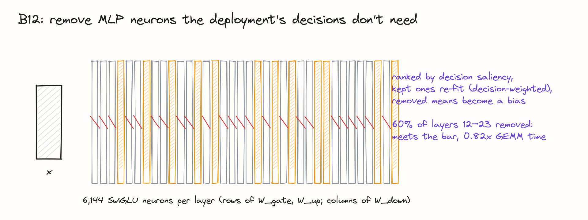

- **Background:**
  - the MLPs are about two thirds of hobson's arithmetic. Each layer has 6,144 SwiGLU neurons, each a row of the gate and up projections and a column of the down projection;
  - removing a neuron shrinks all three matrices, so any kernel gets faster, and the weights shrink too.
- **Motivation / intuition:**
  - on open-domain text almost every neuron fires sometimes, which is why activation-sparsity skipping saves at most about 11% (S9);
  - a banking deployment is a narrow distribution, so many neurons might never fire there, or fire without moving the decision;
  - a neuron that never fires is exactly removable. The rest can be ranked by variance × decision sensitivity: B5's idea applied to the MLP's hidden units instead of to input directions.
- **What we did** (Q5):
  - per neuron, measured firing statistics and decision saliency (the change in the decision from replacing the neuron by its mean) on banking and generic traffic;
  - removed neurons by rank, per layer or with one global budget across layers 12–23;
  - **compensation:** each removed neuron's mean output became a bias, and the kept down-projection columns got a decision-weighted least-squares update.
- **Results:**
  - **exactly dead neurons:** none. All 147,456 neurons are active beyond the tolerance on both domains, so exact removal saves nothing;
  - **ranking** (dev KL, 25% removed per layer in layers 12–23): ranking by variance gives 1.8e-3, by decision saliency 3.7e-4, and decision saliency with compensation 4.2e-5, about 40x lower than variance. Allocating one budget across layers cuts KL another 10x;
  - **removing 60% of layer 12–23 neurons** (19.8% of all GEMM work) meets the fidelity bar on the full kit: 0.28% flips, CF retention 1.000, CF-probe .952, JB-hard .538, REAL-label .788. The global budget kept layers 12–13 whole and only 488–1,229 of 6,144 neurons in each of layers 17–22;
  - **75%** fails (10 REAL flips);
  - **speed:** GEMM time is 0.82x W8A8's at every size tested, 0.79x with B13. End to end at 1,000 tokens that is about 30.7 ms (0.84x, arithmetic). It also removes 20% of weight bytes, which helps short, weight-bound requests on a 4090.
- **Why it came out that way:** layers 0–11 hold 92% of the MLP decision saliency and use their MLPs densely (as R7 found), and removal in layers 8–11 failed on dev.
- **Conclusion:** works in the late layers. Reaching layers 0–11 needs training at the reduced widths, which is untested.

### B13 · Exact dead-computation elimination: two free savings

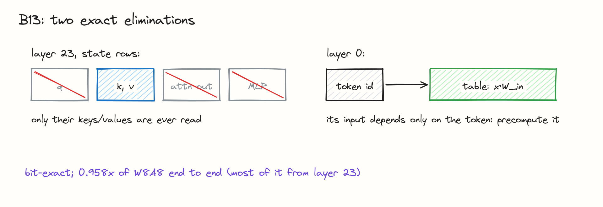

- **Background:** a decision is read only at the readout rows, after layer 23. Anything that no readout row can depend on, and anything that is a fixed function of the token id, can be skipped or precomputed with no change to the output.
- **Motivation / intuition:**
  - **layer 23.** Q1 measured exactly zero decision gradient at layer 23's state-row outputs. Later layers don't exist, and the readout rows read state rows at layer 23 only through attention's keys and values. So for state rows layer 23 needs only its K and V projections; the output projection, gate/up and down are never read. That is about 3% of all GEMM work;
  - **layer 0.** Its input projections act on the token embedding before any mixing, so they are a function of the token id alone. They can be precomputed for every token in the deployment's vocabulary and replaced by a table lookup, about 1.5% of GEMM work;
  - an LLM generating text can't drop layer 23's state rows, because every generated token becomes a row that later tokens read.
- **What we did:**
  - Q4 implemented both in the runtime and timed them;
  - Q5 checked exactness by filling the skipped values with NaN and confirming that no NaN reached any of the 3,227 output vectors.
- **Results:**
  - **exactness:** bit-identical probabilities and logits on all 3,227 questions on kernels whose results don't depend on the row count. In the deployed runtime, the layer-23 change alters 2 of 3,227 decisions (max probability change .004), because cuBLAS and attention kernels pick different tile shapes for fewer rows. Swapping layer 23's kernels with no elimination at all moves the probabilities just as much;
  - **speed:** 0.958x W8A8's latency at 1,000 tokens (34.8 against 36.3 ms), 0.946x at 4,000, and 0.960x with 15 questions;
  - **the layer-0 table alone** gives 0.6%, because its gather costs a third of the GEMM it replaces. It needs 220 MB in bf16 for the 13,376 token ids of banking traffic, which cover 99.75% of banking eval tokens. A full-vocabulary table would be 4.09 GB.
- **Conclusion:** use it. The saving is small but exact, and it stacks with everything.

### B14 · Short requests: a persistent kernel didn't keep the tensor cores busier

- **Background:**
  - the median JevBench request is about 143 rows. At that size W8A8 takes 7.4 ms on the A10G: 5.17 ms of GEMMs, 1.0 ms of glue, 0.88 ms of GDN and 0.32 ms of other work;
  - the floors are 2.29 ms to stream the 1.37 GB of int8 weights at 600 GB/s, and 2.9 ms of int8 arithmetic at peak;
  - so the multiplies run at only about 55% of what's achievable. Tiles don't fill the GPU's 80 SMs (streaming multiprocessors), and weight loading isn't overlapped with compute.
- **Motivation / intuition:**
  - a decision is a single pass with every row known up front, and it writes no KV cache;
  - one persistent kernel could run all 96 GEMMs in a single launch, streaming each layer's weights once while the rows stay on chip and prefetching the next layer's weights during the current one;
  - J5 bounded the gain at about 35% for 140 rows. It should be larger on a 4090, where short requests are limited by weight loading.
- **What we did** (Q4): a persistent W8A8 kernel running a forward's 96 GEMMs in one launch, with a grid-wide barrier between GEMMs and L2 prefetch of the next weights, compared with a CUDA graph of J5's 96 tuned kernels.
- **Results:**
  - 5.26 ms against 4.68 ms at 140 rows (12% slower), and 15% slower at 256 and 512 rows;
  - the 95 grid barriers cost 0.22 ms in total;
  - prefetching the next GEMM's weights changed the time by under 1%.
- **Why it came out that way:**
  - launches and dependencies are not where the time goes;
  - per-tile efficiency is. At these sizes even J5's tuned kernels run the gate/up projection at only about 50% of DRAM bandwidth and 55–60% of the tensor rate;
  - moving GDN and the glue into the same kernel was not built. They take 1.9 ms in 211 launches at 140 rows, and running them as phases inside one launch would save about 1 ms, roughly 13% (arithmetic).
- **Conclusion:** no benefit on the A10G. Short-request GEMM time is set by tile efficiency, so better small-M tiles, not fewer launches, are the remaining work.

## A · Architecture changes

These ideas change what the model computes while keeping hobson's size. They change the layout of the request, the input vocabulary, the attention mask, or add a module.

Most of them attack the row count $N$. A decision deployment is far more repetitive than LLM traffic:
- **Fixed questions:** the same few question specs on every request. 200 real banking requests use 5, and banking hook requests carry 1, 4, 8 or 15 questions of 78–1,201 tokens each.
- **Recurring content:** the same knowledge-base pages, hook notes and tool schemas, spliced into the middle of the state.
- **The same phrasing,** over and over.

The work that content causes can move out of the request and be done once per deployment (A3–A7). LLM prefix caching only covers exact shared prefixes, and most of this content isn't one.

The other ideas:
- **A1, A2** change the attention mask;
- **A8–A10** try input features, modules and pretraining for detail reading;
- **A11** tests a decision-native architecture from scratch;
- **A12, A13** try other ways of reading out a decision.

**What we found.** The row reductions were large: 1.9x lower latency on banking for compiled documents (A6), 2.0x for the vocabulary (A7) and 2–5x for compiled questions (A3, A4). None met the accuracy bar at the LoRA-scale budgets used (3–40M training tokens). The misses concentrated on the two 23-way procedure questions and on exact values.

Two findings shaped later work:
- **hobson reads the state at the question's content tokens** (A5). That is why compiling question rows fails, and it motivated the decision-native layouts M2 and M3.
- **Detail reading is fixed by training data, not by new modules or input features** (A8, A9; see E1).

### A1 · A 2B bidirectional encoder: the reported 2x was serving overhead

- **Background:**
  - **Encoders and decoders:** an encoder (BERT, T5's encoder) lets every token attend in both directions, while a decoder's causal mask lets each token see only what came before it.
  - **The reported speed:** Brooker's T5Gemma-based e1b decider was reported to serve in 30–35 ms on a 3090, against 60–65 ms for hobson-v19.
- **Motivation / intuition:**
  - **No mask needed:** a decision model never generates, so it has no need for the causal mask.
  - **The reported speed** suggested an encoder could be twice as fast.
  - **Better reading:** two-way reading might fix hobson's weak detail reading (CF pair accuracy .268).
  - **The arithmetic said otherwise before we started:** the T5Gemma-2B encoder does 4.05 GFLOP per token, 1.46x hobson's 2.77. Decisions are limited by arithmetic above about 150 rows, so in an equally optimized runtime the encoder should be 1.2–1.7x slower at every length.
- **What we did (J1):**
  - **The model:** the T5Gemma-2B encoder with a pointer head.
  - **Training:** exactly hobson's F7 recipe (40.5M tokens; LoRA rank 16; cross-entropy plus KL divergence to hobson), 2.7 h.
  - **Masking:** state rows attended only to the state, so the state could be cached and shared across questions. A fork (e1a) let the state read the question.
  - **Runtime:** fused as aggressively as hobson's. hobson got the same tile autotuning, to keep the comparison fair.
- **Results:**
  - **Latency:** 85.8 against 56.7 ms at 1,000 tokens. The encoder is 1.17x slower at 64 tokens, 1.51x at 1,000 and 1.66x at 4,000, and never faster. With 4 questions in one packed pass it takes 99.4 ms at 1,000 tokens, against 69.9 ms for hobson's packed lower bound.
  - **Accuracy:**
    - JB-all .688 (McNemar p .32), REAL-label .770 (bar .78);
    - CF pair accuracy .170 against .268 (p < .001), CF-probe .222 against .328 (p .010);
    - worse Brier score on every suite.

    Its one advantage is option order: .949 of decisions unchanged under option rotation, against hobson's .922.
  - **Letting the state read the question (e1a)** raised CF-probe pair accuracy from .222 to .316 (p 1e-4), matching hobson, and left CF, REAL-label and JevBench unchanged.
- **Why it came out that way:**
  - **Width:** the encoder is wider (width 2,304 and MLP 9,216, against hobson's 2,048 and 6,144), and it has full attention in every layer where hobson has cheap GDN.
  - **The reported 2x** came from the stock engine's overhead (S1), not from the architecture.
- **Conclusion:** slower and less accurate; drop it. The hint that letting the state read the question helps detail binding was tested again in A2 and A4.

### A2 · Bidirectional GDN: a reverse scan at linear cost, but no measurable gain from it

- **Background:**
  - **What a state row can see:** in hobson, row t of the state encodes only tokens 1 to t. Question rows read the state through 6 attention layers and through each GDN layer's fixed-size recurrent state, which favours recent tokens.
  - **The effect on detail reading:** hobson tracks 17% of counterfactual edits in the first half of the state and 34% in the second.
- **Motivation / intuition:**
  - **What the scan adds:** a reverse GDN scan lets each state row absorb what comes after it.
  - **What it reuses:** it reuses hobson's own projections (q, k, v and the gates β, g), so only the GDN kernel time grows, linearly in length. The matrix multiplies, 86–91% of the time, are unchanged.
  - **Against A1:** this is a much cheaper way to get bidirectional reading than a full-attention encoder.
- **What we did (J2):**
  - **Function-preserving construction:**
    - each GDN layer outputs o_fwd + γ·o_rev;
    - each attention layer mixes its causal and non-causal outputs with a weight λ;
    - γ and λ start at zero, so the untrained model is exactly hobson.
  - **Variants:**
    - qag: the state is cached without the question;
    - qa: one bidirectional pass over state and question together, so the state reads the question;
    - early: reverse scans in layers 0–10 only.
  - **Training:**
    - adaptation: 200 steps of masked next-token prediction (MNTP) on real states, then the F7 fine-tune at about 1/7 of F7's budget (4.6M tokens);
    - controls: the same fine-tune causally, and the matched control, which runs the identical MNTP step causally.
- **Results:**
  - **Latency:** 13% slower at 1,000 tokens (64.8 against 57.1 ms) and 19% slower at 4,000 (243.6 against 205.2 ms). The layers-0–10 version is 8% and 13% slower.
  - **qa can't share the state across questions,** because each question changes the state: 4 questions at 1,000 tokens take 240.1 against 83.3 ms.
  - **Accuracy:** every bidirectional arm meets the accuracy bar (qag: JB-hard .569, REAL-label .785). But the matched causal control also meets it (JB-hard .562, REAL-label .790).
    - Against the plain causal fine-tune, the bidirectional arms look significantly better. The matched control removes most of that difference, so the gain came from the language-model-style adaptation on real states, not from bidirectionality.
  - **The one residual effect:** qa, where the state reads the question, is the only arm better than hobson on CF pairs (23 against 7, p .005) and better than the matched control (25 against 10, p .017). Those p-values are uncorrected for about 20 tests.
  - **What no arm changed:** CF on states of 4,000 tokens or more (.01–.03), date-order probes and distractor probes.
- **Conclusion:** no speed benefit, since it is slower, and bidirectionality itself adds no measurable accuracy. Question-aware reading is the one hint, and it costs a full state pass per question. A4 tested the same question and found no clear benefit at equal training.

### A3 · Question-first layout with a precompiled question bundle: 15 questions for the price of one, but the state reading has to be retrained

- **Background:** each deployment has a fixed set of question specs. In hobson's layout every question's text (78–1,201 tokens) is reprocessed after the state on every request. So 15 questions over a 1,000-token state cost 237 ms in bf16, against 57 ms for one.
- **Motivation / intuition:**
  - **Compile once:** put the question bundle first and compute its GDN states, convolution tails and attention keys/values once per deployment. A request then computes only its state plus a few answer rows per question, so 15 questions cost about the same as 1.
  - **The cost of the layout:** hobson was trained with the state first. In this layout state rows come after the questions and attend to them, so the layout has to be trained in.
- **What we did (H7; F5 for a variant with selection):**
  - **The layout,** [bundle][state][one slot set per question]:
    - the bundle is compiled once;
    - a slot set is a question's option-end rows plus its `<answer>` row (3 rows for yes/no, 24 for a 23-way choice);
    - each set attends to the state and to its own question's span of the bundle, and starts from the state's final GDN state, so sets never see each other.
  - **Compile cost:** compiling the 15-question bundle takes 81–186 ms once, and the cache is 115 MB.
  - **Training:**
    - LoRA rank 16 on all 24 layers, distilled from frozen state-first hobson;
    - data: 70% real train-split requests (KL to hobson), 20% counterfactual pairs, 10% labelled rows;
    - a dense loss matching each slot row's hidden state to hobson's own option and answer rows at layers 5, 11, 17 and 23, added at update 150. This was the step that made it learn;
    - 900 updates (1.5 h).
- **Results:**
  - **Speed** (15 questions, 1,000-token state, A10G):

    | precision | hobson's layout | compiled bundle |
    |---|---|---|
    | bf16 | 237 ms | 57 ms |
    | W8A8 | 166 ms | 37 ms |
    | W4A4 | 103 ms | 26 ms |

    The cache matches an uncached pass at cosine 0.99999. The trained model, in its own runtime, takes 66 against 226 ms.
  - **Untrained,** hobson ignores the state in this layout: REAL agreement .40, below the .68 of a model that never sees the state. A one-slot version learned only the no-state prior.
  - **After 900 updates:**
    - state-dependent agreement .685 on REAL and .836 on LONG (bar .95);
    - JB-hard .408 against .523 (p .04);
    - REAL-label .785, equal to hobson;
    - detail reading far better than hobson's: CF item accuracy .817 against .594, CF-probe .977 against .653.

    Continuing to 1,300 updates gave .691 and .818: a plateau.
  - **The misses concentrate in the two 23-way procedure questions,** whose text is 1.0–1.2k tokens. There, REAL state-dependent agreement is .396, against .796 on the other questions.
  - **Bundling costs nothing:** decisions with a shared bundle and with one question per sequence agree on .965.
  - **F5's variant** added token selection after layer 4: 22.8 ms against 75.5 dense in that runtime, but agreement fell from .67 to .35. Seeing the questions first did not make early selection safe.
- **Caveat:** the counterfactual training data used the CF-probe suite's own generator, so the probe gains are partly in-distribution.
- **Conclusion:** the largest multiplier for multi-question requests, but it changes what the state rows compute, and LoRA with KL and row distillation flattens at about .69 agreement. A4 and A5 tried to get the same saving with the state kept first.

### A4 · Questions compiled into weights: 2–5x for deployed questions, short of the bar on the procedure questions

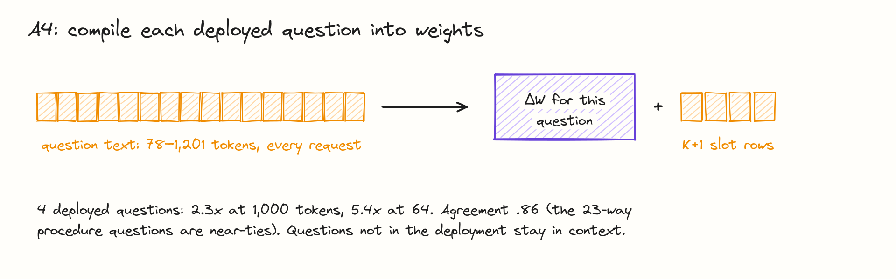

- **Background:**
  - **LoRA** adds a low-rank update to each weight matrix. Many LoRAs can be applied in one batch (as S-LoRA and Punica do for serving).
  - **A hypernetwork** is a network that outputs another network's weights.
- **Motivation / intuition:**
  - **The cost:** hobson rereads every deployed question on every request, 78–1,201 tokens of full 2B computation per question, about 1.5k tokens for the deployed 4- and 15-question sets.
  - **The proposal:** question text is a per-deployment constant, so compile it into weights. Each question becomes a small weight delta plus K + 1 slot rows (one per option and one for the answer).
  - **The saving:** a request then costs T + Σ(K + 1) rows instead of T + Σ|question|, a 27–42x smaller question term.
  - **"Late" placement:** the delta touches only the slot rows. hobson's state pass is untouched and shared by all questions, unlike A3.
- **What we did (J6):**
  - **Adapters for all 38 deployed questions,** a shared rank-16 LoRA plus a rank-8 LoRA per question:
    - distilled from hobson for 120 minutes on real train-split traffic (KL plus H7's dense row loss);
    - then 704 updates on counterfactually edited train states.
  - **An "early" arm** also applied the delta to the state rows, so the state could read the question.
  - **A hypernetwork** generated the delta for unseen questions from hobson's reading of the question text. It was trained on 31 questions, with 7 held out.
- **Results:**
  - **Latency** (A10G, bf16), against the best in-context layout:

    | request | state length | compiled | in context | speedup |
    |---|---|---|---|---|
    | 4 deployed questions | 64 tokens | 18.8 ms | 101.0 ms | 5.4x |
    | 4 deployed questions | 1,000 tokens | 64.8 ms | 146.3 ms | 2.3x |
    | 15 deployed questions | 1,000 tokens | 65.7 ms | 132.8 ms | 2.0x |
    | the 1,014-token procedure question | 1,000 tokens | 54.0 ms | 103.9 ms | 1.9x |

    One short question gains nothing beyond 64 tokens, because the unfused delta kernels add about 2.5 ms.
  - **Accuracy on the deployed questions:**
    - REAL-label .785, the same as hobson (p 1);
    - state-dependent agreement .864 on REAL and .891 on LONG (bar .95);
    - without the two procedure questions, .900 and .957.

    87–93% of the procedure misses are near-ties for hobson itself (top-two margin under .2), and an extra rank-32 adapter on those questions didn't help.
  - **Early against late:** the early arm is better on counterfactual ground truth (8 pairs against 1, p .04), no different on REAL-label or REAL agreement, and worse on LONG. It costs a state pass per question: 251.4 ms for 4 questions at 1,000 tokens.
  - **The hypernetwork failed:** JB-all fell from .723 to .524 (p 5e-7), and on held-out questions REAL state-dependent agreement was .26.
- **Conclusion:** a large speedup for multi-question and long-question requests, not yet accurate on the procedure questions. Unseen questions must stay in context. Because the late placement keeps hobson's state rows, they share the same state pass.

  The next step is untested: state rows in W8A8, compiled rows in bf16. H6 measured that layout at 40.6 ms for 15 questions at 1,000 tokens.

### A5 · Compiled question rows: the question's content rows are hobson's readers

- **Background:** A4 replaces the question with learned weights. A5 tries to keep hobson exactly and cache the question's own rows instead.
- **Motivation / intuition:**
  - **The layout:** the state stays first and untouched. Each question row is precomputed once as hobson's own computation of the question without any state, stored as keys/values and GDN inputs.
  - **Per request:** the cached question rows are replayed after the state, and only a few rows per question run live.
  - **The one approximation** is that compiled rows never see the state. With every row live it equals hobson exactly.
  - **The saving:** question text is 72–93% of the rows in short requests, so this would put multi-question short requests far below hobson's cost.
- **What we did (J14):**
  - **Live sets:** six arms, varying how many rows per question stay live, from the option ends and suffix (17 of the 204 rows of the question in the ladder below) to the option block plus instruction rows.
  - **Adaptations:**
    - a "compile adapter", a LoRA acting only on the compiled rows;
    - a rank-64 LoRA on the live rows;
    - a full fine-tune.
  - **Evaluation:** all 3,227 questions, plus latency in the W8A8 runtime.
- **Results:**
  - **Compiling 92% of question rows:**
    - 3.4x faster for 15 questions at a 32-token state (20.3 against 69.0 ms in W8A8), 2.0x at 1,000 tokens;
    - accuracy collapses: state-dependent agreement .72, CF-probe retention .03, REAL-label .703 (p < .001);
    - on 195 of 320 CF-probe pairs, it gives the same answer to both items of the pair.
  - **Compiling 69%:** 1.2–1.7x faster, CF-probe retention at most .33.
  - **Compiling only the boilerplate (12% of rows)** meets every bar:
    - agreement .951 on REAL and .952 on LONG;
    - CF retention 1.00, CF-probe .91;
    - REAL-label .782.

    It is only 1.04–1.18x faster for 4–15 questions, and no faster for one.
  - **A full fine-tune** was worse than LoRA on every suite, and it forgot: JB-all .619 in hobson's own layout.
- **Why it came out that way:** untrained hobson, with more and more question rows kept live (of 204):

  | live rows | which rows | REAL agreement | CF retention | CF-probe retention |
  |---|---|---|---|---|
  | 17 | option ends + suffix | .055 | .00 | .01 |
  | 49 | + last 32 instruction rows | .254 | .26 | .47 |
  | 148 | option block | .555 | .35 | .11 |
  | 180 | option block + 32 instruction rows | .832 | .98 | .85 |
  | 200 | option block + 64 instruction rows | .974 | 1.00 | .98 |

  - **Where the reading happens:** hobson gathers evidence from the state at the rows that carry the question's content, the statement and the option criteria. The `<answer>` and option-end rows only read those rows.
  - **Why training can't fix it:** compiling the content rows removes the reading itself, and no adapter can teach a row to read a state it never sees.
  - **The contrast with A6:** there, compiled documents are read by live question rows; here the compiled rows are the readers.
- **Conclusion:** fails with hobson's reading pattern. This finding led directly to M2 and M3. If question rows do all the reading, keep them live and at full depth, and make the state rows cheaper instead.

### A6 · Precompiled deployment documents: half the banking state is the same few hundred documents

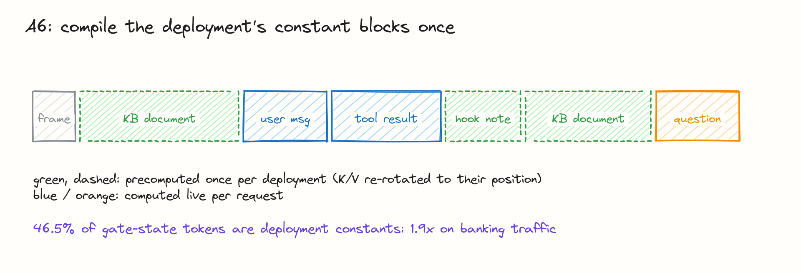

- **Background:**
  - **Prefix caching:** LLM serving caches the keys and values of a shared prompt prefix.
  - **Why that doesn't fit here:** a decision state's constant content (knowledge-base pages, hook notes, tool schemas) appears in the middle of the state, in varying order and combinations, so a prefix cache can't reuse it.
- **Motivation / intuition:**
  - **The share:** 46.5% of real gate-state tokens are fixed per deployment, and 52% of banking's.
    - Knowledge-base documents are 72% of the compiled banking text.
    - The fixed frame at the start is only about 45 tokens, so an exact prefix cache would save about 1%.
  - **The proposal:** compile each constant block once, in a neutral context, and splice it into every request that contains it. A request then pays for its dynamic content only.
- **What we did (J9):**
  - **Splicing:**
    - a segmenter splits each state into constant blocks and dynamic pieces;
    - each block is compiled once, with its attention keys re-rotated exactly to the position where it is used;
    - its GDN effect is stored as an affine map, S_out = A·S_in + B. The delta rule is linear in the state S, so blocks compose exactly in any order (verified at 1.3e-4 relative error).
  - **The layout:** blocks move to the front of the state in order of first appearance.
  - **A "compile adapter"** (LoRA rank 16, 400 updates) acts only on compiled rows. The live path is exactly hobson's weights, so states with no constants, such as JevBench, give hobson's answers by construction.
- **Results:**
  - **The library:**
    - banking's strict library is 2,781 blocks (604 distinct documents, 1.16M tokens), and 389 blocks cover 90% of uses;
    - attention keys/values take 12 KB per token: 14.2 GB in all, about 2 GB for the hot set (arithmetic).
  - **Latency** on 84 real eval-split requests:

    | traffic | hobson | compiled | speedup |
    |---|---|---|---|
    | banking | 180.5 ms | 94.9 ms | 1.90x (median per request 1.80x) |
    | LONG | – | – | 1.98x |
    | REAL | – | – | 1.47x |
    | retail | – | – | 1.14x |

    - At 1,000 tokens with 55% compiled: 39.2 against 57.1 ms.
    - No gain below 256 tokens. The saving trails the token ratio because the remaining matrix multiplies are smaller and less efficient, and assembling the cache costs about 5 ms.
  - **Accuracy:**
    - JB-all .727, identical by construction;
    - REAL-label .767 (p .17 against hobson; bar .78);
    - CF pair accuracy .256 (p .30), CF-probe .344;
    - state-dependent agreement .908 on REAL and .861 on LONG.
  - **The gap is the two procedure questions,** which ask about the documents themselves. Their agreement was .792 on REAL and .612 on LONG at 400 updates, still rising. Every other question reached .952 and .966.
  - **The cause is the reordering:** recomputing everything exactly in the new block order already drops agreement to .947 on REAL and .830 on LONG. Moving the documents costs more than compiling them.
  - **The GDN states aren't needed:** a library of keys/values only (no GDN states) is within 2 points, and saves 9.4 MB per block. Documents are read mainly through attention.
- **Conclusion:** a large speedup on deployments with heavy documents, slightly below the accuracy bar, and the procedure-question gap was still shrinking when training stopped. M2 later made document precompilation exact: segment isolation leaves no cross-document mixing to approximate, and 228 of 228 decisions were unchanged.

### A7 · Domain vocabulary: a decision model can afford a huge vocabulary

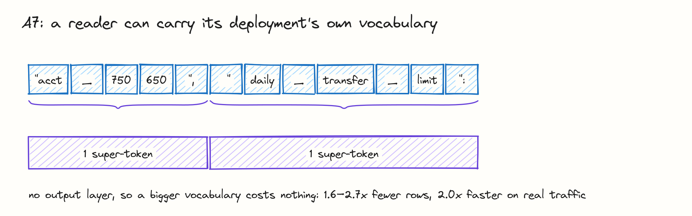

- **Background:** an LLM pays for its vocabulary twice. The output layer costs V × d multiplies per generated token, and every token must be emittable. So vocabularies stay general-purpose.
- **Motivation / intuition:**
  - **A decision model has no output layer,** so an extra embedding row is a table lookup that costs no arithmetic.
  - **Deployment text repeats heavily:** the same knowledge-base pages, schemas and record layouts.
  - **The proposal:** a vocabulary learned from the deployment's own traffic, with tokens that span whole phrases, cuts rows directly, and latency is linear in rows. The model stays the same 24-layer 2B.
- **What we did (J7):**
  - **The vocabulary:** BPE over hobson's existing token ids, so every new token is a concatenation of tokens hobson already reads. Merges may cross spaces and punctuation but never digits or newlines.
    - Vocabularies of 4k, 16k and 64k added tokens, trained on 34M train-split tokens.
  - **Embeddings:** each new embedding starts as the mean of its pieces' embeddings, plus learned corrections. Positions (RoPE) stay at each token's original position.
  - **Training:**
    - "token distillation": match hobson's hidden states at aligned positions in 6 layers, plus KL to its decisions;
    - LoRA rank 16, 400 updates (about 7M tokens), and longer runs of 1,100 and 1,800 updates (20M and 33M tokens).
- **Results:**
  - **Tokens:** the 64k vocabulary cuts real state tokens 2.41x (2.67x on LONG). JevBench, which has no deployment text, shrinks only 1.04x.
  - **Latency:**
    - 27.8 against 57.1 ms at 1,000 original tokens, and 92.5 against 201.2 ms at 4,000;
    - on real traffic the modeled median falls from 128.6 to 61.4 ms (2.0x), and on LONG from 253 to 110 ms (2.4x).
  - **Accuracy:**
    - at 64k after 400 updates, REAL-label fell to .730 (p .0007);
    - after 1,100–1,800 updates it recovered to .765–.767 (p .20–.25), still below .78;
    - state-dependent agreement plateaued at about .84, and CF retention reached .47–.75.

    The 4k vocabulary (1.60x fewer tokens) reached REAL-label .777 and agreement .844. Keeping user and assistant lines at the original granularity didn't help.
- **Why it came out that way:** agreement stopped improving between 20M and 33M tokens, which points at the capacity of a rank-16 LoRA rather than the number of tokens. Published vocabulary transplants (ZeTT) close their gap with full continued training on under 1B tokens.
- **Conclusion:** a large speedup that is not yet accurate. A full-rank fine-tune on 0.3–1B tokens is the untested next step. If it worked, it would be a 2x multiplier on every GPU, stacking with W8A8 and the compiled layouts.

### A8 · Value-identity and structure features: the model doesn't use them

- **Motivation / intuition:**
  - **hobson gets 0 of 51 identity counterfactuals right,** such as recognizing `04/17/1979` and `April 17, 1979` as the same date. A canonical code per value, identical for equal values and unrelated otherwise, would make identity matching a one-head lookup.
  - **GDN has no notion of position** beyond the order of its recurrence, and 18 of 24 layers are GDN. So explicit structure coordinates (field name, record, role, turn recency, digit place) might help it bind values to records.
- **What we did (J7):** added these as zero-initialized per-token input channels, so the untrained model is exactly hobson, and trained them with the same 400-update recipe as A7. The data included J7's own detail-reading augmentation (value against record, thresholds, cross-format dates), with templates disjoint from the eval suites.
- **Results:**
  - **The value-identity channel is unused:** zeroing it in the trained model moves CF pair accuracy from .622 to .619 and identity pairs from 4/51 to 4/51.
  - **All channels together, against the same recipe without them:** better on CF pairs (14 against 4, p .03) and worse on date-order probes (6 against 18, p .02).
  - **Identity pairs:** hobson 0/51, the no-channel control 1/51, with channels 4/51.
  - **Cost:** 0.3 ms at 1,000 tokens.
  - **The data alone did the reading:** plain digit tokens plus 400 updates of the augmentation took CF-probe pair accuracy from .328 to .903, and held-out value pairs from .32 to .96, with no channels. The best model to meet the bar was the channels arm, at hobson's speed (REAL-label .795), and its gain came from the data.
- **Conclusion:** no real accuracy gain from the features. Detail reading is a training-data problem (E1).

### A9 · A built-in exact comparator: correct pointers, but the torso already knows the answer

- **Motivation / intuition:**
  - **Many decisions reduce to a typed relation:** an amount against a limit, one date before another, an id equal to the one on file, a field belonging to the named record.
  - **A transformer has no exact comparator:** digits arrive one token at a time, so date order becomes soft pattern matching.
  - **The proposal:** a small module that compares parsed values exactly, with the network only learning where to point. It should fix hobson's .06 on date order and .33 on amount probes, at any scale.
- **What we did (J12):**
  - **The module:**
    - a regex extractor finds amounts, dates, ids and key-value pairs in the state;
    - a module (XR) after layers 11 and 17, on question rows only, has 16 heads. Each picks two literals with learned pointers and reads exact relations between them: equal, less, greater, same record, date gaps;
    - 18.6M parameters (0.8% of hobson), with the output initialized to zero.
  - **Training data:** 3,200 synthetic comparison pairs, with templates disjoint from CF-probe's.
  - **A matched control:** the same LoRA and data, no module, 450 updates each.
- **Results:**
  - **The control,** with no module, lifts CF-probe pair accuracy from .328 to .991. On a harder suite (3.5–7k-token states, three distractor records, near-ties as small as $0.01 or one day) it scores .975 against hobson's .150. The module arm scores .991 and .931.
  - **The module goes unused:** switching it off at inference changes no pair decision (CF 235 → 237 pairs, CF-probe 317 → 317). Its pointers do find the right literals: where the extractor found them, some head puts ≥ .98 on the exact gold pair for amounts, dates and statuses. But the torso already computes the answer.
  - **Both arms miss the REAL-label bar:** .752 (p .019) and .755 (p .050).
  - **Untouched:** JevBench's temporal_numeric and multi_hop families didn't move in either arm, because they need multi-step composition, not comparison.
  - **Cost:** +0.55–2.4 ms on the GPU.
- **Conclusion:** unnecessary, because data does it. The open case for in-network primitives is multi-operand arithmetic (sums of line items, date plus N days across time zones), which is untested.

### A10 · Decision pretraining: dense self-generated questions help only with little labelled data

- **Background:** ELECTRA pretrains by detecting replaced tokens, matching RoBERTa at about a quarter of the compute. Its own ablation shows most of the gain comes from having a loss on every token, which next-token prediction already has.
- **Motivation / intuition:**
  - **What's sparse in a decision model is the decision signal:** hobson's fine-tuning mix has one label per 346 tokens. A model that never sees the state agrees with hobson on 68% of real questions, so most labels don't require reading the state at all.
  - **The proposal:** generate many exact true/false questions about each state from its own text. Is this span verbatim, or has one digit or date been changed? What value follows this field? Which of two dates is earlier? Labels are exact by construction, and every one depends on the state.
- **What we did (J4):**
  - **The corpus:** up to 40 such questions per state pass, one decision per 112 tokens (3.1x the fine-tune's density), on 5,000 train-split states (4.4M tokens).
  - **The arms,** each followed by hobson's fine-tuning recipe:
    - decision pretraining (DP), then the fine-tune;
    - the fine-tune alone;
    - the fine-tune alone, continued to DP's total compute;
    - ordinary next-token pretraining on the same states, then the fine-tune.
- **Results:**
  - **With 1,000 labelled rows:**
    - CF-probe pair accuracy .484 against .219;
    - CF .443 against .268;
    - JB-all 5 points higher.
  - **With 4,000 rows,** only the CF-probe gain remains (.483 against .264).
  - **At equal compute,** ordinary fine-tuning is better on JB-all (10 tasks against 23, p .035).
  - **Distilling toward hobson erases the gain:** CF-probe falls from .55 to .39 between 4,000 and 12,000 rows, because the teacher can't read those details either.
  - **Next-token pretraining on the same states** gives the same JevBench gain but costs real traffic (REAL-label .693 at 4,000 rows).
  - **No arm reached REAL-label .78.** The latency is the same as hobson's, since only the weights change.
- **Conclusion:** helps only when labelled data is very scarce. Not a substitute for decision data.

### A11 · A slot model from scratch: depth only on the readout rows ties the decoder at a third of the arithmetic

- **Motivation / intuition:** a decoder spends about 2P FLOPs on every token at every layer, but a decision reads only K + 1 rows. A decision-native network would put depth on the options, not the tokens:
  - a shallow pass over the state that doesn't depend on the question;
  - the question stem and each option encoded separately;
  - a deep stack that runs only over a few slot rows (the answer, each option, and 4 scratch slots), each attending to everything.

  Extra questions would then be nearly free, and option order would be irrelevant by construction. Unlike R3–R5, no state row is dropped or pooled; every token stays readable by every slot layer.
- **What we did (J11):**
  - **The arms,** all trained from scratch at equal training FLOPs with a pointer readout:
    - the slot design;
    - a variant with exact value channels and binding priors (vslot2);
    - a weight-tied version run for 3 rounds (belief);
    - a causal decoder control in hobson's layout.
  - **Scales:** 20M, 38M and 114M non-embedding parameters, at 5, 10 and 16 PFLOP of training.
  - **The data:** 70% exact-label synthetic decisions, 15% labelled rows, 15% real states distilled from hobson.
  - **A training fix applied to every arm:** the first control learned nothing, and a dense auxiliary loss plus qk-norm made all arms learn.
- **Results:**
  - **Cost at equal accuracy:** the slot model matches the decoder at 0.28–0.37x the inference FLOPs.
    - Latency at 1,000 tokens: 3.17 against 6.94 ms at 38M parameters, and 5.53 against 13.3 ms at 114M.
    - Four questions cost 5–10% more, against 19–54% for the decoder's shared-prefix path.
    - Option order makes no difference: max probability change 6.3e-7 over 322 rotated pairs.
  - **No accuracy advantage:** on synthetic decisions the slot model is within ±1 point of the decoder, and vslot2 within +1 to +3. Large gains appear only where the task is the operator itself: argmax, .59–.67 against .41–.43.
  - **Accuracy doesn't scale at this budget:** the decoder's synthetic accuracy is .461, .466 and .442 at the three sizes. Every arm is far below hobson (JB-all at most .372, p ≤ 1e-12).
- **Conclusion:** a cheaper design at equal accuracy, but unproven at 2B and at realistic budgets. Moving depth from tokens to readout rows is also the premise of M3 (shallow state, deep question rows), which was tested on hobson itself.

### A12 · Dual encoders and late interaction: options must be read together with the state

- **Background:** a dual encoder encodes the state and each option separately and scores them by similarity. Late interaction (ColBERT-style) compares their token vectors.
- **Motivation / intuition:** encode the state once, then score any number of options and questions cheaply.
- **What we did:** trained scoring heads on a frozen Qwen3-0.6B, plus earlier encoder and dual-encoder retrofit tests against the 2B (early round).
- **Results:**
  - **RACE reading comprehension:** the heads scored .31–.34 (chance .25), against .65 with the options in the same sequence as the passage. They came within 4 points only on retrieval-like choices.
  - **Detail-dependent decisions:** encoders and dual encoders were 9–20 points below the 2B.
  - **The speed benefit is already available:** S6 shares the state across questions, and A4 compiles the questions.
- **Conclusion:** too inaccurate. The option has to be read in the presence of the state.

### A13 · Pointer programs and a JSON-structured reader

- **Motivation / intuition:**
  - **Pointer programs:** a planner writes a small program over the state (which fields to fetch, which to compare) and an exact executor runs it.
  - **A structure-native reader:** read agent states as the JSON they mostly are, pooling over leaves and fields.
- **What we did:** early-round tests of both.
- **Results:**
  - **Pointer programs:** the gains came from Claude writing a program per task. Small models placed only 22–34% of pointers correctly.
  - **The JSON reader:** pooling JSON leaves couldn't compare amounts or dates.
- **Conclusion:** no benefit. A9 later showed that exact comparison is learned from data once the model is shown enough of it.

## M · Mixers and decision-native layout

This theme changes how rows exchange information: the *mixer* (softmax attention or GDN's recurrence) and the *layout* (which rows may see which, and for how many layers). The rest of the model stays the same. The agents were M1, M2 and N1 (BRIEF11).

**The premise:** a decision model needs its state *read*, not fully digested. Only the K + 1 readout rows at the end of the question are ever used, and earlier rounds showed they do most of the reading themselves:
- in layers 18–23, state rows carry only 0–1.7% of the decision's gradient sensitivity (Q1);
- layer 23's state rows are needed only for their keys and values (B13);
- state rows through only 8 of 24 layers met the accuracy bar (R2);
- an exit at layer 16 changed 0 of 6,216 decisions (R1);
- hobson reads the state at the question's own content tokens (A5).

So state rows could get cheap, shallow, local processing, as long as the question rows can still reach every state row at full depth.

**Why an LLM can't do this.** A language model is trained to predict the next token at every position, and generates by doing so. Every position's representation must therefore summarize everything before it, at full depth. A decision model is read at a handful of rows after the state, so nothing forces a state row to know about rows in other parts of the state, or to be processed to layer 24.

**Why it matters beyond FLOPs:**
- **Exact precomputation.** If a state segment's rows depend only on that segment, a constant document (a knowledge-base page, a hook note) produces the same rows in every request, so it can be computed once per deployment and reused exactly. In hobson's layout this reuse is approximate (A6).
- **Hardware shape.** Independent fixed-size segments run as one batched operation, and a long GDN recurrence becomes many short independent ones. Systolic-array chips such as Inferentia prefer exactly that (HW3).

**Which floor terms it changes:**
- rows $N$: precomputed documents leave the request;
- layers per row $\ell_i$: state rows stop at depth $k$;
- on Inferentia, efficiency $\eta$: fewer long dependent chains.

**What we found:**
- **M2 is the first decision-native layout to meet an accuracy bar,** and it makes document precomputation exact.
- **M3** works at depth 12 and not at depth 8.
- **M1** is latency-neutral on the GPU; its accuracy is pending.
- **M4** was not built, and M5 is promising but untrained.

### M1 · All-attention hobson: plain matrix multiplies in place of GDN's recurrence

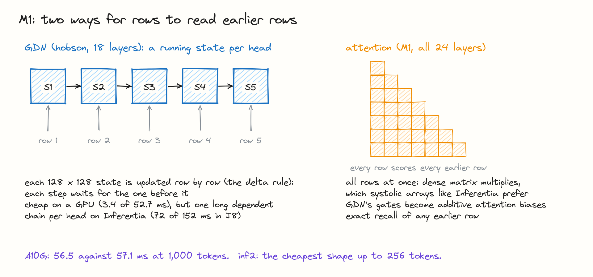

- **Background:** hobson's 18 GDN (Gated DeltaNet) layers mix rows through a running state.
  - Each of 16 heads keeps a 128 × 128 matrix.
  - For each new row the state decays a little, erases what it had stored under that row's key, and writes the row's value there. This is the "delta rule".
  - In practice the rows are processed in chunks, with a small triangular solve per chunk, and each chunk's result feeds the next.
  - Softmax attention instead keeps every earlier row's key and value and reads them all with two dense matrix products.
- **Motivation / intuition:**
  - **On a GPU** the recurrence is cheap: the GDN scan is 3.4 of hobson's 52.7 ms at 1,000 tokens.
  - **On Inferentia it is not.** Each head's chunks form one long dependent chain, and in J8's port GDN took 72 of 152 ms despite being 1–2% of the arithmetic (HW1).
  - **Attention is cheap at decision lengths** (S2), it is nothing but dense matrix multiplies, and it recalls any earlier row exactly rather than through a compressed state.
  - **Why hybrids use GDN in the first place.** Hybrid models like Qwen3.5 use GDN mainly to cut the cost of very long contexts, and of the key-value cache that grows with every generated token. Decision requests are mostly a few thousand tokens and generate nothing, so those reasons mostly don't apply.
- **What we did** (M1):
  - **The conversion.** Each GDN mixer became causal softmax attention with 16 heads of 128, built from that layer's own parameters: its input and output projections, its short convolution and its gated output norm.
    - q and k get a per-head RMSNorm with a learned gain, which sets the softmax temperature.
    - RoPE (rotary position encoding) is applied as in hobson's attention layers.
    - GDN's write gate and decay become additive attention biases, carried in 6 of each head's 128 dimensions so that a stock FlashAttention kernel runs the layer. The bias trick adds no error beyond bf16's: relative error 1.85e-3 against an explicit fp32 softmax, against 1.99e-3 for plain bf16 attention.
  - **Training,** in two stages:
    1. **Transfer:** each converted layer is fitted to reproduce its GDN layer's contribution to the residual stream, on hobson's own inputs (20 minutes, 1.64M tokens).
    2. **End to end:** distillation from hobson: KL to its decisions on real train-split states, matching of hidden states at layers 5, 11, 17 and 23 on the answer and option rows, cross-entropy on gold-labelled training rows, and at most 10% counterfactual examples, with LoRA adapters (rank 32) on the rest of the model.
  - **Timing:** a fused runtime with FlashAttention in all 24 layers and hobson's matrix multiplies unchanged.
- **Results, untrained:**
  - the conversion is a warm start, not a copy: REAL state-dependent agreement .36, JB-all .290;
  - each converted layer's output has 3.9x the squared error of adding nothing at all. Its direction is partly right (cosine .26–.62 with GDN's output in layers 0–16, .75–.93 in layers 17–22), but its magnitude is far too large, because softmax averages raw values while the delta rule writes corrections to what is already stored;
  - converting one layer at a time, 7 of the 9 GDN layers in 0–10 drop agreement to .35–.73, while layers 14–22 each keep it at .98 or more. The early layers are where GDN's specific behaviour matters.
- **Results, early checkpoints** (1.6–2.3M tokens, all 3,227 questions):
  - after transfer: JB-all .645 (p .001), REAL-label .728, REAL state-dependent agreement .812;
  - after 52 further updates of only the small mixer parameters (q/k gains, decay, convolution, norm gains): REAL-label .770, state-dependent agreement .861 (LONG .903), JB-all .645 (p .001), JB-hard .415 (p .009), CF pair accuracy .192 (p < .001), CF-probe .263 (p .02), RuleTaker depth 3 .827 against hobson's .867 on 300 held-out rows (p .023);
  - that passes two of the relaxed bar's five clauses (REAL-label and state-dependent agreement) and fails both bars.
- **Why the first end-to-end runs drifted:** updating the 378M full-rank mixer weights at a learning rate of 5e-6 or more pushed the hidden-state error from .033 to .058–.12 within 40–80 updates, while LoRA alone or the small parameters alone each improved it.
- **The main run is in progress.** The user approved it on October 7, after the permission system blocked it overnight.
  - It started at 06:12 PDT from the transfer checkpoint, with the full-rank mixer weights frozen, LoRA and the small parameters trained, and 5.8 hours of training.
  - At 180 minutes (about 17M tokens), on a train-split dev set: total-variation distance to hobson .0485 (from .068 at the start), KL .0129 (from .0234), state-dependent agreement .916.
  - The dev set has only 95 state-dependent questions, and it overstated fidelity once before (.926 on dev against .812 on REAL after transfer). The full evaluation is due about 13:05 PDT.
- **Latency on the A10G** (bf16, measured):

  | state tokens | 64 | 256 | 1,000 | 4,000 |
  |---|---|---|---|---|
  | hobson, 1 question | 15.6 ms | 25.4 | 57.1 | 201.3 |
  | M1, 1 question | 15.1 | 25.3 | 56.5 | 211.0 |
  | hobson, 4 questions | 52.7 | 57.9 | 95.2 | 246.1 |
  | M1, 4 questions | 48.3 | 54.3 | 93.9 | 265.4 |

  - At 4,000 tokens the matrix multiplies take 169.9 ms in both models. M1's attention takes 30.8 ms where hobson spends 8.2 ms on attention plus 13.1 ms on the GDN scan, so M1 is 9.6 ms slower with one question and 19.3 ms with four.
  - Projected at 1,000 tokens (arithmetic): 1.02x hobson's latency on a 3090, 0.95x on a 4090 and 0.98x on a 5090.
- **On Inferentia2** (N1, random weights of M1's shapes, one NeuronCore, measured):
  - **Latency:** 23.0 against hobson's 32.6 ms at 64 tokens, 28.3 against 42.0 at 256, 137.3 against 132.1 at 1,000, and 588.4 against 653.6 at 4,000.
  - **Cost per million decisions:** $2.43 at 64 tokens, against $3.44 for hobson on inf2 and $3.16 on the A10G; $2.99 at 256 (against $4.43 and $5.29); $14.5 at 1,000 (against $14.7 and $17.7).
  - **With a custom NKI attention kernel** (0.5 ms per layer, assumed, not measured), N1 projects about 81 ms at 1,000 tokens (arithmetic).
- **Conclusion:**
  - On GPUs, M1 neither helps nor hurts up to 1,000 tokens, and costs 5–8% at 4,000.
  - Its case is Inferentia, where it is already the cheapest shape up to 256 tokens, and exact recall.
  - Whether it can be trained back to hobson's accuracy waits on the main run.

### M2 · Segment-isolated state: segments stop seeing each other, so documents can be precomputed exactly

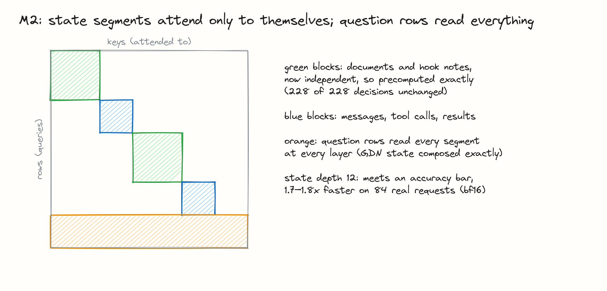

- **Background, what a segment is:** M2's segmenter cuts each rendered state into its natural pieces:
  - header sections, each message, each tool call, each tool result, each knowledge-base document, each hook note, and paragraphs of free text;
  - segments average 180 tokens on real traffic;
  - a document's rank and retrieval score are split off into their own tiny segment, so the document's tokens are identical in every request that retrieves it;
  - the segmenter reproduced the state exactly on 750 of 750 states.
- **Motivation / intuition:**
  - question rows do the reading (A5, Q1), so state rows may not need to see other segments at all;
  - if they don't, segments become independent. A constant document gives the same rows in every request, so its work moves from every request to once per deployment, exactly. 46.5% of real state tokens are such constants (A6);
  - in hobson's own layout a document's rows depend on everything before it, which is why A6's precomputation was approximate and needed an adapter.
- **How the layout works:**
  - **State rows** attend only to U and to their own segment. U is the 4-token `<state>\n` marker that every segment sees, so it acts as a shared attention sink. State rows use positions counted from the start of their segment. Each segment's GDN convolution and recurrence run on their own, starting from U's GDN state $S_U$.
  - **Question rows** read every state row at every layer. In attention layers they see all state keys at their global positions. In GDN layers they start from an exact composition of the segment states.
  - **The composition** is exact because the GDN recurrence is linear in its state. A segment's own rows don't depend on what came before it, so running segment $i$ from any starting state $S$ ends at $A_i(S - S_U) + E_i$:
    - $E_i$ is the segment's end state when started from $S_U$;
    - $A_i$ is its transfer matrix;
    - both are computed once.

    Folding $S \leftarrow A_i(S - S_U) + E_i$ over the segments in order reproduces exactly what a single scan would have reached (J9's affine composition). A cheaper order-free sum of segment states is wrong by 390% in relative error on random activations.
  - **State depth $k$.** State rows go through layers 0 to $k-1$ only. In each deeper layer their layer-$k$ outputs are projected once into the keys and values (attention) or the GDN inputs that question rows read. They skip the output projection and the MLP, which is about two thirds of a layer's arithmetic. This is J3's bridge, and it is the M3 idea. Question rows go through all 24 layers.
  - **Two layouts:**
    - **N** isolates every segment;
    - **C** isolates only documents and hook notes. The dynamic text (messages, tool calls and results) is one causal stream that reads the documents first. This is J9's document-first layout, made exact.
  - **Checks** (verified): changing a token in one segment moves another segment's rows by exactly 0.0, and with every option switched off the forward pass is hobson's.
- **Training-free measurements** (hobson's weights, 966 evaluation items including all 400 REAL-label questions):

  | layout | REAL state-dependent agreement | REAL-label | CF / CF-probe retention |
  |---|---|---|---|
  | hobson in this runtime | .990 | .787 | 1.00 / 1.00 |
  | every segment isolated, all layers | .817 | .723 | .77 / .41 |
  | isolated in layers 8–23 only | .938 | .787 | .97 / .84 |
  | isolated in layers 16–23 only | .995 | .785 | 1.00 / 1.00 |
  | only documents and hook notes isolated | .889 | .785 | .97 / .84 |
  | order-free sum instead of the exact composition | .452 | .568 | .14 / .00 |

  - **hobson does its cross-segment mixing in layers 0–7.** Isolating layers 16–23 costs nothing; isolating 0–7 costs 17 points.
  - Segment-local positions cost nothing: at most .027 change in any probability against the original positions.
- **What we did** (M2):
  - distilled both layouts from hobson with the same recipe as M1, with adapters that merge into the existing weights, training depths 8 and 12 jointly;
  - N trained for 2.6 hours and was then continued to 4.1 hours (26.1M tokens); C trained for 2.3 hours (15.9M tokens);
  - evaluated on all 3,227 questions with McNemar tests against hobson, plus the RuleTaker multi-step deduction probe (150 held-out items per depth).
- **Results:**

  | | hobson | N, k = 12 (4.1 h) | C, k = 12 (2.3 h) | N, k = 8 (4.1 h) | C, k = 8 (2.3 h) |
  |---|---|---|---|---|---|
  | JB-all (p) | .723 | .693 (.35) | .697 (.26) | .636 (.005) | .654 (.01) |
  | JB-hard (p) | .523 | .477 (.42) | .485 (.33) | .408 (.03) | .423 (.03) |
  | REAL-label (p) | .785 | .787 (1.0) | .770 (.35) | .782 | .780 |
  | REAL state-dependent agreement | 1 | .870 | .870 | .861 | .853 |
  | CF pair accuracy | .268 | .719 | .702 | .712 | .714 |
  | CF-probe pair accuracy | .328 | .537 | .981 | .559 | .981 |
  | CF-probe retention | 1 | .638 | .990 | .667 | 1.000 |
  | RuleTaker depth 3 | .860 | .807 | .800 | .653 | .747 |
  | Brier, REAL-label | .347 | .355 | .349 | – | .344 |

  - **N at k = 12 meets the strict accuracy bar.** It misses the relaxed bar by one JevBench task (160 of 231, .6926 against .693).
  - **C at k = 12 meets the relaxed bar.** It misses the strict bar only on REAL-label: .770 against .78, not significantly below hobson.
  - **At k = 8 both lose JevBench significantly,** and training N longer made that worse (.649 to .636) while raising its real-traffic agreement (.844 to .861).
  - The high CF pair accuracies come from the counterfactual examples in the training mix (E1), not from the layout.
- **Exact precomputation** (60 banking requests, 228 questions; every document and note segment, 61% of state rows, computed standalone and spliced in):
  - in hobson's own layout, 7 of 228 decisions change (3.1%), with probability changes up to .26;
  - with trained N and C, 228 of 228 are unchanged, with probability changes of at most .0057 and .0076 (bf16 rounding).
- **Speed** (A10G, bf16, fused runtime, CUDA graphs, documents compiled, measured):
  - **At 1,000 tokens, with 55% of the state compiled:** N k12 34.8 ms, C k12 33.1, N k8 29.8, C k8 28.7, against 57.1 for hobson. At 4,000 tokens: 89.9, 87.0, 75.0 and 73.0 against 204.7.
  - **On J9's 84 real requests,** mean latency: hobson 160.1 ms, A6 98.4, N k12 94.0, C k12 88.0, C k8 75.1. That is 1.70x for N k12 and 1.82x for C k12, against A6's 1.63x. On the 59 banking requests C k12 is 2.01x (178.8 to 88.8 ms).
  - **The isolation code itself costs** 5 ms at 1,000 tokens and 18 ms at 4,000. That is the exact-composition scan, gathers and concatenations, all unfused PyTorch, so it can come down.
  - **Projected** for N k12 with 55% compiled, at 1,000 tokens (arithmetic): 18.4, 9.8 and 7.0 ms on a 3090, 4090 and 5090, against hobson's 29.6, 14.6 and 10.7.
- **The weakness is record binding.**
  - Under N, a tool call and its result are separate segments, so linking a record to the id it was looked up for is left entirely to the question rows. They didn't learn it in 4.1 hours.
  - On CF-probe items with a distractor record, N tracks 0.0 of id-match and status pairs (hobson .38 and .25), which is why its CF-probe retention is only .638.
  - C keeps the dynamic text mixed and scores .88–1.0 on the same kinds.
- **On Inferentia2,** M2's shapes (N1; k = 8, 256-token blocks, random weights) are slower than hobson: 175.4 ms against 132.1 at 1,000 tokens. Each live GDN layer needs three kernel calls, each with about 2 ms of fixed overhead there. At 4,000 tokens the graph exceeds the compiler's instruction limit.
- **Conclusion:**
  - **What M2 achieves:** the first decision-native layout to meet an accuracy bar, at 1.7–1.8x hobson's speed on real requests in bf16 (2.0x on banking), and it turns document precomputation from approximate into exact.
  - **Next steps:**
    - train C at k = 12 for the full budget and run it in the 8-bit runtime (P1), projected at about 3x on banking traffic (arithmetic);
    - or isolate by linkage: keep a tool call, its result and any segment that mentions the same ids connected, to recover binding while constants stay isolated.

### M3 · Shallow state, deep reading: state rows stop at layer k, question rows read them at every layer

- **Background:** R2's depth split ran state rows through only the first 8 layers. Question rows went through all 24 and read the state's layer-8 keys and values in the deeper layers. It met the accuracy bar but lost multi-step deduction.
- **Motivation / intuition:**
  - Q1 measured that in layers 18–23 state rows carry 0–1.7% of the decision's gradient sensitivity, and layer 23's state rows need only their keys and values.
  - The deep layers are working for the question rows, so the state can be frozen early as long as the question rows keep reading it at every depth.
  - BRIEF11 framed this as cheap local mixing for state rows plus full cross-attention for question rows at every layer. It was tested as M2's state depth $k$, alone and combined with segment isolation.
- **Cost:** frozen state rows still need one projection per deep layer for the keys and values (or GDN inputs) that question rows read, but they skip the output projection and the MLP. With 55% of the state compiled, k = 8 runs in 28.7–29.8 ms at 1,000 tokens and k = 12 in 33.1–34.8 ms, against 57.1 for hobson (M2, measured).
- **Results, untrained** (hobson's weights, M2's 966 items):
  - frozen after layer 12: state-dependent agreement 1.00, REAL-label .782, CF retention 1.00, CF-probe retention .946, RuleTaker depth 3 .847 (hobson .860);
  - frozen after layer 8: .803, .755, .71, .57 and .687.
- **Results, trained** (inside M2's layouts; the full table is in [M2](#m2)):
  - k = 12 meets a bar in both layouts. k = 8 loses JevBench significantly in both (.636–.654 against .723), and more training lowered it further;
  - the largest JevBench drops at k = 8 were in three small families: ambiguous (.14 against .71, 7 tasks), adequacy (.58 against .83) and policy (.58 against .75);
  - RuleTaker depth 3 is .800–.807 at k = 12, against .860 for hobson. Training eroded it from the untrained .847, as J3 also saw; depth 5 is .620–.687 against .720.
- **Conclusion:** depth 12 is the working point. Depth 8 would need a way to restore multi-step reasoning across the state (M4), or training data that exercises it.

### M4 · Global summary slots: a small shared scratchpad for facts that must meet

- **Motivation / intuition:**
  - Shallow or isolated state processing loses deduction that chains facts from different parts of the state. In R2's depth split, RuleTaker depth 3 fell from .860 to .647; at M3's k = 8 it fell to .65–.75; N lost record binding (M2).
  - A few learned slots (32–64) that every state row can write to and read from at each layer would let distant facts interact at a cost of about N × m for m slots, rather than N², all as dense matrix multiplies. The global tokens some long-context transformers use work the same way.
  - Constant documents could stay exactly precomputable if they write to the slots but never read from them (a design option, untested).
- **Status:** not built; M2 ran out of time.
- **Conclusion:** the candidate fix for the multi-step weakness at k = 8 and for record binding under full isolation, and the natural next experiment if C's binding-preserving layout turns out not to be enough.

### M5 · Exact top-k reads for question rows

- **Background:** in an attention layer each question row scores every state key and takes a probability-weighted average of their values. Most of those weights are tiny.
- **Motivation / intuition:**
  - Decisions usually turn on a few exact values: an amount, a date, an id. If each question row keeps only its top-k keys per head and reads only those, it reads the important rows exactly and ignores the rest.
  - The scoring is one matrix multiply, and the read becomes fixed-size work.
  - This is different from R3's token selection. R3 dropped state rows for all later layers with a learned router and lost exact values; M5 keeps every state row and only sparsifies the question rows' reads, using the model's own exact scores.
- **What we did** (M2): hobson's weights, untrained. Question rows kept the top k state keys per head at the 6 attention layers; the GDN layers were unchanged. Evaluated on M2's sweep subset.
- **Results:**

  | k | agreement | state-dependent agreement | REAL-label | CF retention | CF-probe retention |
  |---|---|---|---|---|---|
  | 16 | .939 | .875 | .777 | .971 | .838 |
  | 64 | .972 | .909 | .787 | .971 | .865 |
  | 256 | .991 | .971 | .787 | 1.000 | .946 |

- **Speed:** not timed. At 1,000 tokens attention is 1.7% of hobson's time (S2), so M5 would not speed up hobson itself at these lengths. Its use is in layouts where question rows do all the long-range reading (M2, M3), and at long states.
- **Conclusion:** at k = 256, without any training, it stays close to hobson (state-dependent agreement .971, CF-probe retention .946 against a .95 bar). It needs training and timing before it can be judged.

### M6 · Linear attention without the erase term

- **Background:** GDN is gated linear attention plus the delta rule's erase step. Without the erase step (gated linear attention, or a Mamba-2-style mixer), each chunk is just masked matrix multiplies with decay, with no triangular solve, which suits systolic arrays.
- **Motivation / intuition:** it would remove the dependent per-chunk solve that made GDN slow on Inferentia (HW1, HW3).
- **Why it was not planned:**
  - The erase step exists because plain linear attention recalls specific items poorly: new writes pile up on top of old ones stored under similar keys. Decisions need exact recall of ids, amounts and dates (CF-probe).
  - Converting hobson would change the function of all 18 GDN layers, with no GPU speed benefit: the GDN scan is 6.5% of GPU time at 1,000 tokens.
- **Status:** not planned. It is a fallback only if a fused GDN layer on Inferentia can't get below about 2 ms (HW3's kill test). N1's kernel already reached 1.37 ms per layer; the remaining cost is the glue around it.

### M7 · Local attention as the only mixer

- **Background:** in sliding-window ("local") attention each row sees only the previous W rows, so cost grows linearly with length, and the work is block-structured.
- **Motivation / intuition:** if question rows can do the long-range reading, state rows might need only local context.
- **What we did** (J1): on the T5Gemma 2B encoder (A1), 21 of 26 layers were switched to local attention with a 512-row window while question rows stayed global, without retraining.
- **Results:**
  - latency fell by 0% at 1,000 tokens, 5% at 2,000 and 11% at 4,000, because attention is a small share of the arithmetic at these lengths (S2);
  - LONG state-dependent agreement fell from .842 to .758, CF pair accuracy from .170 to .126, and REAL-label from .770 to .765.
- **Conclusion:** on its own it buys little speed and loses long-range reads. Its useful form is as the state-row mixer inside a layout where question rows read globally. M2's segment-local attention is that idea, with segments defined by content rather than a fixed window.

## C · Combinations

The ideas in the other sections were each measured alone. Some act on different terms of the wall-time floor (rows, layers per row, arithmetic rate), so their savings should roughly multiply. Others act on the same layers, and then the second one saves less than it did alone.

A combination counts only when the whole stack runs end to end through the deployed kernels and is scored on all 3,227 questions. So far one stack has been built and measured that way, C1. The larger combined stack with ablations (BRIEF9) is paused.

### C1 · k64rr + layer-16 exit: the first configuration to meet both the fidelity bar and the speed bar

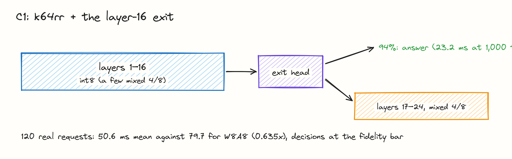

- **Background:**
  - **k64rr** (P11): H1 ranked the 96 GEMMs by how much 4-bit rounding in each moves the decision. The 64 most sensitive run in W8A8 on all rows, and the other 32 run in row-role precision (state rows W4A4, question rows W8A8). Alone it meets the fidelity bar at 0.877x W8A8's latency at 1,000 tokens;
  - **the layer-16 exit** (R1): a small head reads the residual stream after layer 16 and answers early when it's confident. Alone, on W8A8, it changed none of 6,216 real decisions and ran at 0.688x W8A8 on real requests.
- **Motivation / intuition:**
  - the two pieces cut different costs. The exit removes layers 16–23 for most decisions, and k64rr makes most of layers 13–23 cheaper while keeping the sensitive early layers in int8;
  - both were at the noise floor alone, so the stack might keep hobson's decisions while combining their speedups;
  - they overlap in layers 16–23. The question was how much of k64rr's saving the exit would leave.
- **How the cascade works:**
  - layers 0–15 run in k64rr's format, then the exit head (hobson's pointer head plus a rank-512 adapter) produces a decision from the layer-16 residual;
  - the runtime reads the exit head's margin, the top option's probability minus the runner-up's;
  - if the margin is at least τ = .054, that answer is final. Otherwise layers 16–23 continue from the saved residual and hobson's own head answers;
  - nothing the first part computed is wasted: splitting the pass at layer 16 is bit-identical to running it whole;
  - it runs as two CUDA graphs, layers 0–15 plus the exit head and then layers 16–23 plus the full head, with one host read of the margin in between. PyTorch doesn't expose conditional graph nodes, so a single graph can't skip the second half at run time.
- **What we did** (Q2, box q2b):
  - rebuilt the kernels, the mixed-precision runtime and k64rr's GPTQ codes, and reproduced k64rr's scores exactly;
  - trained a fresh exit head by KL to k64rr's own final decisions on 4,205 train-split questions, with early stopping on 1,736 others (DEV), following J15's recipe;
  - set τ on DEV as the smallest margin that changed no DEV decision, then applied it unchanged to all 3,227 eval questions;
  - timed J15's 120 real requests on the same box for W8A8, k64rr, W8A8 + exit and the full stack.
- **Results, accuracy** (all 3,227 questions, deployed kernels; meets the fidelity bar):
  - **REAL flips:** 0.65% of REAL decisions differ from hobson's (bar 0.7%). McNemar against the bf16 runtime is not significant (6 lost, 3 gained, p .51);
  - **detail tests:** CF retention 1.000; CF-probe retention .952, one pair above the .95 bar;
  - **other bars:** JB-hard .531 (not significantly different from hobson's .523); REAL-label .790 (bar .78);
  - **exit share:** 94.2% of eval questions exit at layer 16 (89.5% of CF-probe questions, which hide details deeper in the state);
  - **what the exit changed:** 4 of 3,227 decisions against full-depth k64rr, none of them on REAL or LONG;
  - **the W8A8 baseline in this draw:** plain W8A8 itself flips 1.11% (McNemar against bf16 p .039). As J15 found, GPTQ calibration draws vary between about 0.65% and 1.1%.
- **Results, speed** (A10G, W8A8 = 1x):

  | | W8A8 | k64rr | W8A8 + exit | **C1** |
  |---|---|---|---|---|
  | 120 real requests: mean / median / p95 (ms, measured) | 79.7 / 63.9 / 217.3 | 69.3 / 55.6 / 186.6 | 54.9 / 42.7 / 146.8 | **50.6 / 40.0 / 137.7** |
  | ratio of means | 1 | 0.870x | 0.689x | **0.635x** |

  - **At exactly 1,000 tokens with one question:** 23.8 ms expected, 0.654x W8A8's 36.4 (arithmetic: measured segment times weighted by the measured exit share). Across lengths: 0.722x at 64 tokens, 0.686x at 256 and 0.633x at 4,000.
  - **GEMM time** at 1,000 tokens: 16.4 against 25.8 ms (0.636x, arithmetic), inside the brief's 0.65x bar.
  - **Projected at 1,000 tokens:** 13.1 ms on an RTX 3090, 7.8 on a 4090 and 5.3 on a 5090, against W8A8's 19.9, 11.6 and 7.9.
- **Why it came out that way:**
  - **most of the gain is the exit.** k64rr's 32 cheaper GEMMs are all in layers 13–23, and the exit skips 25 of them for 94% of questions. Below layer 16, k64rr is int8 apart from 7 GEMMs, so the stack is 0.922x of W8A8 + exit, not 0.877x;
  - **what's left.** With the exit in place, layers 0–15 are about 98% of the remaining GEMM time, and k64rr keeps layers 0–12 entirely in int8 because they are the sensitive ones;
  - **B12 and B13 weren't added.** Inside the cascade they would touch only layers 12–15 and the 6% of requests that continue, worth about 1–2% (arithmetic), and each would need the exit head re-validated.
- **The multi-question case:**
  - a request skips layers 16–23 only if *every* question on it exits, since the questions share one pass over the state;
  - on 4-question DEV requests all questions exit 86% of the time, close to what independent exits would give. So 15-question requests should all exit only about 55% of the time (arithmetic);
  - that puts 15-question requests at about 0.76–0.82x W8A8, missing the speed bar. Banking hook requests carry 1, 4, 8 or 15 questions, so this matters in deployment.
- **Conclusion:**
  - the best configuration so far that keeps hobson's decisions: about two thirds of W8A8's latency on real one-question requests, measured;
  - its CF-probe margin is a single pair, so a new GPTQ draw or exit head needs re-checking;
  - the next gains have to come from layers 0–12 (row precision chosen by the question, B1; the decision-native layout, M2) and from the multi-question case.

## HW · Hardware

These ideas keep hobson's weights and function and change the silicon. In the wall-time floor they change the peak rate R_p and the bandwidth B. Because the hardware's price changes too, the measure is both latency and cost per million decisions.

**The reference:**
- An A10G costs $1.212 per hour on demand.
- Serving hobson in bf16, one request at a time, costs $17.7 per million decisions at 1,000 tokens ($12.2 in W8A8).
- Requests are latency-bound and served one at a time per device throughout this section, following J8's cost method.

**What we found:**
- **Inferentia2** runs hobson exactly and is now slightly cheaper than the A10G: 0.83x the cost per decision at 1,000 tokens (HW3). It is still 2.5x slower per request. It runs at only about 28% of the chip's peak, because of how we ported it; a corrected port should reach about 0.3–0.4x the A10G's cost (arithmetic).
- **CPUs with AMX and Apple laptops** are far from both the latency and the cost of a GPU.

### HW1 · Inferentia2 and AMX CPUs: an exact port at cost parity, and a clean CPU negative

- **Background:**
  - **Inferentia2** is AWS's inference chip. Each chip has two NeuronCore-v2, each with:
    - a Tensor Engine, a systolic array of over 90 TFLOPS bf16 that works on 128-row tiles;
    - Vector and Scalar engines;
    - an on-chip scratchpad (SBUF) and an accumulator memory (PSUM);
    - access to the chip's 32 GiB of HBM.

    Models compile ahead of time from PyTorch/XLA traces with the Neuron compiler, and custom kernels are written in NKI, the Neuron Kernel Interface. An inf2.xlarge has one chip and costs $0.76 per hour.
  - **Sapphire Rapids CPUs** have AMX units that multiply bf16 and int8 tiles. A c7i.8xlarge (16 cores) costs $1.428 per hour.
- **Motivation / intuition:**
  - A decision is a single compute-bound pass at batch 1, so its cost tracks peak FLOPs per dollar. inf2 offers about 250 peak TFLOP-hours per dollar against about 58 for the A10G, 4.3x.
  - A decision model also suits ahead-of-time compilation better than a generator. It has one static graph per length bucket, nothing generated, and no key-value cache to manage across steps.
  - For CPUs, the question was whether decisions could run next to the agent on its own host.
- **What we did** (J8):
  - **A pure-PyTorch hobson** (`hob.py`), with the LoRA merged and GDN written as matrix multiplies only.
    - The inverse (I + L)⁻¹ in GDN's chunked form uses exact block forward substitution. The obvious Neumann/doubling series blew the state up to 3 × 10¹⁶ by layer 8.
    - It matches an fp64 recurrent reference to 4 × 10⁻⁸.
  - **On inf2:**
    - the whole model as one graph, with lengths padded to multiples of 128 (exact for the real rows, because everything is causal);
    - a custom NKI kernel for the GDN core, one program per head;
    - a Neuron-friendly layout (HobNL).
  - **On the CPU:** the same model in bf16 under PyTorch's inductor compiler, with oneDNN AMX linear layers on 16 pinned cores.
- **Results:**
  - **Fidelity:**
    - inf2 agrees with hobson on .9928 of 837 questions. Its 6 changed decisions all sit where hobson's top probability is .36–.51.
    - CF retention is 1.000 and CF-probe .966.
    - The CPU agrees on .9950 of all 3,227 questions. Both are at the noise floor.
  - **Latency on one NeuronCore:** 30.9, 43.1, 152.0 and 537.5 ms at 64, 256, 1,000 and 4,000 tokens, against 9.4, 15.7, 52.7 and 200.5 ms on the A10G (2.7–3.3x slower).
  - **The path to 152 ms at 1,000 tokens:**

    | step | latency |
    |---|---|
    | naive XLA graph (48.5 GB of SBUF spill traffic) | 457 ms |
    | + NKI GDN kernel | 416 ms |
    | + the HobNL layout | 169 ms |
    | + a two-phase kernel (state-independent tiles first, then a sequential state pass) | 152 ms |
  - **Where it goes:**
    - GDN takes 72 of the 152 ms (4.0 ms per layer), against 3.4 ms for all of GDN on the A10G.
    - The NKI kernel is limited by latency, not arithmetic: the engines are only 19–24% busy.
    - The rest of the model reaches about 40 effective TFLOPS.
  - **Cost per million decisions** (inf2.xlarge with both cores, one request per core):

    | tokens | inf2 | A10G | ratio |
    |---|---|---|---|
    | 64 | $3.26 | $3.16 | 1.03x |
    | 256 | $4.55 | $5.29 | 0.86x |
    | 1,000 | $16.04 | $17.74 | 0.90x |
    | 4,000 | $56.7 | $67.5 | 0.84x |

    Two cores running at once don't slow each other.
  - **CPU:**
    - 96 ms at 64 tokens and 577 ms at 1,000 tokens on 16 cores, which is 10–14x the A10G's latency and 12–16x its cost ($229 per million at 1,000 tokens).
    - AMX bf16 multiplies at hobson's shapes reach only 0.5–1.3 TFLOPS per core, and int8 is no faster.
    - That rate bounds even a perfect CPU runtime at about 200 ms for 1,000 tokens.
- **Conclusion:**
  - Inferentia2 matches the GPU on cost with identical decisions, but at about 3x the latency. The 4.3x price advantage was lost almost entirely in the GDN kernel, which led to HW3.
  - CPUs are ruled out for this model.

### HW2 · Apple M4 Pro: limited by its GPU's arithmetic rate

- **Background:**
  - Apple's M-series chips share unified memory between the CPU, the GPU and the Neural Engine.
  - MLX is Apple's array framework for them.
  - An M4 Pro's GPU tops out at about 7.5 TFLOPS for matrix multiplies.
- **Motivation / intuition:**
  - Many agents run on developer laptops, where a local decision model would avoid any network hop.
  - Notes from another assistant, which the engineer shared, made strong claims about this hardware:
    - the Neural Engine runs at 94% utilization with weights on chip;
    - the CPU's matrix units (SME) beat the GPU at batch 1;
    - a 4-bit 2B decides in 4.7 ms.
- **What we did** (early round): ran hobson in MLX and in torch-MPS on an M4 Pro laptop, with 1,000 real state tokens plus a real question of about 106 tokens, and tested each claim.
- **Results:**
  - **Latency:** hobson in MLX takes 469 ms at 1,000 tokens, against a 367 ms floor set by the GPU's 7.5 TFLOPS. torch-MPS is about 1.45x slower.
  - **The GPU has no faster path:** no faster half-precision mode and no matrix units.
  - **4-bit weights don't help:** 461 against 420 ms for the model body.
  - **Idle penalty:** after 1–3 s idle, the next call costs an extra 10–43 ms.
  - **Claims that don't hold for reading a long input:**
    - SME beats the GPU at batch 1;
    - the Neural Engine runs at 94% utilization with on-chip weights;
    - the 2B fits in on-chip cache;
    - the 4.7 ms decision (true only for generating one token);
    - a Rust/candle engine is faster;
    - static padding pays off.
  - **Two that hold:** MLX shares memory with numpy without copying, and the Neural Engine and GPU overlap 1.83x from a single thread.
- **Why it came out that way:** reading 1,000 tokens through a 2B model is about 3 TFLOP of arithmetic, and at 7.5 TFLOPS the measured compute floor is 367 ms, whatever the memory system. Most published claims about fast Apple inference measure generating one token, which is limited by memory bandwidth instead.
- **Conclusion:** a 1,000-token decision at 2B accuracy can't approach 10 ms on an M-series laptop. It is about 47x too slow.

### HW3 · A pipelined NKI GDN kernel: keep Inferentia's engines busy

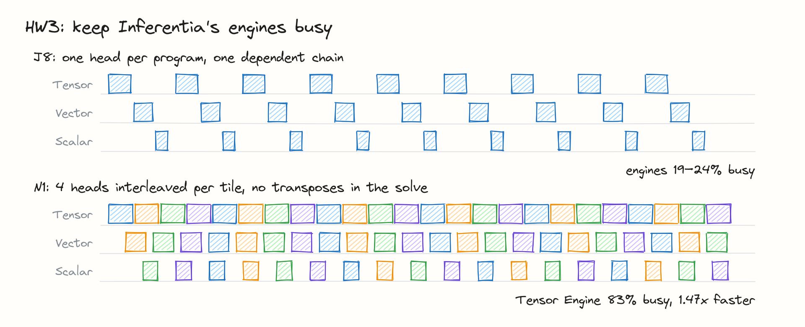

- **Background:**
  - GDN's chunked algorithm works on 128-token chunks. For each chunk and head, it builds a triangular matrix of key interactions, solves (I + L), and updates a 128 × 128 state: many small, dependent matrix operations. On the A10G, fla's Triton kernels do all of this in 3.4 ms at 1,000 tokens.
  - On Inferentia every matrix product goes through the Tensor Engine, and its result lands in PSUM and must be copied to SBUF before reuse. A transpose is itself a matrix product with an identity.
- **Motivation / intuition:**
  - J8's kernel was correct, but it ran each head as one dependent chain.
    - Each 128-token chunk took about 35 Tensor Engine operations, 14 of them transposes, each followed by a PSUM-to-SBUF copy.
    - The inverse used 6 levels of block doubling.
    - The engines sat 76–81% idle, and GDN took 72 of 152 ms despite being 1–2% of the arithmetic.
  - The 16 heads are independent, so interleaving them should fill the pipeline, much as more warps hide latency on a GPU.
  - J8 projected that a GDN as cheap as fla's would bring 1,000 tokens to about 84 ms per core and $8.9 per million decisions, 0.5x the A10G.
- **What we did** (N1; `~/decider2/n1/code/gdn11.py`):
  - **Heads:** all 16 heads in one program, 4 stacked per [128, 512] tile, so each copy, mask and PSUM bank covers four heads.
  - **Layout:** q, k and v arrive token-major, as the projection writes them, which needs only 2 transposes per head-chunk.
  - **The solve:** the exact block-doubling solve updates by operand order ((AB)ᵀ = BᵀAᵀ) instead of by transposes.
  - **The serial part:** rewritten as S′ = A S + B and o = Q′S + O₀, where A, B, Q′ and O₀ don't depend on the state. The only serial chain per chunk is then one fp32 matrix product plus an accumulate.
  - **Around the kernel:** plain token-major matrix multiplies for the GDN projections. Loading weights at run time instead of inlining them cut full-model compile time from 1,059 to 111 s.
- **Results:**
  - **Kernel:**
    - 1.373 ms for 16 heads at 1,152 tokens, against 2.022 ms for J8's kernel measured warm (1.47x faster); 4.747 against 6.778 ms at 4,096 tokens.
    - The Tensor Engine is 83% busy.
    - It is exact to 4.5 × 10⁻⁷ against J8's fp64 reference (bar 10⁻⁵).
    - J8's often-quoted 4.1 ms included a one-time cold DMA wait of about 2.08 ms.
  - **Model on one NeuronCore:**
    - 32.6, 42.0, 132.1 and 653.6 ms at 64, 256, 1,000 and 4,000 tokens (J8: 30.9, 43.1, 152.0, 537.5).
    - With 4 questions: 82.9, 103.1, 159.5 and 506.3 ms.
    - The single-question slowdown at 4,000 tokens is unexplained.
  - **Decisions:** .9952 agreement on 837 questions, with 4 changes, all where hobson's top probability is .36–.50. CF retention is 1.000 and CF-probe .966.
  - **Cost:**
    - $14.7 per million decisions at 1,000 tokens, 0.83x the A10G's $17.7, against a target of 0.5x (about 90 ms).
    - Two cores at once take 139.1 ms each (+5%), or 14.4 decisions per second per chip.
  - **Where the time goes at 1,000 tokens:**
    - GDN costs 59.9 ms: the kernel itself is about 25 ms (1.37 ms per layer), and the XLA "glue" around it is about 35 ms (1.95 ms per layer). The glue covers the convolution and SiLU on [T, 6144], the l2-norm, the gate and decay columns, and the copies around the call.
    - The rest of the model takes 72.2 ms, at about 48 effective TFLOPS against the roughly 55 TFLOPS the Tensor Engine sustains back to back.
  - **Other model shapes** (random weights, latency only):
    - M1's all-attention shape runs 23.0, 28.3, 137.3 and 588.4 ms at 64, 256, 1,000 and 4,000 tokens. It is the cheapest shape at short lengths: $2.43 per million decisions at 64 tokens against $3.16 on the A10G.
    - M2's segment layout takes 175.4 ms at 1,000 tokens and didn't compile at 4,000 (it exceeds the compiler's instruction limit).
- **Why it came out that way:** every partial move of work between XLA and NKI shifted the total by 10–25 ms in one direction or the other. For example, moving the decay preparation into the kernel cost the kernel 0.06 ms standalone but made the full graph slower. The cost sits at the boundary between compiler-generated code and the custom kernel (layouts and spills), not in the arithmetic.
- **What the measurements say about the implementation** (diagnosis, 2026-10-07): the chip is not the limit; the port is.
  - **Overall rate:** the whole model runs at about 26 TFLOPS (3.46 TFLOP in 132 ms), about 28% of a NeuronCore's roughly 92 TFLOPS peak. The A10G runs hobson at about 85% of its peak.
  - **The kernel does unnecessary 32-bit work.** BRIEF11 required the kernel to match a 64-bit reference to within 1e-5. That forced every product into fp32, which the Tensor Engine runs 3.4x slower than bf16 (N1 measured 262 against 76 ns per 128 × 128 × 128 product). It also forced an exact block-doubling inverse, which is 17 of the kernel's 29 products per head-chunk.
    - So "83% busy" meant busy with that fp32 work: useful GDN arithmetic ran at about 4 TFLOPS.
    - A kernel with bf16 inputs and fp32 sums, and a forward-substitution solve like fla's, should take about 0.1–0.2 ms per layer (arithmetic). fla takes 0.19 ms per layer on the A10G.
    - The right bar is the decision-level noise floor, as for every GPU change, not 1e-5 on the kernel.
  - **The glue is about 10x too slow.** It moves about 14 MB of elementwise data per layer, which should take about 0.1–0.2 ms, not 1.95 ms.
  - **Weights are read several times.** J8's graph read 13.7 GB of weights per pass for 3.8 GB of weights.
  - **The Tensor Engine's real top speed is unchecked.** N1's 55 TFLOPS back to back used 128-wide tiles. Whether 512-wide tiles reach the specification is untested.
  - **Done properly** (arithmetic): about 40–60 ms at 1,000 tokens per core, close to the A10G's 52.7 ms, for about 0.3–0.4x the A10G's cost per decision.
- **Conclusion:**
  - Better than J8's port, and slightly cheaper than the A10G, but far from what the chip allows. The diagnosis above puts most of the gap in our implementation choices: the 1e-5 exactness bar, an exact block-doubling inverse, and compiler-generated code around one custom kernel.
  - N1's own projection, which kept the fp32 kernel, was about 85 ms ($9.0 per million, 0.5x the A10G) after fusing the glue, speeding up the kernel and the other matrix multiplies.
  - A port held to the decision noise floor, as described above, should reach about 40–60 ms (arithmetic). Step 10 of [Recommended next steps](#recommended-next-steps) describes it.

## E · Data and evaluation

These items are not speedups. They are what we learned about the model's accuracy and about how to measure it, and they set the terms for every other result. E1 and E2 matter because most function-changing ideas in this report were judged on detail reading, where hobson itself is weak. E3 is why the bars sit where they do.

### E1 · Counterfactual training data fixes detail reading, without any change to the architecture

- **Background:** the CF and CF-probe suites pair two states that differ by one edit, chosen so the right answer flips, such as a changed digit, an inserted amount or a swapped date. A model tracks the edit only if it gets both items right. hobson is weak here:
  - it tracks .268 of CF pairs: 0 of the identity and procedure-intent pairs, .10 of inserted amounts, and 1 of 76 pairs on states of 4,000 tokens or more;
  - it moves its probability the right way 95% of the time, but often not across 0.5;
  - on CF-probe it tracks .328, with date comparisons at .03–.06 and status checks with a distractor record at .25.
- **Motivation / intuition:** there are three possible explanations for the weakness, and they call for different remedies:
  - a 2B model may lack the capacity;
  - transformers may need an exact primitive for numbers and ids (A8, A9 tested this);
  - hobson's training data may simply never have asked for this kind of reading.

  If it's data, every design in this report can be trained with the fix, and speed and detail reading become separate problems.
- **What we did:** several agents added counterfactual and detail-reading examples to otherwise ordinary fine-tunes:
  - **H7** built `cf_aug` on train-split states and used it in the schema-first fine-tune (A3). Its templates match CF-probe's, so its CF-probe gains are partly in-distribution.
  - **J3** used H7's `cf_aug` in the depth-split training (R2).
  - **J7** wrote 4,000 pairs of its own: a stated value against the record, lookups, an amount above a threshold, one date before another in different formats, half with distractor records. None used an evaluation template, field, tool or wording.
  - **J12** generated 3,200 pairs in 11 kinds: number, date and date-window comparisons; status and id equality; a stated identity against the record; an amount against a cap; existence. Their tools, fields and phrasings are disjoint from CF-probe's. A control arm trained without J12's comparator module (A9).
  - **M2** used at most 15% such examples in its distillation.
- **Results:**
  - **J12's control** (a LoRA touching 0.66% of the weights, 450 updates):
    - CF-probe pair accuracy rose from .328 to .991, on templates it never saw;
    - J12's harder suite rose from .150 to .975. That suite has 3,500–7,000-token states, three same-schema distractor records and near-ties of $0.01–0.50 or 1–2 days;
    - CF identity pairs rose from 0 to .18 (.43–.47 in the run with the comparator, whether it was on or off).
  - **J7:** held-out detail pairs with unseen values rose from .323 to .960 after 400 updates.
  - **H7:** inserted requests for a human were tracked 1.0 against hobson's .35, and inserted amounts 1.0 against .10.
  - **J3 and M2:** CF pair accuracy .70–.72, against hobson's .268.
- **What it costs:**
  - **Accuracy on real traffic tends to fall.** J12's arms scored REAL-label .752 and .755 (p .019 and .050 against hobson's .785), with state-dependent agreement .88–.89. H7 saw the same tilt.
  - **Distilling toward hobson pulls students back toward hobson's mistakes.** In J4's decision pretraining (A10), distillation took CF-probe from .55 back to .39.
  - **Kinds the data doesn't cover don't move.**
    - Procedure-intent pairs stayed at 0 in every version, and identity pairs stayed at 0 wherever the data didn't include them (H7, J3).
    - Multi-step composition didn't move either: in J12, temporal_numeric stayed at 2–3 of 15 and multi_hop at 6–8 of 18.
- **Conclusion:**
  - **Diagnosis:** hobson's exact-reading failures are gaps in its training distribution, not a capacity limit of a 2B model, and they need no new module.
  - **Open problem:** the mix. Real-traffic accuracy has to be kept while the detail reading is taught.
  - **Recipe J12 proposed:** weight matching hobson on real train-split states more heavily, keep synthetic examples at no more than 15%, and gate on REAL-label ≥ .78 together with CF-probe ≥ .95. M2's C layout comes closest so far, with REAL-label .770 and CF-probe .981.

### E2 · this-that-model: a sibling fine-tune with complementary errors

- **Background:**
  - this-that-model-1.0 (arXiv 2609.23886) is another decision model fine-tuned on the same Qwen3.5-2B base as hobson, with an identical configuration. Its weights are decider-2b's plus a 0.2–0.5% full-rank change, while hobson is the base plus a rank-16 LoRA, so the two are siblings.
  - It reads its answer from the letter labels' embedding rows at "Answer: (", instead of using a pointer head.
  - Its paper reports 30.9 ms per decision.
- **Motivation / intuition:** a different recipe on the same architecture shows how much of hobson's behaviour comes from training rather than from model size, and its latency claim needed checking.
- **What we did** (H4): reproduced the release, ran it in our fused runtime, and scored it on the evaluation kit with the state first, as hobson is.
- **Results, speed:**
  - in the fused runtime both models take 52.7 ms at 1,000 tokens;
  - the 30.9 ms figure is for 176–183-token prompts, one question per pass, eager Hugging Face code on an RTX 5080 laptop GPU. On the A10G the repository's own script takes 47.6 ms for that workload and our fused runtime takes 16.0 ms.
- **Results, accuracy:**

  | | this-that | hobson |
  |---|---|---|
  | JB-hard | .477 (p .41) | .523 |
  | REAL-label | .698 | .785 |
  | REAL / LONG state-dependent agreement with hobson | .806 / .636 | 1 / 1 |
  | CF item accuracy / pair accuracy | .812 / .633 | .594 / .268 |
  | CF-probe item accuracy / pair accuracy | .669 / .338 | .653 / .328 |
  | SHUF, both items right | .636 | .245 |

  - **Where this-that wins:** in a schema-first layout its CF-probe pair accuracy rises to .553, and date-order pairs to .84 (hobson .06).
  - **Where hobson wins:** clearly on question meanings it was trained on, e.g. `cc_can_still_help` .94 against .22, `UserAskedForHuman` .95 against .58, `needed_procedure` .62 against .19.
  - **Calibration:** this-that is overconfident out of distribution (expected calibration error .38).
  - **The errors are complementary:**
    - at least one of the two models is right on 338 of 400 REAL-label questions (hobson alone: 314) and 83 of 130 JB-hard tasks (hobson alone: 68);
    - simply averaging their probabilities doesn't capture this: JB-hard .515, REAL-label .762.
  - **Low-bit sensitivity is similar:** plain W8A8 rounding without rotation flips 3.4% of hobson's decisions and 4.2% of this-that's.
- **Gaps in the release:**
  - the paper describes caching a schema-first prefix, but the released code ships no prefix cache;
  - the default truncation at 1,536 tokens keeps the *start* of the state and drops the newest turns, which costs 7 points of REAL-label (.627 as shipped against .698 untruncated).
- **Conclusion:**
  - **Not a replacement:** it is not a substitute for hobson on real traffic.
  - **Useful as a second teacher:** its strengths are exactly hobson's weaknesses, so a student distilled from both, with the counterfactual data of E1, is a candidate for a better target for every speedup in this report.
  - **Its schema-first layout is worth reusing:** with a compiled prefix, 15 questions over 1,000 tokens take 60 ms instead of 135 in bf16, exact up to bf16 noise. It has to be trained for, though, because the two layouts agree on only .760 of decisions untrained (A3).

### E3 · Evaluation noise floors: how small a difference we can actually measure

- **Motivation / intuition:**
  - Early rounds called several compressions "lossless" because they agreed with hobson on most inputs. Many of those inputs can be answered without reading the state at all, and JevBench barely tests deep reading or exact details.
  - Before any fidelity claim can mean something, we have to know how much a decision moves when nothing meaningful has changed, and how much reading a test can detect.
- **What we did:**
  - built the evaluation kit with baselines that deliberately read less of the state (see the section [How we measure accuracy](#how-we-measure-accuracy));
  - measured the runtime's own noise and repeated calibration draws;
  - compared emulated and deployed kernels;
  - tracked dev-set estimates against the full kit.
- **What we found:**
  - **Agreement on easy inputs overstates fidelity.**
    - An empty state already agrees with hobson on .681 of REAL-agree questions. Dropping every state row after layer 7 agrees on .789, and keeping a random 50% after layer 7 on .940.
    - On the counterfactual suites those same baselines collapse: with the state dropped after layer 7, CF pair accuracy is .089 against hobson's .268.
    - So the bars use state-dependent agreement and counterfactual retention, not plain agreement.
  - **A model can beat hobson on a counterfactual metric while reading less.**
    - Keeping the 10% of state rows hobson's question attends to scores 1.28x hobson's CF pair accuracy, but it keeps only .88 of the pairs hobson gets right: it keeps the salient inserted sentence and drops the context that makes hobson cautious.
    - On CF-probe, dropping the state after layer 7 scores 1.09x hobson, because the early layers already match the question's id or status string lexically.
    - So the bars use *retention* of hobson's own tracked pairs, and the distractor kinds, which defeat the lexical shortcut.
  - **The runtime has its own noise.**
    - The bf16 runtime differs from hobson's reference on 0.37–0.46% of decisions, and re-running one matrix multiply in fp32 moves decisions as much as quantizing it to 8 bits.
    - Three GPTQ calibration draws for the same W8A8 recipe gave 0.65–1.11% flips (P1).
    - Two numerically equivalent W4A4 runtimes disagree on 12% of decisions, so 4-bit results count only when measured in the deployed kernels, not in emulation.
    - hobson's own references differ from the deployed service's stored answers on 5 of 1,535 decisions, all within 0.005 of the boundary.
  - **Small dev sets mislead.** After M1's transfer stage, a train-split dev set gave state-dependent agreement .926 on 95 questions, against .812 on the full REAL suite, about 4 standard errors apart.
  - **Some suites can't resolve small differences:**
    - JB-hard's standard error is about 4.4 points;
    - at n = 400, REAL-label can't separate designs near the top: the 10%-attention baseline above scores .787, against hobson's .785;
    - LONG agreement is no harder than REAL-agree (random 25% of rows after layer 7 scores .915 against .893);
    - long-state CF mostly measures hobson's own limit, since hobson tracks 1 of 76 pairs there.
- **Conclusion:**
  - Set every bar against these floors, and use paired tests (McNemar) rather than raw flip counts.
  - Lean on state-dependent agreement, counterfactual retention and the distractor kinds.
  - Accept low-bit results only from deployed kernels, and make final calls on the full kit, not on dev subsets.

## Recommended next steps

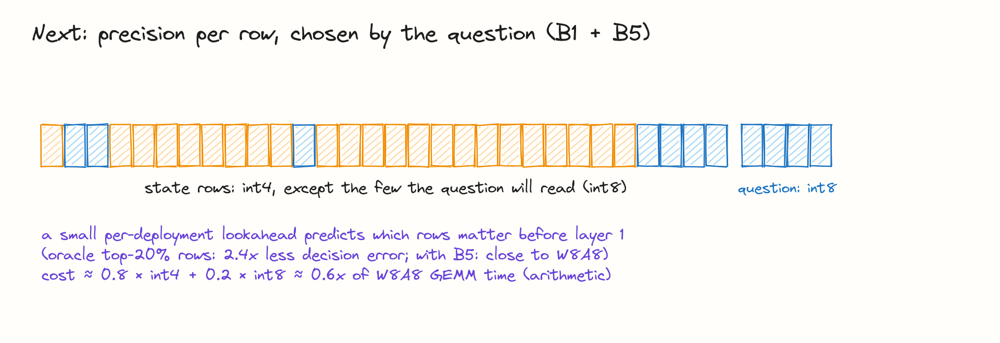

1. **Ship the measured, fidelity-preserving stack.** It contains:
   - the fused runtime (S1);
   - C1, which is k64rr mixed 8/4-bit with the layer-16 exit (P11 + R1);
   - the exact eliminations (B13);
   - packed multi-question passes (S6);
   - the Rust tokenizer (S8);
   - fp16 accumulation for any remaining bf16 matrix multiplies on GeForce (S7).

   That is 0.635x of the 8-bit runtime's latency on 120 real requests, with decisions inside the fidelity bar. It projects to 13.1 ms on a 3090 and 7.8 ms on a 4090 at 1,000 tokens. Check each GPTQ calibration draw against the bar: draws differ by 0.65–1.1% of decisions (P1).
2. **Choose each state row's precision from the question** (B1 + B5). This is the most direct attack on the remaining 4-bit obstacle.
   - **What we know:** in layers 0–11 the decision's sensitivity to rounding sits in a few state rows (the top 5% carry 63%). The question's attention at layer 7 identifies nearly the same rows. Putting the top 20% in int8 cuts decision-margin error 2.4x (oracle), and with B5's decision-weighted transforms on the rest the error is 0.050, against 0.038 for full W8A8.
   - **What's missing:**
     - a selector cheap enough to run before layer 1, such as a small per-deployment lookahead over the state with the question;
     - Kronecker-factored transforms, so B5 costs about 1–8% of a matrix multiply instead of more than the whole forward pass.
3. **Finish the decision-native layout** (M2).
   - Train variant C (documents isolated, state rows through 12 layers) for the full budget, and run it in 8-bit. That projects to about 3x on banking traffic (arithmetic).
   - Try isolation by linkage, where segments that mention the same ids or records stay connected, to recover the record binding that full isolation loses.
4. **Run the combined stack with ablations** (BRIEF9, paused): C1 + compiled documents (M2 or A6) + domain vocabulary (A7) + B11–B13. This is the most likely route to under 10 ms on a 3090. By arithmetic, 10 ms there in int8 needs about 2.8x fewer row-layers than a full 1,000-token request. The exit supplies about 1.5x of that, and compiled documents or the vocabulary would have to supply the rest.
5. **Retrain the row-removing layouts with larger budgets:** compiled questions (A3, A4), documents (A6) and vocabulary (A7).
   - **Why:** each fell short mainly on the two 23-way procedure questions, after 3–40M tokens of LoRA training.
   - **The recipe to try:** a full fine-tune or higher LoRA rank; distilling the state rows as well as the answer rows; richer option rows for the procedure questions.
   - **The gate:** state-dependent agreement ≥ .95 against hobson, with paired tests.
6. **Cheaper versions of the two accurate-but-costly 4-bit ideas:**
   - token-id prototypes (B3 without the nearest-neighbour search: the prototype is looked up by token id);
   - training only the transforms against the decision loss (B4/B5).
7. **Test 4-bit on Blackwell** (P4).
   - **The configuration:** NVFP4 on state rows, 8-bit question and answer rows, and FP8 on the roughly 8 most sensitive matrix multiplies, in real NVFP4 kernels.
   - **The verdict:** if it can't get below 1% flips with CF-probe retention ≥ .95, 4-bit hobson needs retraining of the base model.
8. **Measure exact context parallelism** (S5) on a 4-GPU node. F6's code was lost with `/tmp` in the laptop reboot, so it has to be rewritten first. It is the only route to about 10 ms on 3090-class cards that is exact by construction.
9. **Decide whether decisions may be computed as the conversation happens** (S11). If yes, prototype an append-only request format and a runtime that keeps each conversation's GDN states between gates. Then measure real per-conversation reuse, which today's records can't show.
10. **Redo the Inferentia port** (HW3's diagnosis):
    - **Precision:** bf16 inputs with fp32 sums, held to the decision noise floor instead of 1e-5.
    - **Kernels:** a forward-substitution solve, and whole GDN layers fused into one NKI kernel, then the MLP and attention layers.
    - **Checks:** that weights are read once per pass, and the Tensor Engine's real top speed at 512-wide tiles.
    - **Target:** 60 ms or less at 1,000 tokens, about 0.3–0.4x the A10G's cost per decision.

    If M1 meets an accuracy bar, port M1's attention instead of GDN.
11. **Treat detail reading as a training problem, separate from speed** (E1). Counterfactual training data fixes most of hobson's detail errors. A decider trained that way, and distilled from both hobson and this-that-model (whose errors complement hobson's, E2), may be a better base for everything above.

## Caveats

- **Projections:** no RTX 3090, 4090, 5090 or H100 was measured. The projections chain separately measured factors.
- **Traffic coverage:** the real-traffic suites come from one set of tau3 deployments, mostly banking. LONG has only 471 questions.
- **JB-hard resolution:** JB-hard (130 tasks) can't resolve differences under about 4 points.
- **Small flip counts:** flip counts near the bf16 floor are Poisson noise, so we use paired tests.
- **Training budgets:** most training runs used 3–40M tokens. Where training was involved, "fails" means "fails at this budget". The agents' reports give learning curves.
- **Emulation:** 4-bit results differ between emulation and deployed kernels. Where both exist, this report quotes the deployed-kernel numbers.
- **M1** is still training; its entry reports the latest checkpoint only.

## Files

In the repository package (`research/fast-decision-models/` in the strands-decider fork), `~/decider2/` is the `decider2/` folder next to this report; model checkpoints and some large files are not included (see `decider2/EXCLUDED.md`).

Everything is in `~/decider2/`. The original `/tmp/decider2` tree was lost in a laptop reboot. The earlier agents' reports survive in the session transcript, and the eval kit and shared code were recovered from the GPU boxes (`recovered/`).

**Evaluation and runtimes:**
- `evalkit/`: the suites, references, split, train pool and scorer (`evalkit.py`, `README.md`).
- `d1/lean2.py`: the fused bf16 runtime. `systems/`: the lean runtime and the packed multi-question forward.
- `h2/`: the low-bit runtime and kernels.

**Agent folders, by round:**

| round | folders | topics |
|---|---|---|
| H | `h1/`–`h7/` | formats, the low-bit runtime, error propagation, this-that-model, learned rotations, mixed-row precision, the schema-first fine-tune |
| F | `F7_REPORT.md` | equal-latency controls |
| J | `j1/`–`j15/` | encoder, bidirectional GDN, depth split, pretraining, short-input kernels, compiled questions, vocabulary, Inferentia, compiled documents, BitNet, slot model, comparator, adaptive width, compiled question rows, early exit |
| Q | `q1/`–`q5/` | the 4-bit program |
| M | `m1/`, `m2/` | decision-native mixers and layout |
| N | `n1/` | the Inferentia kernel |

Each agent folder has `NOTES.md` and `DRAFT_REPORT.md` (or `REPORT.md` in older rounds).

**Briefs and figures:**
- `BRIEF7.md`–`BRIEF11.md`: each round's rules, hypotheses and pass bars.
- `analysis/`: the post-processing pipeline (`catalog.py`, `metrics.py`, `latency_grid.py`, `figures.py`, `run_all.sh`) and the diagram scripts (`sketch.py`, `ideas_diagrams.py`).

**Related documents:**
- `docs/STEERING_BENCH_LITERATURE.md`: the companion literature review.
- `docs/CPU_DECISION_MODEL_MEMO.md`: the CPU analysis.

## Status (2026-10-07)

- **Running:** M1's main distillation (all-attention hobson).
- **Awaiting a decision:** next steps 2–6 and 9, including whether to relax the cold-request scope (S11).
- **Paused:** the combined stack and its ablations (BRIEF9), and the CPU follow-up.

